# C.I.D. — Master Project Document

## AI-Powered Criminal Network Analysis System · Smart India Hackathon 2026 · Problem Statement 26189

> **Single Source of Truth (SSOT).** This document describes the C.I.D. project itself: the problem, the concept, the data, the intelligence methods, the product, the architecture, the evidence model, governance, limitations and open questions. It is **not** an implementation plan, schedule, or build guide.

---

## CONTENTS

- 00. DOCUMENT CONTROL
- 01. EXECUTIVE OVERVIEW
- 02. PROBLEM DOMAIN
- 03. PROJECT OBJECTIVES
- 04. SYSTEM SCOPE
- 05. EXISTING ECOSYSTEM
- 06. C.I.D. CONCEPT
- 07. USERS & USE CASES
- 08. DATA SOURCES
- 09. DATA MODEL & ONTOLOGY
- 10. DATA PROCESSING PIPELINE
- 11. ENTITY RESOLUTION
- 12. CRIMINAL KNOWLEDGE GRAPH
- 13. NETWORK ANALYSIS
- 14. AI / ML LAYER
- 15. DETECTION TYPOLOGIES
- 16. SPATIO-TEMPORAL INTELLIGENCE
- 17. RISK & ALERT SYSTEM
- 18. EXPLAINABLE INTELLIGENCE
- 19. EVIDENCE VS INFERENCE
- 20. CORE PRODUCT FEATURES
- 21. INVESTIGATOR EXPERIENCE
- 22. SYSTEM ARCHITECTURE
- 23. TECHNOLOGY ARCHITECTURE
- 24. SECURITY, PRIVACY & GOVERNANCE
- 25. LEGAL & ETHICAL FRAMEWORK
- 26. EVALUATION FRAMEWORK
- 27. RESEARCH & REFERENCES
- 28. COMPETITIVE DIFFERENTIATION
- 29. LIMITATIONS & RISKS
- 30. FUTURE EVOLUTION
- 31. PROJECT DECISIONS & RATIONALE
- 32. OPEN QUESTIONS
- 33. GLOSSARY
- 34. APPENDICES
- MASTER DOCUMENT AUDIT

---

## 00. DOCUMENT CONTROL

### 00.1 Identification

| Field | Value |
|---|---|
| Document title | C.I.D. Master Project Document |
| Project name | **C.I.D.** `[DECIDED]` as the canonical name in this document. No official expansion of the letters is defined (see Q-PRD-01). |
| Descriptive title | AI-Powered Criminal Network Analysis System |
| Competition | Smart India Hackathon (SIH) 2026 |
| Problem statement | PS 26189 — "AI-Powered Criminal Network Analysis System" |
| Organisation context | Ministry of Home Affairs (MHA) / National Crime Records Bureau (NCRB), Women Safety Division (exact organisational attribution: see C-11) |
| Category · Theme | Software · Blockchain & Cybersecurity |
| Team | Beyond Just Programming (deck Team ID 47) |
| Version | **2.0** |
| Document status | DRAFT — restructured from v1.0; items marked `[OPEN]` await team decision |
| Last updated | 2026-09-10 |
| Supersedes | Master Reference Document v1.0 (August 2026) |

### 00.2 Purpose

This document exists so that a new team member, technical evaluator, researcher, product designer, developer, or AI agent can understand C.I.D. completely from this document alone. Every derivative artefact — pitch decks, demo scripts, implementation plans, UI designs, research tasks, and AI-agent task prompts — must be derivable from, and consistent with, this document.

### 00.3 Single-Source-of-Truth rules

1. **Precedence.** If any derivative artefact (deck, script, plan, design, code comment) disagrees with this document, this document wins until it is formally changed.
2. **Change first here.** A project decision changes by updating this document (Section 31 decision registry and the change log), then propagating to derivatives — never the other way round.
3. **Status is authoritative.** The status label attached to a statement is part of its meaning. A `[PROPOSED]` item quoted without its label in a derivative artefact is a misquotation.
4. **Contradictions are recorded, not hidden.** Known conflicts are listed in Appendix L (Contradiction Register, IDs C-01…) and remain `[OPEN]` until resolved by a team decision.

### 00.4 What this document is not

This document does not contain a 36-hour build plan, sprint plan, task assignment, repository structure, installation or deployment instructions, or coding schedule. Implementation planning is a separate, later artefact that must derive from this document.

v1.0 contained two sections that are presentation- or schedule-specific: §13 "Implementation roadmap" (Phase 0–1 hackathon scope and demo script) and §16 "Slide mapping". In v2.0:
- The long-term phases (pilot, scale) are preserved as `[FUTURE]` items in Section 30.
- The prioritisation signal in the v1.0 prototype scope (which capabilities the team considered core) is preserved in the scope tiers of Section 04.4.
- The prototype technology column is preserved as a technology tier in Section 23.
- The hackathon schedule, demo script, and slide-copy rules are removed from this document and belong to derivative artefacts (implementation plan, deck). Appendix K maps every v1.0 section to its v2.0 location.

### 00.5 Source register

| ID | Source | Role in this document | Authority |
|---|---|---|---|
| S0 | Deep-research write-up on PS 26189 by Jemina | Upstream research that v1.0 was built on | Not consulted directly in v2.0; its content reaches this document only through S1 |
| **S1** | Master Reference Document v1.0 (August 2026) | **Primary source** | Authoritative for all project content unless S2 overrides |
| S2 | v2.0 restructure brief (team, September 2026) | Defines the structure, status system, canonical transformation, and four product features that must be preserved (F-01 to F-04) | Authoritative for structure and for the features it names |
| S3 | C.I.D. pitch-deck content and pre-submission review notes (August–September 2026) | Secondary. Deck statements are team statements; reviewer suggestions are recommendations only | Deck statements may be `[DECIDED]` only where S1/S2 agree; reviewer suggestions are at most `[PROPOSED]` or `[OPEN]` |
| E | Standard external knowledge added in v2.0 (published algorithms, papers, statutes) | Supplementary context | Always tagged `[RESEARCH]`; items not independently checked are additionally marked `VERIFY` |

Each section begins with a *Sources* line naming where its content comes from.

### 00.6 Status labels

| Label | Meaning | Rule of use |
|---|---|---|
| `[DECIDED]` | A confirmed project decision, established in S1 or S2 | May be stated as project fact. Changing it requires a Section 31 entry. |
| `[PROPOSED]` | A recommended approach not yet finalised; includes v2.0 elaborations derived from S1 | Must be presented as a proposal ("C.I.D. proposes…"). |
| `[RESEARCH]` | A concept, method or claim supported by external research or reference | States what the literature supports, not what C.I.D. has achieved. |
| `[ASSUMPTION]` | A working assumption that requires validation | Must never be presented as fact. |
| `[FUTURE]` | A capability intended for later evolution, outside the current conceptual scope | Must never be described as a current capability. |
| `[OPEN]` | An unresolved question or decision | Must not be answered by derivative artefacts without a Section 31 decision. |
| `[DEPRECATED]` | An earlier approach or claim that is no longer active | Must not be reused. Kept for traceability. |

**A status tag applies to the statement, table row, or subsection it is attached to.** A tag on a heading applies to everything beneath it unless a more specific tag overrides it.

**Content markers** (not statuses, but equally binding):

| Marker | Meaning |
|---|---|
| `ILLUSTRATIVE` | An example with synthetic names, numbers or records. Never a result, never real data. |
| `TARGET` | A proposed performance goal. Never an achieved or measured result. |
| `VERIFY` | An external factual claim that must be re-checked before it is used publicly. |

### 00.7 Identifier conventions

| Prefix | Object | Section |
|---|---|---|
| UC-nn | Use case | 07 |
| DS-nn | Data source | 08 |
| T-nn | Detection typology | 15 |
| F-nn | Product feature | 20 |
| G-nn | Governance control | 24 |
| R-nn | Risk / limitation | 29 |
| D-nn | Project decision | 31 |
| Q-CAT-nn | Open question (CAT = PRD, DAT, AIM, ARC, SEC, LEG, UX, EVL, RES) | 32 |
| A-nn | Working assumption | 04 |
| C-nn | Contradiction | Appendix L |

### 00.8 Documentation conventions

| Convention | Rule |
|---|---|
| Project name | Always **C.I.D.** Never "CID", "Criminal Intelligence Database", "Criminal Investigation Dashboard", or any other expansion. |
| Central graph | **Criminal Knowledge Graph (CKG)** — the heterogeneous, temporal, provenance-bearing graph at the centre of C.I.D. |
| Entity (node) types | PascalCase, exactly as defined in Section 09: `Person`, `Organization`, `BankAccount`, `PhoneNumber`, `Vehicle`, `Location`, `Event`, `Device` |
| Relationship (edge) types | UPPER_SNAKE_CASE, exactly as defined in Section 09: `ASSOCIATED_WITH`, `OWNS`, `TRANSFERRED_FUNDS_TO`, `CALLED`, `PRESENT_AT`, `REGISTERED_TO`, `ACCUSED_IN`, `CO_LOCATED_WITH` |
| Properties | snake_case (`source_record_id`, `valid_from`) |
| Evidence classes | **Documented Evidence**, **Derived Relationship**, **AI-Inferred Lead** (Section 19). Property value: `DOCUMENTED` / `DERIVED` / `INFERRED`. |
| Users | "Investigator" means any authorised human user. Specific roles use the names in Section 07. |
| Currency | Indian notation (₹, lakh, crore) |
| Dates | ISO 8601 (YYYY-MM-DD) in data examples |
| Law codes | Refer to both the legacy codes (IPC / CrPC / Indian Evidence Act) and their replacements (BNS / BNSS / BSA) where historical records are involved |

**Vocabulary rules (evidence discipline):**

| Use | Do not use |
|---|---|
| "lead", "alert", "flag", "hypothesis", "AI-inferred link" for model outputs | "evidence", "proof", "confirmed" for model outputs |
| "risk score" | "guilt score", "criminality score" |
| "entity", "subject", "person of interest" for graph nodes | "criminal", "culprit" for any node not convicted |
| "co-presence within a tower footprint" for CDR co-location | "met", "was together with", "GPS location" |
| "explanation fidelity" | "proof strength" |
| "key player", "structurally important entity" | "kingpin" as a finding (acceptable only as the name of typology T-08) |

### 00.9 How humans should use this document

| If you are… | Read first | Then |
|---|---|---|
| New team member | 01, 06, 20 | 09, 12, 19, 22 |
| Technical evaluator | 01, 05, 22, 14 | 11, 13, 18, 26, 29 |
| Developer / architect | 09, 10, 11, 12, 22 | 14, 17, 23, 24, Appendix H |
| Product / UX designer | 07, 19, 20, 21 | 17, 18, Appendix G |
| Researcher | 14, 27 | 11, 13, 16, 26, 32-RES |
| Governance / legal reviewer | 24, 25, 19 | 04.7, 29 |
| Anyone preparing a pitch | 01, 05, 28 | 29 (so you do not overclaim), Appendix L |

### 00.10 How AI agents should use this document

1. Treat status labels as binding. Never restate a `[PROPOSED]`, `[ASSUMPTION]`, `[FUTURE]` or `[OPEN]` item as decided or current.
2. When asked about an `[OPEN]` item, report it as open and cite its Q-ID or C-ID. Do not invent an answer.
3. Use canonical names from 00.8 exactly. Do not introduce synonyms for entity types, edge types, or the project name.
4. Treat all `ILLUSTRATIVE` values as synthetic. Never quote them as performance or real-world facts.
5. Treat `TARGET` values as goals, never as results.
6. Cite by section number and ID (e.g., "§11.8, D-06").
7. Never produce a statement that equates an AI-Inferred Lead, a risk score, or an alert with evidence of guilt (Section 19).
8. Do not derive implementation schedules from this document unless the task explicitly asks for an implementation plan; even then, preserve every status label.
9. If two sections appear to conflict and no C-ID covers it, flag the conflict rather than resolving it.

### 00.11 Change log

| Version | Date | Author | Change |
|---|---|---|---|
| 1.0 | August 2026 | Team (built on S0) | Master reference document: mandate, gap analysis, product value, layered architecture, ontology, component deep dives, stack, typologies, legal framework, evaluation, roadmap, risk Q&A, fact-check appendix (three corrections), slide mapping, glossary |
| 2.0 | 2026-09-10 | Team | Restructured into Sections 00–34 plus audit. Introduced status labels, source register, ID scheme, evidence-vs-inference model (Section 19), confidence taxonomy, alert lifecycle proposal, contradiction register. Integrated features F-01 to F-04 (S2). Removed hackathon schedule and slide mapping (relocated to derivatives). No new facts asserted as `[DECIDED]`; all v2.0 elaborations are tagged `[PROPOSED]`. |

---

## 01. EXECUTIVE OVERVIEW

*Sources: S1 §1, §3, §4, §5; S2.*

### 01.1 C.I.D. in one paragraph

C.I.D. is an AI-powered criminal network analysis system proposed for SIH 2026 PS 26189 (MHA / NCRB). It ingests authorised, lawfully held records — First Information Reports (FIRs), Call Detail Records (CDRs), financial transactions, vehicle records, surveillance data and social media intelligence — resolves the many spellings, scripts and identifiers of the same real-world person or object into single entities, and connects those entities into a heterogeneous, temporal Criminal Knowledge Graph (CKG) in which every relationship carries its source record, confidence and legal basis. Graph analytics and graph machine learning then surface hidden networks, structurally important individuals and suspicious patterns as prioritised, explainable leads. Every lead shows the records and relationships that produced it, and AI-inferred links are always kept visibly separate from documented evidence. C.I.D. assists investigators; it never makes legal or investigative decisions.

### 01.2 Problem statement `[DECIDED]`

PS 26189 asks for a system that ingests FIRs, CDRs, financial records, surveillance data and social media intelligence, then surfaces:

1. Hidden criminal networks
2. Key influencers / kingpins
3. Suspicious patterns and anomalies

### 01.3 Core problem `[DECIDED]`

The investigative bottleneck is no longer data collection. It is **synthesis**: the same suspect exists as unconnected fragments across systems, the relationships that matter are indirect and deliberately hidden, and nothing links the fragments automatically.

### 01.4 Proposed solution `[DECIDED]`

NCRB is not asking for a data lake; it already has one. C.I.D. is **an analytical layer that turns records into relationships, and relationships into prioritised, defensible leads.** It positions as a layer on top of existing systems, not a replacement for them.

### 01.5 Target users `[DECIDED]`

Investigating Officers, crime analysts (including State Crime Records Bureau analysts), financial investigators, senior officers, and prosecutors (Section 07).

### 01.6 Core value proposition `[DECIDED]`

> Police already have the data. What they do not have is the *shape* of the organisation. C.I.D. builds that shape automatically, scores it, and shows exactly why.

### 01.7 Primary capabilities

| Capability | Status | Section |
|---|---|---|
| Multi-source ingestion with provenance tagging from the moment of entry | `[DECIDED]` | 10 |
| Joint entity–relation extraction from multilingual, code-mixed text | `[DECIDED]` approach; model choice `[PROPOSED]` | 10, 14 |
| Indic-native entity resolution with three-tier confidence | `[DECIDED]` | 11 |
| Heterogeneous, temporal Criminal Knowledge Graph with mandatory provenance | `[DECIDED]` | 09, 12 |
| Network analytics: centrality, communities, paths, Key Player Problem (KPP) | `[DECIDED]` | 13 |
| Graph neural network (GNN) anomaly detection | `[DECIDED]` as capability; specific models `[PROPOSED]` | 14 |
| Hidden link prediction | `[DECIDED]` as feature (S2); method `[PROPOSED]` | 14, 20 |
| Spatio-temporal co-location analysis | `[DECIDED]` | 16 |
| Risk fusion into ranked alerts with a defined alert schema | `[DECIDED]` | 17 |
| Explainable intelligence: evidence subgraph per alert | `[DECIDED]` | 18 |
| Lead-vs-evidence separation | `[DECIDED]` (S2) | 19 |
| Network disruption simulation | `[DECIDED]` as feature (S2); scope see C-10 | 20 |
| Investigator views: Network Explorer, Entity 360°, Timeline, Fund Flow, Search, Alerts, Case Management, Evidence Export | `[DECIDED]` | 21 |
| Governance built into the architecture | `[DECIDED]` | 24 |

### 01.8 Key differentiators

From S1 (the four defensible differentiators):

1. **Indic-native entity resolution** — resolving `Mohd Ali` ≡ `मोहम्मद अली` ≡ `Mohammed Ali` with a confidence score, using phonetic methods designed for Indian names rather than English-phonology algorithms. S1 calls this "the single highest-leverage technical contribution."
2. **Proactive network discovery, not reactive lookup** — flagging networks that no one has queried for (scope qualified by C-05).
3. **Explainability as a first-class output** — every alert ships with the evidence subgraph that produced it.
4. **Constitutional guardrails built into the architecture** — purpose limitation, authorisation tiers, sunset deletion, and audit implemented as system behaviour rather than policy text.

From S2 (product features that must be preserved): Evidence-Linked Graph (F-01), Lead-vs-Evidence Separation (F-02), Hidden Link Prediction (F-03), Network Disruption Simulation (F-04).

### 01.9 One-line pitch `[DECIDED]`

> Turns fragmented police, telecom and financial records into a single explainable criminal network graph — surfacing hidden syndicates, ranking key players, and showing investigators exactly why.

Tagline used in v1.0: *"From scattered records to the shape of the syndicate — explainably."*

### 01.10 Core philosophy `[DECIDED]`

- **Leads, never verdicts.** C.I.D. produces prioritised, explained hypotheses for human investigators. Every enforcement action requires a human decision.
- **Nothing asserted without a source.** Every documented relationship traces to a source record; every inference is labelled as an inference.
- **Safeguards are architecture.** Because statutory exemptions may apply to law-enforcement processing, the constitutional constraint is treated as binding, and the only reliable way to honour it is to build limits into the system.

### 01.11 Positioning statements `[DECIDED]`

> **Every existing system answers "tell me about this person." C.I.D. is designed to answer "which network should I be looking at, and why?"**

> **The person who matters is not necessarily the person with the most connections.**

> Existing systems contain or provide access to data; C.I.D. focuses on turning fragmented records into relationships, relationships into networks, and networks into prioritised, explainable intelligence.

(The v1.0 wording "None of them answers…" is an absolute claim about other systems; see Section 28 and C-12 for why the comparative form above is the safer canonical form.)

---

## 02. PROBLEM DOMAIN

*Sources: S1 §1, §2, §3, §8.1, §8.6, §8.8, §8.9; S3 (review notes on hop-depth claims).*

### 02.1 The current investigative environment

India's police records are now largely digital. According to S1, CCTNS (Crime and Criminal Tracking Network & Systems) holds 28 crore+ records, with 99%+ of FIRs filed digitally (figures: see C-08, `VERIFY`). That volume is far beyond manual review. Current link analysis is typically performed by an analyst who reads case files personally and draws a chart — in i2 Analyst's Notebook or on a whiteboard. That practice is accurate but slow, and bounded by one person's reading capacity and memory.

**The bottleneck is no longer collection. It is synthesis.**

### 02.2 Fragmented crime data

A single suspect exists simultaneously as:

| Fragment | System of origin |
|---|---|
| A name in an FIR | Police records (CCTNS) |
| An IMSI (International Mobile Subscriber Identity) in a CDR dump | Telecom records |
| An account number in a bank statement | Financial records |
| A plate number in an e-challan record | Vehicle / traffic records |
| A handle on Telegram | Social media intelligence |

Nothing links these fragments automatically.

### 02.3 Unstructured records

Much of the most important information is narrative text: FIR narratives, police notes, intelligence reports, and scanned legacy documents (PDF dumps). Real police notes and social media text are often Romanised Hindi or other code-mixed text (e.g., *"Usne bola ki paisa hawala se bhejenge"*), with arbitrary script switching, non-standard spelling, and culturally specific idiom. Standard multilingual models handle this poorly.

### 02.4 Entity fragmentation ("identity chaos")

Indian names have no canonical spelling across databases:

```
Mohammad Ali · Mohammed Ali · Md. Ali · Mohd Ali · मोहम्मद अली
Chatterjee · Chaterjee · Chattopadhyay
Azhagiri · Alagiri
Raj Kumar · Rajkumar · Raj Kumaar · राज कुमार
```

If each variant becomes a separate node, the network fragments into disconnected islands and the investigator never sees the shape of the organisation. If two different people with similar names are merged, an innocent person inherits someone else's network (Section 11.8).

### 02.5 Hidden relationships

Many relationships that matter were never written down anywhere. They exist only as patterns across records: two people whose phones repeatedly appear in the same tower footprint at 2 a.m. but never call each other; two companies that share a registered address and a director.

### 02.6 Cross-domain relationships

The most informative relationships span data domains: a person (FIR) owns a phone (CDR) that was present at a location where a vehicle (e-challan) was recorded, and controls an account (bank records) that received funds from a company (company registration records). No single-domain system sees such a chain.

### 02.7 Temporal complexity

Meaning depends on sequence. A transaction that is benign on Tuesday may be layering on Friday, given what preceded it. Composite patterns are time-bounded — for example, *a spike in device co-location followed within 48 hours by rapid layered transfers*. Networks also change over time: a previously sparse subgraph can densify rapidly.

### 02.8 Spatial complexity

CDR-based location is cell-tower-level, not GPS-level. An urban cell footprint is a few hundred metres; a rural one can be kilometres. Spatial reasoning must therefore be expressed as co-presence within a tower footprint, with explicit uncertainty (Section 16).

### 02.9 Financial and network complexity

Organised crime deliberately inserts distance between the principal and the act: layers of shell companies, mule accounts, and intermediaries. S1 states that the link that matters may be 6–10 hops away, beyond what manual reading can reach and beyond what many databases can query efficiently.

> **Caveat (C-06, `[OPEN]`).** In dense graphs, "small-world" structure means almost any two nodes can be connected within a few hops, so the mere existence of a 6–10 hop path carries little evidential weight. The meaningful capability is **multi-hop paths ranked by evidence strength and relationship type**, not path length itself. The "6–10 hops" wording is preserved from S1 but flagged for review.

### 02.10 Difficulty discovering unknown networks

Query platforms require the officer to know whom to ask about. An organisation nobody has yet named is invisible to a lookup-based workflow. (The proportionality limits on proactive discovery are discussed in 04.7, 17.10 and C-05.)

### 02.11 Difficulty prioritising leads

Analysts face questions such as "which of these 400 accounts matter?" with finite capacity. S1 notes that an analyst can review on the order of 50 alerts a week, not 5,000 (`[ASSUMPTION]`, illustrative capacity figure). A system that produces thousands of undifferentiated alerts is operationally useless regardless of its statistical accuracy.

### 02.12 Difficulty explaining why an AI-generated lead matters

"Risk = 94%" is not probable cause. No magistrate grants a warrant on an opaque score, and no defence counsel will let one stand unchallenged. An AI lead that cannot be traced to records and relationships cannot be acted on responsibly.

### 02.13 Investigator pain points

| User | Question they cannot easily answer today | Why |
|---|---|---|
| Investigating Officer | "Who else is involved in my case?" | Associates are spread across unlinked systems and spellings |
| Crime / SCRB analyst | "Which of these 400 accounts matter?" | Manual charting; no structural ranking |
| Financial investigator | "Where did this money actually go?" | Multi-hop layering through shells and mules |
| Senior officer | "Where do I put my limited teams?" | No prioritised view across networks |
| Prosecutor | "Will this hold in court?" | Findings lack provenance, reproducibility, and audit trail |

### 02.14 Retrieval vs relationship discovery vs network intelligence

| Level | Question answered | Output | Typical system |
|---|---|---|---|
| **Data retrieval** | "Show me the records about X." | Records | Record-search systems (e.g., CCTNS national search by name, vehicle, modus operandi) |
| **Relationship discovery** | "What is X connected to, and through what?" | Typed, sourced relationships and paths | Link-analysis tools; C.I.D.'s CKG |
| **Network intelligence** | "Which network matters, who holds it together, what is anomalous, and why?" | Prioritised, explained leads about networks and key players | C.I.D.'s analytics, risk and explainability layers |

C.I.D. is positioned at the second and third levels. It consumes the output of the first level; it does not replace it.

---

## 03. PROJECT OBJECTIVES

*Sources: S1 §1, §3, §5, §11, §12. Objectives restate S1 content; v2.0 grouping is `[PROPOSED]`.*

### 03.1 Primary objectives `[DECIDED]`

| ID | Objective | What C.I.D. must achieve |
|---|---|---|
| PO-1 | Surface hidden criminal networks | Connect entities across data sources into networks that are not visible in any single record or system |
| PO-2 | Identify key influencers | Rank entities and *sets* of entities by structural importance — disruption impact (KPP-1) and reach (KPP-2) — not only by connection count |
| PO-3 | Detect suspicious patterns and anomalies | Flag named typologies (Section 15) and anomalous structures or behaviour |
| PO-4 | Unify fragmented identities | Resolve variants of the same real-world entity into one entity with a confidence score, while avoiding false merges |

### 03.2 Secondary objectives

| ID | Objective | Status |
|---|---|---|
| SO-1 | Reduce the time needed to link a suspect across databases (TARGET: from days to minutes; no baseline measured) | `[PROPOSED]` target |
| SO-2 | Surface multi-hop connections that manual analysis cannot reach (subject to C-06) | `[DECIDED]` |
| SO-3 | Reduce duplicate-identity fragmentation in the case graph | `[DECIDED]` |
| SO-4 | Support the IPC ↔ BNS offence-code transition in one ontology | `[DECIDED]` |

### 03.3 Intelligence objectives `[DECIDED]`

- Turn records into typed relationships, relationships into networks, and networks into ranked leads.
- Attach a named pattern (typology), a time window, contributing records, and an evidence subgraph to every alert.
- Detect emerging networks (rapid densification) and behavioural change over time.
- Remain robust to camouflage (criminals deliberately transacting with legitimate nodes).

### 03.4 Investigator objectives `[DECIDED]`

- One-click network expansion from an FIR or entity.
- A complete, sourced view of one identity (Entity 360°).
- A human-readable reason for every AI alert.
- Findings that leave the system timestamped, source-linked and audit-trailed, suitable for inclusion in a case file.

### 03.5 Governance objectives `[DECIDED]`

- Every query tied to a case identifier and a legal basis.
- Tiered authorisation for sensitive data (telecom and financial data require documented judicial or designated-authority approval).
- Immutable audit of every access.
- Automatic, time-bound deletion for individuals cleared of suspicion.
- No use of caste, religion or community as model features; audit for proxies.
- Human decision required for every enforcement action.

### 03.6 Non-objectives

| Non-objective | Status |
|---|---|
| C.I.D. does not collect or intercept data; it analyses data already lawfully held | `[DECIDED]` |
| C.I.D. does not produce verdicts, determine guilt, or recommend charges | `[DECIDED]` |
| C.I.D. does not score neighbourhoods, localities or demographic groups (not a place-based predictive-policing system) | `[DECIDED]` |
| C.I.D. does not replace CCTNS, ICJS, NATGRID, or any existing record system | `[DECIDED]` |
| C.I.D. does not replace investigators or analysts | `[DECIDED]` |
| C.I.D. does not perform facial recognition or biometric identification | `[ASSUMPTION]` — S1 does not include biometrics in the capability set; confirm as an explicit non-objective (Q-PRD-04) |

### 03.7 Definition of success

C.I.D. succeeds conceptually when all of the following hold. Numerical targets are `TARGET` values from S1 §12 (Section 26); none has been measured.

1. **Resolution is trustworthy.** Variants of the same entity collapse into one entity; distinct people are not merged (entity-resolution precision is the priority metric).
2. **Every documented edge is traceable** to a source record and legal basis (a design invariant, not a statistical target).
3. **Alerts are useful at analyst capacity.** Precision among the top-K alerts (precision@K) is high enough that reviewing the top of the queue is worthwhile.
4. **Every alert is explainable** with an evidence subgraph whose removal materially reduces model confidence (explanation fidelity).
5. **Retrospective validation works.** Replaying a historical, solved case, C.I.D. surfaces the known network before the historical arrest date (S1: "the most persuasive demo").
6. **Governance holds.** No query executes without case ID and legal basis; every access is audited.

---

## 04. SYSTEM SCOPE

*Sources: S1 §3, §8, §11, §13, §14. Scope tiering in 04.4 is `[PROPOSED]`, derived from the S1 prototype prioritisation.*

### 04.1 In scope `[DECIDED]`

- Ingestion of authorised feeds (batch and streaming), with provenance tagging at entry
- Parsing, OCR and normalisation, including multi-script and transliterated text
- Joint entity–relation extraction from unstructured text
- Structured feature extraction from CDRs, transactions and geo data
- Indic-native entity resolution with a human review band
- Construction and maintenance of the heterogeneous, temporal CKG
- Graph analytics (centrality, community detection, paths, KPP)
- GNN-based anomaly detection and link prediction
- Spatio-temporal co-location analysis
- Risk fusion, alert generation, and an analyst queue
- Explainability (evidence subgraphs, feature attribution)
- Investigator interface and evidence export
- Governance controls across all layers

### 04.2 Out of scope `[DECIDED]`

- Data collection, interception, or surveillance operations
- Legal determinations, charging decisions, or enforcement actions
- Demographic, caste, religious or community profiling
- Place-based (neighbourhood) crime prediction
- Replacement of existing national systems

### 04.3 Current vs future scope

- **Current conceptual scope:** the target architecture described in Sections 06–24, qualified by the status of each component.
- **Future scope:** Section 30 — pilot deployment, national-scale graph infrastructure, CCTNS/ICJS API integration, cross-agency onboarding, activation of federated learning with differential privacy, and other `[FUTURE]` items.

### 04.4 Capability tiers `[PROPOSED]`

The v1.0 prototype scope (ingest → entity resolution → graph with centrality and KPP-1 → one heterogeneous GNN with GNNExplainer) indicates which capabilities the team treats as the essential core. v2.0 formalises that signal as tiers:

| Tier | Meaning | Capabilities |
|---|---|---|
| **Core** | Without these, the system is not C.I.D. | Provenance-tagged ingestion; normalisation; entity extraction; Indic entity resolution with three-tier confidence; CKG with mandatory provenance; centrality, communities, paths, KPP-1; HGT-based anomaly scoring with GNNExplainer evidence subgraph; Evidence-Linked Graph (F-01); Lead-vs-Evidence Separation (F-02); Network Explorer and Entity 360°; governance controls G-01 to G-08 |
| **Advanced** | In the target architecture; strengthen the core | Joint entity–relation extraction across three encoders; temporal GNNs (TGN/EvolveGCN); anti-camouflage GNNs (CARE-GNN/PC-GNN); link prediction (F-03); disruption simulation (F-04); DBSCAN co-location; PGExplainer and SubgraphX; Timeline and Fund Flow views; risk fusion across three score families |
| **Future** | Phase-gated evolution (Section 30) | Streaming complex event processing at national scale; massively parallel graph database; multi-teacher knowledge distillation; federated learning with differential privacy; CCTNS/ICJS API integration; cross-agency deployment |

### 04.5 Working assumptions

| ID | Assumption | Status |
|---|---|---|
| A-01 | Real deployment would access data through NCRB's existing CCTNS/ICJS data-sharing framework | `[ASSUMPTION]` (S1 Q&A) |
| A-02 | Source systems can supply a stable record identifier usable as `source_record_id` | `[ASSUMPTION]` |
| A-03 | The legal basis for each record can be determined and attached at ingestion | `[ASSUMPTION]` |
| A-04 | Validation before real-data access uses public benchmarks and synthetic Indian-context data with injected ground truth | `[DECIDED]` approach; representativeness is an `[ASSUMPTION]` |
| A-05 | Financial-intelligence users (e.g., FIU / ED, as named in S1) would be able to access C.I.D. under an inter-agency arrangement | `[ASSUMPTION]` |
| A-06 | Deployment is on-premise within the agency network | `[ASSUMPTION]` (deck statement in S3; not in S1; see C-04) |
| A-07 | Analyst review capacity is on the order of tens of alerts per analyst per week | `[ASSUMPTION]` (S1 illustrative figure) |

### 04.6 Dependencies

| Dependency | Why C.I.D. depends on it | Status |
|---|---|---|
| Lawful, authorised access to source data | Nothing can be analysed without it | `[OPEN]` — no data-access arrangement exists (Q-DAT-01) |
| Source-record identifiers and legal-basis metadata | Mandatory edge provenance | `[ASSUMPTION]` A-02, A-03 |
| Indic phonetic resources | Entity resolution | `[PROPOSED]` — S1 plans a custom IndicSoundex (Q-AIM-02) |
| Labelled or benchmark data for GNN training and evaluation | Anomaly detection and link prediction | `[OPEN]` — domain transfer from public benchmarks unproven (R-15) |
| An offence ontology mapping IPC ↔ BNS | Normalisation of offence codes | `[DECIDED]` requirement; mapping source `[OPEN]` (Q-DAT-05) |

### 04.7 Boundaries of AI decision-making `[DECIDED]`

**C.I.D. discovers and prioritises investigative leads. C.I.D. does not make legal or investigative decisions.** C.I.D. is not a replacement for investigators.

| AI may… | AI must not… |
|---|---|
| Extract entities and relations from text, with confidence | Present extracted relations as verified facts without source linkage |
| Auto-merge entities at confidence ≥ 0.95 (reversible, audited) | Merge entities below the auto-merge threshold without human review |
| Propose merges in the human-review band | Hide a low-confidence link; low-confidence links are visually distinguished, never hidden |
| Rank entities, sets, and networks | Treat a rank or risk score as evidence of guilt |
| Flag anomalies and named typologies | Initiate any enforcement action |
| Suggest likely unrecorded relationships (AI-Inferred Leads) | Render an inferred relationship identically to a documented one |
| Simulate structural effects of removing nodes | Recommend a specific arrest as a decision |
| Explain its outputs | Execute a query without a case ID and legal basis |

---
## 05. EXISTING ECOSYSTEM

*Sources: S1 §3, §15 (fact-check appendix); S3 (review notes on statistics currency and framing). Figures are as recorded in S1's fact-check; several need re-verification (C-08, `VERIFY`).*

> **Care rule.** Evaluators from MHA/NCRB know these systems better than we do. Describe them precisely, credit their capabilities, and never exaggerate a gap to make C.I.D. look better. C.I.D. is complementary to all of them.

### 05.1 Ecosystem diagram

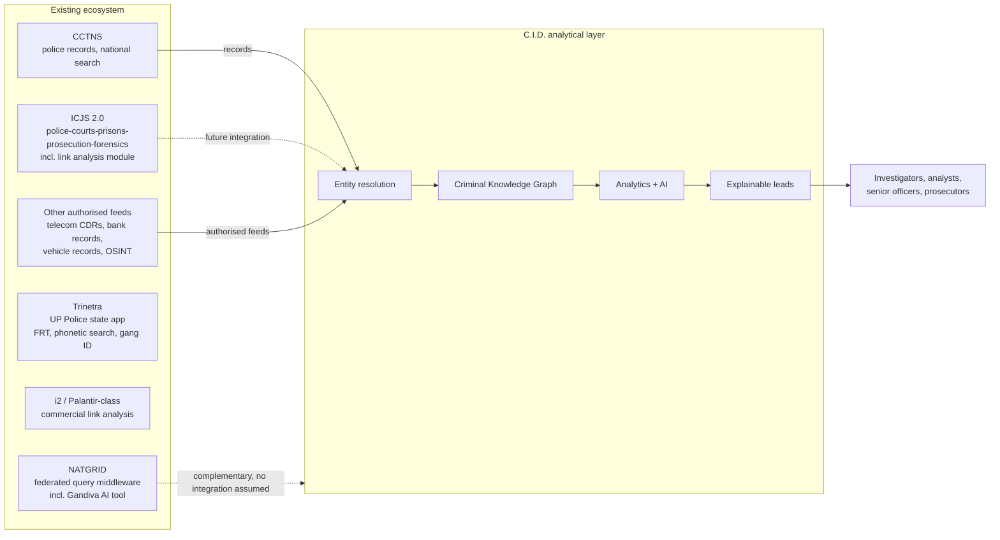

Dashed arrows are `[FUTURE]` or `[OPEN]`; no integration with any government system exists or is assumed.

### 05.2 System-by-system analysis

#### CCTNS — Crime and Criminal Tracking Network & Systems (NCRB)

| Aspect | Content |
|---|---|
| What it does | Digitises and networks police records nationally. |
| Relevant capabilities | Per S1: 17,130 police stations plus ~6,000 higher offices; 28 crore+ records; 99%+ of FIRs filed via CCTNS; national search by name, vehicle and modus operandi; the base on which ICJS is built. `VERIFY` — a later figure of 17,762 police stations (as of 1 June 2026) was reported in S3 review notes; the "28 crore+" figure may be dated (C-08). |
| Relationship to C.I.D. | Primary upstream source of FIRs and criminal history (DS-01, DS-10). C.I.D. consumes CCTNS-derived records; it does not duplicate CCTNS functions. |
| Gap C.I.D. addresses | CCTNS search returns *records*, not *networks*. It is built for retrieval, not relationship inference. |
| What C.I.D. should NOT claim | That CCTNS lacks analytics entirely; that C.I.D. replaces CCTNS; outdated counts presented as current. |

#### ICJS 2.0 — Interoperable Criminal Justice System

| Aspect | Content |
|---|---|
| What it does | Links police, courts, prisons, prosecution and forensics. |
| Relevant capabilities | Includes a **Criminal Network Link Analysis module**. NCRB also runs UNIFY photo matching. S1 flags this as "the closest existing thing to our proposal." |
| Relationship to C.I.D. | C.I.D. positions as a layer on top of ICJS-held data, not a replacement. ICJS API integration is `[FUTURE]`. |
| Gap C.I.D. addresses | Per S1: ICJS link analysis operates on police-system data; S1 states it does not fuse CDR, financial and OSINT data and does not perform deep-learning anomaly detection or provide explainability. `VERIFY` — the internal capabilities of the module are not fully publicly documented. |
| What C.I.D. should NOT claim | That ICJS has no link analysis; that criminal link analysis is new in India; specific ICJS limitations beyond what is verifiable. |

#### NATGRID — National Intelligence Grid (MHA)

| Aspect | Content |
|---|---|
| What it does | Federated query middleware connecting user agencies to data providers. |
| Relevant capabilities | Per S1 (verified there): ~21 data-provider categories; ~10–11 user agencies; access extended to state police up to Superintendent of Police (SP) rank; ~45,000 queries/month; operational since 2023; uses an AI tool named "Gandiva" for cross-database suspect linking; National Population Register (NPR) integration explored; outside RTI purview; no dedicated parent statute. |
| Relationship to C.I.D. | Complementary. No integration is assumed. Any future relationship is `[OPEN]` (Q-ARC-06). |
| Gap C.I.D. addresses | NATGRID is a *query* platform: an officer must know whom to ask about. C.I.D. aims to help identify which network deserves attention. |
| What C.I.D. should NOT claim | That NATGRID has no AI (Gandiva exists); anything that frames NATGRID as deficient. S3 review notes warn that the evaluator may be from MHA, which operates NATGRID. Frame as complementary. |

#### Trinetra (Uttar Pradesh Police / Staqu)

| Aspect | Content |
|---|---|
| What it does | Mobile application over state criminal records. |
| Relevant capabilities | Launched December 2018 by UP Police with Staqu; ~5 lakh (500,000) records; facial recognition, phonetic search, gang identification. |
| Relationship to C.I.D. | Comparable state-level system; no relationship. |
| Gap C.I.D. addresses | Per S1: state-scoped, biometric-first, no financial or temporal graph reasoning, no explainability layer (`VERIFY` for current capabilities). |
| What C.I.D. should NOT claim | `[DEPRECATED]` "over 900,000 records" (corrected to ~5 lakh). `[DEPRECATED]` the nickname "Crime GPT" (not a real designation). That Trinetra has no name matching — it has phonetic search (see C-12). |

#### Commercial link-analysis platforms (i2 Analyst's Notebook, Palantir-class)

| Aspect | Content |
|---|---|
| What it does | Mature link-analysis and investigation interfaces. |
| Relevant capabilities | Mature visual link analysis; established in law-enforcement use worldwide. |
| Relationship to C.I.D. | Alternative approach; C.I.D. does not integrate with them. |
| Gap C.I.D. addresses | Per S1: foreign, expensive, licence-bound; in traditional i2 workflows the analyst builds the chart manually; no Indic-language entity resolution. |
| What C.I.D. should NOT claim | That Palantir-class platforms are manual-only (they perform automated data integration — the "manual chart" characterisation applies mainly to traditional i2 workflows; `VERIFY`); an absolute "no Indic entity resolution" claim without verification; a licence/foreign-vendor criticism while C.I.D. itself uses Neo4j (C-07). |

### 05.3 Positioning statement `[DECIDED]`

> **Existing systems contain or provide access to data; C.I.D. focuses on turning fragmented records into relationships, relationships into networks, and networks into prioritised, explainable intelligence.** C.I.D. is designed as a complementary analytical layer over lawfully held data, adding multimodal fusion (police + telecom + financial + open-source), Indic-native entity resolution, learned anomaly detection, and explainability.

---

## 06. C.I.D. CONCEPT

*Sources: S1 §1, §4, §6.1, §7, §11; S2 (six-stage transformation and principle list).*

### 06.1 The central transformation `[DECIDED]`

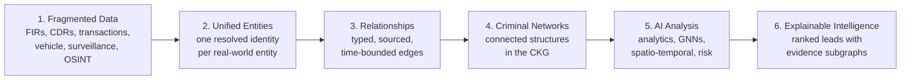

The six-stage form (S2) is canonical. S1 and the deck use a five-stage form — *fragmented data → unified entities → relationship graph → AI detection → explainable intelligence* — which is the same transformation with stages 3–4 combined. The two are consistent.

| Stage | What happens | Output | Principal risk | Section |
|---|---|---|---|---|
| 1. Fragmented Data | Authorised records arrive with source system, ingestion time and legal basis attached | Provenance-tagged raw records | Missing or unlawful data | 08, 10 |
| 2. Unified Entities | Parsing, normalisation, extraction and entity resolution collapse variants into one entity | Resolved entities with confidence | False merges / false splits | 10, 11 |
| 3. Relationships | Typed edges connect entities, each carrying source record, confidence, validity window and legal basis | Typed, sourced edges | Extraction errors; misclassified evidence class | 09, 12 |
| 4. Criminal Networks | Edges from many sources converge in one heterogeneous, temporal graph; connected structures emerge | The CKG | Spurious connectivity; boundary ambiguity | 12 |
| 5. AI Analysis | Graph analytics, GNNs and spatio-temporal analysis score entities, sets and networks; risk engine fuses scores | Scores, embeddings, predicted links, alerts | False positives; bias; opacity | 13–17 |
| 6. Explainable Intelligence | Every alert is paired with an evidence subgraph and a plain explanation separating documented facts from inferences | Explained, prioritised leads | Over-reliance; explanation infidelity | 18, 19 |

### 06.2 Architectural centre of gravity `[DECIDED]`

The heterogeneous graph is the pivot between multimodal input and every downstream intelligence product. **Everything above the graph is construction; everything below it is inference.** This split is also the evidence boundary: construction produces documented and derived relationships; inference produces AI-Inferred Leads (Section 19).

### 06.3 Core principles

| Principle | Meaning | How C.I.D. enforces it | Status |
|---|---|---|---|
| **Evidence first** | Every documented relationship must trace to a source record | `source_record_id` is mandatory on every edge; click-through to the source record (F-01) | `[DECIDED]` |
| **Human-in-the-loop** | Humans decide; the system suggests | Human review band in entity resolution; human decision required for every enforcement action | `[DECIDED]` |
| **Explainability** | No alert without a reason a human can check | Evidence subgraph and feature attribution attached to every alert | `[DECIDED]` |
| **Traceability** | Any output can be reproduced and attributed later | Model version pinning, deterministic replay, immutable audit, hash-chained export | `[DECIDED]` |
| **Confidence-aware intelligence** | Uncertainty is shown, never hidden | Confidence on every edge and entity; confidence bands on alerts; low-confidence links visually distinguished | `[DECIDED]` |
| **Separation of evidence and inference** | AI hypotheses never look like documented facts | Evidence classes DOCUMENTED / DERIVED / INFERRED with distinct visual encoding (F-02) | `[DECIDED]` principle; encoding `[PROPOSED]` |
| **Privacy and proportionality** | Intrusion must satisfy the Puttaswamy proportionality test | Purpose limitation at query time; tiered authorisation; data minimisation; sunset deletion | `[DECIDED]` |
| **Investigator control** | The investigator steers the analysis | Filters, expansion, review queues, dismissal of leads; the AI digs, the human decides | `[DECIDED]` |
| **Safeguards in architecture, not policy** | Controls are system behaviour | Queries without case ID and legal basis are rejected, not merely logged | `[DECIDED]` |
| **Precision over recall for identity** | A wrong merge is worse than a missed merge | Auto-merge only at ≥ 0.95; entity-resolution precision is the priority metric | `[DECIDED]` |
| **Networks and transactions, not demographics** | Score behaviour and structure, never groups of people | Protected attributes excluded as features; proxies audited | `[DECIDED]` |

### 06.4 Preserved positioning lines

| Line | Use |
|---|---|
| "Every existing system answers 'tell me about this person.' C.I.D. is designed to answer 'which network should I be looking at, and why?'" | Positioning (comparative form; see C-12) |
| "The person who matters is not necessarily the person with the most connections." | Network analysis (KPP-1) |
| "Police already have the data. What they don't have is the *shape* of the organisation." | Value proposition |
| "`source_record_id` and `legal_basis` are what make the graph evidence rather than speculation." | Provenance (applies to documented edges; see C-02) |
| "A wrong merge in a criminal graph means an innocent person inherits someone else's network." | Entity resolution stakes |
| "'Risk = 94%' is not probable cause." | Explainability |
| "Every agency gets the detection capability of the whole country's data, and no agency gives up its data." | Federated learning (`[FUTURE]`) |

---

## 07. USERS & USE CASES

*Sources: S1 §5, §8.10, §11.5, §14. Governance roles in 07.6 are `[PROPOSED]`; authority levels are `[ASSUMPTION]` pending operational input.*

### 07.1 Investigating Officer (IO)

| Aspect | Description |
|---|---|
| Role | Officer responsible for investigating a registered case |
| Information needs | "Who else is involved in my case?" — associates, phones, vehicles, accounts, linked FIRs |
| Problems faced | Associates scattered across unlinked systems and spellings; no time for manual cross-referencing |
| What C.I.D. provides | Entity 360° and one-click network expansion from an FIR; hidden-link suggestions; co-location analysis |
| Key workflows | UC-01, UC-02, UC-06, UC-08, UC-09, UC-11 |
| Expected outputs | Linked entities with source records; case-scoped subgraphs; evidence export |
| Level of authority | Queries limited to assigned cases and jurisdiction (RBAC + ABAC); sensitive data subject to authorisation tier `[ASSUMPTION]` |
| Must NOT treat AI output as | Evidence of involvement. An AI-Inferred Lead is a reason to investigate, not a finding. |

### 07.2 Crime Analyst / SCRB Analyst

| Aspect | Description |
|---|---|
| Role | Analyst supporting investigations and pattern analysis, including at a State Crime Records Bureau (SCRB) |
| Information needs | "Which of these 400 accounts matter?" — structure, ranking, communities, anomalies |
| Problems faced | Manual chart-building bounded by personal reading; alert overload |
| What C.I.D. provides | Ranked key-player list with fragmentation impact; community detection; alert queue ranked for precision@K; network evolution replay |
| Key workflows | UC-03, UC-05, UC-06, UC-07, UC-10 |
| Expected outputs | Key-player sets, network briefs, triaged alerts |
| Level of authority | Analytical access within authorised scope; cannot action enforcement `[ASSUMPTION]` |
| Must NOT treat AI output as | A ranking of culpability. Structural importance is not guilt. |

### 07.3 Financial Investigator (e.g., FIU / ED, as named in S1)

| Aspect | Description |
|---|---|
| Role | Investigator tracing proceeds of crime and laundering |
| Information needs | "Trace where this money actually went." |
| Problems faced | Layering through shells and mules; multi-hop paths across institutions |
| What C.I.D. provides | Multi-hop fund-flow map with per-hop retained value; shell-company and mule-network typologies |
| Key workflows | UC-04, UC-06, UC-11 |
| Expected outputs | Fund-flow paths with transaction references |
| Level of authority | Inter-agency access `[ASSUMPTION]` A-05 |
| Must NOT treat AI output as | Proof of laundering. A flow pattern matching a typology may have lawful explanations. |

### 07.4 Senior Officer / Command

| Aspect | Description |
|---|---|
| Role | Supervises investigations and allocates resources |
| Information needs | "Where do I put my limited teams?" |
| Problems faced | No prioritised cross-network view |
| What C.I.D. provides | Prioritised network risk queue; resource-allocation view (S1; interface not yet specified — Q-UX-03) |
| Key workflows | UC-05, UC-07, UC-14 |
| Expected outputs | Ranked networks with confidence bands and explanations |
| Level of authority | Supervisory; may approve escalation `[ASSUMPTION]` |
| Must NOT treat AI output as | A mandate to act. Risk ranking supports allocation decisions; it does not make them. |

### 07.5 Prosecutor

| Aspect | Description |
|---|---|
| Role | Assesses whether findings can support prosecution |
| Information needs | "Will this hold in court?" |
| Problems faced | Findings without provenance, reproducibility or audit trail |
| What C.I.D. provides | Evidence subgraph, confidence scores, source records, full audit chain, reproducible alert replay |
| Key workflows | UC-11, UC-12 |
| Expected outputs | Case-scoped evidence packages that separate documented evidence from inference |
| Level of authority | Read access to case packages `[ASSUMPTION]` |
| Must NOT treat AI output as | Admissible evidence. Only the underlying source records (with required certification) can be evidence; model outputs are investigative aids. |

### 07.6 Governance roles `[PROPOSED]`

S1 implies these roles without naming them.

| Role | Implied by | Responsibility |
|---|---|---|
| Entity-resolution reviewer | Human review band (0.75–0.95) | Accept or reject proposed merges; the reviewer's identity and qualification are `[OPEN]` (Q-SEC-03) |
| Supervisory officer | Human decision for enforcement; tiered authorisation | Approve escalations and sensitive-data access |
| Auditor / oversight | "Audit the auditors" | Review access logs, model changes, fairness dashboard |
| Model governance owner | Version pinning, drift monitoring, revalidation | Approve model changes |
| Designated authorising authority | Judicial / designated-authority approval for telecom and financial data | Grant access for highly sensitive tiers (legal status `[OPEN]`, Q-LEG-02) |

### 07.7 Use-case catalogue

| ID | Use case | Primary actor | C.I.D. behaviour | Output | Status |
|---|---|---|---|---|---|
| UC-01 | Expand a network from an FIR | IO | Resolve FIR entities; expand typed neighbourhood within authorised scope | Case-scoped subgraph with source links | `[DECIDED]` |
| UC-02 | Resolve an identity across sources | IO, ER reviewer | Show resolved entity, aliases, match evidence, review status | Golden entity profile | `[DECIDED]` |
| UC-03 | Identify key players in a network | Analyst | Compute centrality, communities, KPP-1/KPP-2 sets | Ranked key-player sets with fragmentation / reach impact | `[DECIDED]` |
| UC-04 | Trace a multi-hop fund flow | Financial investigator | Follow `TRANSFERRED_FUNDS_TO` chains with amounts and retained value | Fund-flow map | `[DECIDED]` |
| UC-05 | Triage the alert queue | Analyst, senior officer | Rank alerts by risk and confidence | Prioritised queue | `[DECIDED]` |
| UC-06 | Understand why an alert fired | IO, analyst | Show evidence subgraph, contributing records, features, fidelity | Explanation panel | `[DECIDED]` |
| UC-07 | Simulate network disruption | Analyst, senior officer | Remove selected node(s)/set; recompute structure | Fragmentation effect (see C-10 for succession claims) | `[DECIDED]` feature; scope `[OPEN]` |
| UC-08 | Review hidden-link suggestions | IO, analyst | Present predicted links as AI-Inferred Leads with rationale | Confirm / dismiss / investigate | `[DECIDED]` feature; method `[PROPOSED]` |
| UC-09 | Analyse co-presence | IO, analyst | Cluster tower-level presence in time windows | `CO_LOCATED_WITH` candidates with frequency and window | `[DECIDED]` |
| UC-10 | Replay network evolution | Analyst | Time-slider over `valid_from`/`valid_to` | Network state at time *t* | `[DECIDED]` |
| UC-11 | Build a case file and export | IO, prosecutor | Attach entities/subgraphs to a case; export with hash and audit trail | Evidence package | `[DECIDED]` |
| UC-12 | Assess court-readiness | Prosecutor | Show provenance, evidence class, model version, replayability | Readiness view | `[PROPOSED]` |
| UC-13 | Audit access and model use | Auditor | Query append-only audit log | Audit reports | `[DECIDED]` capability; interface `[PROPOSED]` |
| UC-14 | Allocate investigative resources | Senior officer | Network risk queue across cases in jurisdiction | Allocation view | `[DECIDED]` need; design `[OPEN]` |

---

## 08. DATA SOURCES

*Sources: S1 §1, §2, §6, §7, §8.1–8.3, §8.6, §11. Only fields named in S1 are listed as fields. Anything else is marked `[OPEN]` (field availability unconfirmed).*

### 08.1 Taxonomy overview

| Class | Sources |
|---|---|
| Police records | DS-01 FIRs; DS-02 police reports and case notes (including legacy PDF dumps); DS-10 criminal history |
| Telecom | DS-03 CDRs |
| Financial | DS-04 financial transactions; DS-05 bank / account information |
| Registries | DS-06 vehicle records; DS-11 company registration records |
| Surveillance and movement | DS-07 surveillance records; DS-12 travel records |
| Intelligence and open source | DS-08 intelligence reports; DS-09 social media intelligence |

Status: FIRs, CDRs, financial records, surveillance data and social media intelligence are named in the problem statement `[DECIDED]`. Vehicle records, travel records and company registration records appear in S1's architecture and ontology but have no defined feed `[PROPOSED]`.

### 08.2 Source matrix A — content

| ID | Source | Nature | Structure | Fields established in S1 | Entities | Relationships |
|---|---|---|---|---|---|---|
| DS-01 | FIR | Formal complaint/case registration with narrative | Semi-structured (header fields + free-text narrative) | FIR_no, section_of_law (IPC/BNS), datetime; narrative. Extractable types: Accused, Victim, Witness, Alias, Statutory Offence, Document Type, Property/Article, Location, Vehicle, Weapon, Date/Time | Person, Event, Location, Vehicle, Organization | `ACCUSED_IN`, `ASSOCIATED_WITH`, `OWNS`; victim/witness roles have no edge type (C-13) |
| DS-02 | Police reports, case notes, legacy dumps | Narrative text; scanned documents | Unstructured; may require OCR | None defined `[OPEN]` | Any | Any extractable relation |
| DS-03 | CDR | Telecom metadata | Structured | Calling/called numbers, timestamp, duration, cell_tower; IMSI; operator; activation_date (PhoneNumber attributes). IMEI appears only as a Device attribute; whether CDR feeds provide it is `[OPEN]` | PhoneNumber, Location (cell tower), Device | `CALLED`, `PRESENT_AT` (via tower), `REGISTERED_TO` (from subscriber data) |
| DS-04 | Financial transactions | Movement of value between accounts | Structured | amount, timestamp, channel, txn_id | BankAccount | `TRANSFERRED_FUNDS_TO` |
| DS-05 | Bank / account information | Account master data | Structured | account_hash, IFSC, holder_ref, open_date, KYC_status | BankAccount, Person, Organization | `OWNS` |
| DS-06 | Vehicle records (registration; e-challan) | Registration and traffic enforcement | Structured | reg_no, make, owner_ref; plate number in e-challan records. e-challan time/place fields `[OPEN]` | Vehicle, Person, Location | `OWNS`, `REGISTERED_TO`, possibly `PRESENT_AT` `[OPEN]` |
| DS-07 | Surveillance records | Observations of presence or activity | Unknown `[OPEN]` | None defined `[OPEN]` | Person, Device, Location, Vehicle | `PRESENT_AT` |
| DS-08 | Intelligence reports | Analyst/agency narrative | Unstructured | None defined `[OPEN]` | Any | Any extractable relation |
| DS-09 | Social media intelligence (OSINT) | Public/obtained social content | Unstructured, code-mixed | Handles (e.g., Telegram) | Person; handle has no node type (Q-DAT-03) | `ASSOCIATED_WITH` (extracted) |
| DS-10 | Criminal history | Prior FIRs, arrests | Structured (CCTNS) | Event: event_id, type (FIR/arrest/meeting), section_of_law, datetime | Person, Event | `ACCUSED_IN` |
| DS-11 | Company registration records | Corporate registry data (source system `[OPEN]`) | Structured | reg_no, name, incorporation_date, registered_address, directors[] | Organization, Person, Location | `OWNS` (stake_pct); directorship has no edge type (C-13) |
| DS-12 | Travel records | Movement records | Unknown `[OPEN]` | None defined `[OPEN]` | Person, Location, Event | `PRESENT_AT` |

### 08.3 Source matrix B — characteristics and inference

| ID | Temporal | Spatial | Evidence considerations | Data-quality concerns | What C.I.D. can infer |
|---|---|---|---|---|---|
| DS-01 | Registration datetime; incident time in narrative | Place of occurrence; police station | Primary documented source; historical FIRs use IPC, post-1 July 2024 FIRs use BNS | Spelling/script variation; code-mixing; incomplete narratives | Actors, roles, co-accused associations, offence types |
| DS-02 | Document date; embedded dates | Embedded places | Provenance of scanned originals must be preserved | OCR errors; layout noise | Additional entities and relations |
| DS-03 | Precise call timestamps and durations | **Cell-tower footprint only** — few hundred metres urban, kilometres rural | Telecom data is a highly sensitive tier requiring documented judicial/designated-authority approval | Subscriber ≠ actual user; shared/family phones; SIM swaps; burner numbers | Communication structure; co-presence within tower footprint; burner patterns |
| DS-04 | Precise transaction timestamps | Branch/ATM locations where available `[OPEN]` | Financial data is a highly sensitive tier; txn_id is the provenance anchor | Channel inconsistencies; split/merged records; mule accounts with KYC obtained via others | Fund-flow paths, pass-through ratios, velocity, structuring |
| DS-05 | open_date | Branch (IFSC) | Store hashes/references, not raw account numbers, where only matching is needed | Nominee/proxy holders; stale KYC | Account control; account age |
| DS-06 | Registration date; challan time `[OPEN]` | Challan location `[OPEN]` | — | Plate transcription errors; ownership ≠ use | Vehicle–person links; possible presence |
| DS-07 | `[OPEN]` | `[OPEN]` | Sensitivity tier `[OPEN]` | `[OPEN]` | Presence, co-presence |
| DS-08 | Report date | Embedded | Reliability grading of intelligence `[OPEN]` | Hearsay; unverifiable claims | Candidate relationships (should rarely be DOCUMENTED-class for the underlying fact) |
| DS-09 | Post timestamps | Rarely reliable | Lawful basis for collection must exist upstream; C.I.D. does not collect | Fake/shared handles; transliteration; sarcasm/idiom | Aliases; associations; intent signals (low confidence) |
| DS-10 | Event datetimes | Police-station jurisdiction | Court outcomes matter: an accused may be acquitted (outcome field `[OPEN]`, Q-DAT-06) | Stale records; name variants | Co-offending history; recidivism context |
| DS-11 | incorporation_date | registered_address | Public-registry provenance | Nominee directors; address reuse by service providers | Shell indicators: recent incorporation, shared directors/addresses |
| DS-12 | `[OPEN]` | `[OPEN]` | `[OPEN]` | `[OPEN]` | Movement corridors |

### 08.4 Cross-source convergence

The value of C.I.D. comes from sources converging on the same resolved entity. A `Person` resolved from an FIR (DS-01), linked to a `PhoneNumber` via subscriber registration (DS-03), to a `BankAccount` via KYC (DS-05), and to an `Organization` via directorship (DS-11) becomes a single node with four independent, sourced evidence trails. Each trail keeps its own provenance and legal basis (Section 12.7).

---
## 09. DATA MODEL & ONTOLOGY

*Sources: S1 §7, §8.2, §8.3, §8.4, §8.6. Node and edge types and their attributes are `[DECIDED]` (S1: "what you actually implement"). Meanings, temporal semantics and evidence requirements are v2.0 elaborations `[PROPOSED]` unless marked otherwise.*

### 09.1 Ontology design principles `[DECIDED]`

1. **Typed, not generic.** Nodes and edges carry types. A generic "person-connected-to-person" graph destroys the semantics that detection depends on.
2. **Provenance on every edge.** No edge exists without its source record, confidence, ingestion time, validity window and legal basis.
3. **Time is first-class.** Relationships have validity intervals, enabling "what did the network look like on date *t*" queries.
4. **Identifiers minimised.** Store hashes and references rather than raw personal identifiers wherever an identifier is needed only for matching (`account_hash`, `msisdn_hash`).
5. **Offence codes normalised across legal regimes.** IPC and BNS sections map to one common crime ontology.

### 09.2 Node (entity) types

| Type | Meaning | Attributes (S1) | Typical sources | Temporal semantics | Confidence | Evidence requirement |
|---|---|---|---|---|---|---|
| `Person` | One real-world individual, as resolved by entity resolution | entity_id, canonical_name, aliases[], DOB, gender, resolution_confidence | DS-01, 02, 05, 08, 09, 10, 11 | Aliases and attributes accumulate over time; each should retain its source `[PROPOSED]` | resolution_confidence | Every alias and attribute traceable to at least one source record `[PROPOSED]` |
| `Organization` | A registered or described legal/business entity | reg_no, name, incorporation_date, registered_address, directors[] | DS-11, DS-01 | incorporation_date anchors "recently incorporated" signals | Resolution confidence `[PROPOSED]` | Registry record or extracting document |
| `BankAccount` | A financial account | account_hash, IFSC, holder_ref, open_date, KYC_status | DS-04, DS-05 | open_date anchors account age and holding time | Identifier-based; high when matched on hash | Bank record reference |
| `PhoneNumber` | A mobile subscription identifier | msisdn_hash, IMSI, operator, activation_date | DS-03 | activation_date anchors burner and batch-activation signals; MSISDN–IMSI mapping may change over time (SIM swap) `[PROPOSED]` | Identifier-based | CDR or subscriber record |
| `Vehicle` | A registered vehicle | reg_no, make, owner_ref | DS-06 | Ownership changes over time | Identifier-based; plate transcription can err | Registration or challan record |
| `Location` | A place or spatial footprint | geohash, lat, lon, type (residence / cell-tower / ATM / crime-scene) | DS-01, 03, 04, 06, 07, 12 | Static | Precision varies by type; a cell-tower Location is a footprint, not a point (precision attribute `[OPEN]`, Q-DAT-07) | Source record naming or implying the place |
| `Event` | Something that happened at a time | event_id, type (FIR / arrest / meeting), section_of_law, datetime | DS-01, DS-10 | Point in time | FIR/arrest: documented; "meeting": if detected rather than recorded, it is inferred (Section 19) | Source record for FIR/arrest; derivation for detected events |
| `Device` | A physical handset or device | IMEI, device_type | Unclear (C-14; Q-DAT-02) | Device–SIM pairing changes over time | Identifier-based | Source record |

**Entity identifiers.** Resolved entities receive stable, typed identifiers such as `PERSON_184729` `[DECIDED]` (format from S1 examples).

### 09.3 Edge (relationship) types

| Edge | From → To | Meaning | Properties (S1) | Typical source | Temporal semantics | Default evidence class `[PROPOSED]` | Evidence requirement |
|---|---|---|---|---|---|---|---|
| `ASSOCIATED_WITH` | Person → Person | A stated or observed association | strength, first_seen, last_seen, basis | DS-01, 08, 09 | Interval (first_seen–last_seen) | Depends on `basis`: DOCUMENTED if stated in a record; DERIVED if computed; INFERRED if predicted | `basis` must name the grounds; controlled vocabulary `[PROPOSED]` (Q-DAT-08) |
| `OWNS` | Person → Organization / Vehicle / BankAccount | Ownership or control | since, stake_pct | DS-05, 06, 11; text | From `since` | DOCUMENTED from registries/KYC; INFERRED or DERIVED when read from narrative text | Registry/KYC record, or extracting sentence plus classification |
| `TRANSFERRED_FUNDS_TO` | BankAccount → BankAccount | A movement of value | amount, timestamp, channel, txn_id | DS-04 | Point in time | DOCUMENTED | txn_id (see C-03 for Person/Organization endpoints in S1 examples) |
| `CALLED` | PhoneNumber → PhoneNumber | A call between subscriptions | timestamp, duration, cell_tower | DS-03 | Point in time with duration | DOCUMENTED | CDR row; per-call vs aggregated representation `[OPEN]` (Q-ARC-03) |
| `PRESENT_AT` | Person / Device → Location | Presence at a place | timestamp, dwell_time, source | DS-03, 06, 07, 12 | Point or interval | Phone-level presence DOCUMENTED; person-level presence DERIVED via `REGISTERED_TO` (subscriber ≠ user) | Source record plus attribution path (C-14: `PhoneNumber` is not an allowed "from" type) |
| `REGISTERED_TO` | PhoneNumber / Vehicle → Person | Registration in a person's name | date, document_type | DS-03 (subscriber data), DS-06 | From `date` | DOCUMENTED | Registration record. Registration is not proof of use. |
| `ACCUSED_IN` | Person → Event | Named as accused in an FIR/event | role, section, FIR_no | DS-01, DS-10 | Event time | DOCUMENTED | FIR. Accused is not convicted; outcome must be visible (Q-DAT-06). |
| `CO_LOCATED_WITH` | Person → Person | Repeated co-presence within a tower footprint and time window | location, window, frequency | Derived from `PRESENT_AT` | Window-bounded | DERIVED (deterministic) — becomes INFERRED if its inputs are inferred | Underlying `PRESENT_AT` records and clustering parameters |

### 09.4 Mandatory properties on every edge `[DECIDED]`

| Property | Meaning | Why it is mandatory |
|---|---|---|
| `source_record_id` | Identifier of the record that asserts the relationship | Provenance; "non-negotiable for court" (S1); enables click-through (F-01), deletion propagation, and replay |
| `confidence` | S1 definition: "how sure entity resolution was" | Uncertainty must travel with the edge (see C-01: this single field is overloaded) |
| `ingested_at` | When C.I.D. received the assertion | Audit; transaction-time history |
| `valid_from` / `valid_to` | When the relationship held in the real world | Temporal validity; enables "time-travel" queries |
| `legal_basis` | The authorisation under which the data was obtained and may be used | Purpose limitation; admissibility; tiered access |

> S1: "`source_record_id` and `legal_basis` are what make the graph evidence rather than speculation." This holds for **documented** edges. AI-inferred edges have no source record asserting them; their provenance is the model, its version, and the evidence subgraph that produced the inference (C-02).

### 09.5 Proposed provenance extensions `[PROPOSED]`

These fields make Lead-vs-Evidence Separation (F-02, `[DECIDED]`) implementable without overloading `confidence`.

| Property | Applies to | Meaning |
|---|---|---|
| `evidence_class` | Every edge | `DOCUMENTED` / `DERIVED` / `INFERRED` (Section 19) |
| `extraction_confidence` | Edges produced by NLP | Confidence of the entity–relation extractor |
| `resolution_confidence` | Edges whose endpoints were resolved | Minimum resolution confidence of the endpoints |
| `inference_confidence` | `INFERRED` edges | Model probability / score |
| `derived_from[]` | `DERIVED` and `INFERRED` edges | The edge and record IDs the derivation used |
| `model_version` | `INFERRED` edges | Pinned model that produced the edge |
| `method` | `DERIVED` and `INFERRED` edges | Rule, algorithm, or model name and parameters |
| `source_system` | Every edge | Originating system (CCTNS, telecom, bank…) |
| `authorisation_tier` | Every edge | Non-sensitive / sensitive / highly sensitive |
| `record_hash` | Every DOCUMENTED edge | Hash of the source record at ingestion (evidence integrity) |

### 09.6 Why provenance is fundamental

| Function | What breaks without provenance |
|---|---|
| Court use | No link can be tied to an admissible source record |
| Evidence-Linked Graph (F-01) | Nothing to click through to |
| Lead-vs-Evidence Separation (F-02) | Inferences become indistinguishable from facts |
| Sunset deletion | The system cannot find every edge that depends on a deleted record |
| Entity-resolution reversal | An unmerge cannot restore which record belonged to which entity |
| Deterministic replay | An alert cannot be reproduced eighteen months later |
| Audit and purpose limitation | Access to data cannot be tied to the legal basis permitting it |

S1: "Retrofitting provenance later is impossible." Provenance is therefore attached at ingestion (Section 10).

### 09.7 Why heterogeneous, not homogeneous `[DECIDED]`

A shared registered address between two companies is a strong collusion signal; a shared bank *branch* is statistically meaningless. A homogeneous graph cannot tell those apart. A heterogeneous graph, and a GNN trained on it, can. Typed **meta-paths** (e.g., `Person → OWNS → Organization → … → Person`) carry meaning that untyped paths lose.

### 09.8 Offence ontology `[DECIDED]`

Since 1 July 2024, the Bharatiya Nyaya Sanhita (BNS), Bharatiya Nagarik Suraksha Sanhita (BNSS) and Bharatiya Sakshya Adhiniyam (BSA) have replaced the IPC, CrPC and Indian Evidence Act. Historical FIRs use IPC sections; current FIRs use BNS sections. The offence ontology must map **both** into one common crime ontology. The mapping source and granularity are `[OPEN]` (Q-DAT-05).

### 09.9 Ontology gaps — candidate extensions `[OPEN]`

The S1 ontology does not yet represent several things that other S1 sections depend on. These are candidates, not decisions.

| Gap | Needed by | Candidate |
|---|---|---|
| Directorship | Shell-company typology (T-01); `Organization.directors[]` exists only as an attribute | `DIRECTOR_OF` (Person → Organization) |
| Victim / witness roles | FIR extraction types include Victim and Witness; only `ACCUSED_IN` exists | `VICTIM_IN`, `WITNESS_IN` (Person → Event), or a `role` on a generic edge |
| Phone–device pairing | Burner-phone trees (T-04); SIM-swap resilience | `USED_IN` / `PAIRED_WITH` (PhoneNumber ↔ Device) |
| Addresses as shared entities | Shell typology (shared registered addresses) | `REGISTERED_AT` (Organization/Person → Location) |
| Phone-level presence | CDR presence before attribution to a person | Allow `PhoneNumber` as a `PRESENT_AT` source (C-14) |
| Social media handles | DS-09 | `OnlineAccount` node type |
| Weapons, property/articles, documents | FIR extraction types | Node types or Event attributes |
| Candidate same-entity links (< 0.75) | Three-tier ER "log as possible link" | A `POSSIBLE_SAME_AS` candidate edge, always `INFERRED` |
| Source records as nodes | Provenance queries | `SourceRecord` node vs `source_record_id` property (Q-ARC-02) |

---

## 10. DATA PROCESSING PIPELINE

*Sources: S1 §6.2, §8.1, §8.2, §8.3. This section describes information transformation, not implementation.*

### 10.1 End-to-end flow

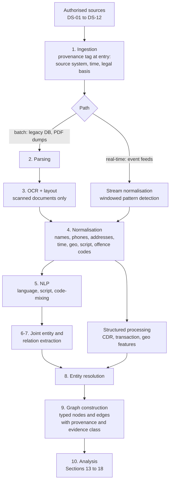

### 10.2 Stage descriptions

| # | Stage | Input → Output | Behaviour | Status |
|---|---|---|---|---|
| 1 | **Ingestion** | Source feeds → timestamped, provenance-tagged events | Two paths: batch ETL for legacy databases and document dumps; real-time streaming for event feeds. Every event carries source system, ingestion timestamp and legal basis from the moment it enters. | `[DECIDED]` |
| 2 | **Parsing** | Files/records → fields and text blocks | Structured fields are mapped to the source schema; free text is isolated for NLP. | `[DECIDED]` |
| 3 | **OCR** | Scanned pages → text with layout | Applies only to scanned or image documents. Multi-script OCR with layout awareness. OCR confidence should propagate to extraction confidence `[PROPOSED]`. | `[DECIDED]` stage; tools `[PROPOSED]` |
| 4 | **Normalisation** | Heterogeneous records → unified records | Names; phone formats (+91 / 0 / 10-digit); addresses; vehicle registration formats; timestamps to UTC with source time zone retained; coordinates to geohash; transaction schemas; script/language; IPC/BNS offence codes to a common crime ontology. Produces *candidate* identities; entity resolution assigns final IDs. | `[DECIDED]` |
| 5 | **NLP** | Text → linguistically processed text | Handles native scripts, Romanised Indic text and code-mixing (Section 14.2). | `[DECIDED]` |
| 6 | **Entity extraction** | Text → typed entity mentions | Domain types: Accused, Victim, Witness, Alias, Statutory Offence, Document Type, Property/Article, Location, Vehicle, Weapon, Date/Time. | `[DECIDED]` |
| 7 | **Relation extraction** | Text + mentions → typed relations | Performed **jointly** with entity extraction to avoid pipeline error propagation. | `[DECIDED]` |
| — | **Structured processing** | CDR, transaction, geo records → features and typed records | Transaction, CDR, geo and temporal feature extraction (velocity, pass-through, co-presence inputs). | `[DECIDED]` |
| 8 | **Entity resolution** | Mentions/records → resolved entities with confidence | Section 11. | `[DECIDED]` |
| 9 | **Graph construction** | Resolved entities + relations → CKG assertions | Upserts typed nodes and edges with temporal, spatial, confidence and provenance properties. Re-ingesting the same record must not duplicate edges; every edge receives an evidence class `[PROPOSED]`. | `[DECIDED]` |
| 10 | **Analysis** | CKG → scores, embeddings, alerts, explanations | Sections 13–18. | `[DECIDED]` |

### 10.3 Why joint extraction `[DECIDED]` / `[RESEARCH]`

The classic pipeline runs Named Entity Recognition (NER) first, then relation classification. Errors propagate: if NER misses a shell company, the relation extractor can never recover it. Joint models optimise both objectives together, so relational context improves entity recognition and vice versa. Span-based and table-filling architectures over a transformer encoder are the approaches S1 identifies as state of the art.

### 10.4 Worked extraction example `ILLUSTRATIVE`

> "Amit transferred ₹5 lakh to XYZ Enterprises through account 1234."

| Output (S1) | Type | Evidence class (v2.0 reading) |
|---|---|---|
| `Amit` | Person mention | — |
| `1234` | BankAccount mention | — |
| `XYZ Enterprises` | Organization mention | — |
| Amit → `TRANSFERRED_FUNDS_TO` → XYZ Enterprises [amount 500000] | Relation | DOCUMENTED *as a statement in the text* — but see C-03: the ontology defines `TRANSFERRED_FUNDS_TO` between BankAccounts only |
| Amit → `OWNS` → Account 1234 | Relation | **Not documented.** "Through account 1234" does not state ownership. This is an inference and must be classed INFERRED (or DERIVED with explicit rule), never DOCUMENTED. |

This example illustrates why evidence classes are needed at extraction time, not only at the AI layer.

### 10.5 Streaming path and entity resolution

S1 §8.1 describes the real-time path as *Source → connector → Kafka topic → Flink → normalised event → graph upsert*, which does not include entity resolution; the architecture (§6.1) places entity resolution before the graph for all data. Streaming events (calls, transactions) still need their identifiers resolved to entities. Incremental entity resolution on the streaming path is `[PROPOSED]`; the conflict is recorded as C-15.

### 10.6 Composite pattern detection on streams `[PROPOSED]`

Stateful stream processing with windowing enables detection of time-bounded composite patterns — for example, a spike in device co-location followed within 48 hours by rapid layered transfers — without waiting for a batch job. S1 names Complex Event Processing (CEP) on the stream as the mechanism. National-scale streaming is `[FUTURE]` (Section 30).

### 10.7 Confidence propagation `[PROPOSED]`

Each stage produces a confidence (OCR → extraction → resolution → inference). The confidence shown to an investigator for an edge must reflect the weakest upstream stage it depends on; the exact combination rule is `[OPEN]` (Q-AIM-06).

---

## 11. ENTITY RESOLUTION

*Sources: S1 §2, §3, §8.4, §12, §14; S3 (identity-resilience suggestion). S1 identifies entity resolution as "the highest-value component" and "the single highest-leverage technical contribution".*

### 11.1 Why entity resolution is necessary `[DECIDED]`

Entity resolution (ER) determines when multiple records refer to the same real-world entity. Every downstream result depends on it:

- **Too few merges (false splits):** the network fragments into disconnected islands and stays invisible.
- **Wrong merges (false merges):** two different people become one node, fabricating a network that does not exist.

S3 review notes put it directly: two records for "Veerappan" must collapse into one node when they are the same person — and two different Veerappans must not.

### 11.2 Variation types

| Variation | Examples (S1) | Why it occurs |
|---|---|---|
| Name variants | Mohammad Ali · Mohammed Ali · Md. Ali · Mohd Ali | No canonical spelling across databases; abbreviations |
| Spelling variants | Chatterjee · Chaterjee | Clerical variation |
| Formal vs anglicised forms | Chatterjee · Chattopadhyay | Historical and regional name forms |
| Transliteration shifts | Azhagiri · Alagiri (`zh`↔`l`, Tamil); `v`↔`w` (several southern scripts); `s`↔`sh` (Bengali) | Different romanisation conventions |
| Cross-script | Mohammad Ali · मोहम्मद अली; Raj Kumar · राज कुमार | Records in Devanagari and other Indic scripts vs Latin script |
| Spacing / segmentation | Raj Kumar · Rajkumar · Raj Kumaar | Word-boundary and vowel-length variation |
| Code-mixing | Romanised Hindi in notes and social media | Arbitrary script switching, non-standard spelling |
| Identifier formats | +91 / 0 / 10-digit phone formats | Inconsistent capture |
| Address variation | Free-text addresses | No standard format (normalisation method `[OPEN]`, Q-DAT-09) |

### 11.3 Why standard phonetic algorithms fail `[RESEARCH]`

Soundex and Double Metaphone encode English phonology. They cannot represent aspirated consonants (`bh`, `dh`, `gh`, `kh`), compound characters (`ksh`, `gy`, `jñ`), or regional transliteration shifts. Indic phonetic keys (S1: IndicSoundex / IndicMetaphone) map such variants to shared keys so that `Azhagiri` and `Alagiri`, or `Chatterjee` and `Chaterjee`, collapse to one key. S1 specifies a **custom** IndicSoundex; the availability and coverage of existing Indic phonetic libraries is `VERIFY` / `[OPEN]` (Q-AIM-02).

### 11.4 Methodology `[DECIDED]`

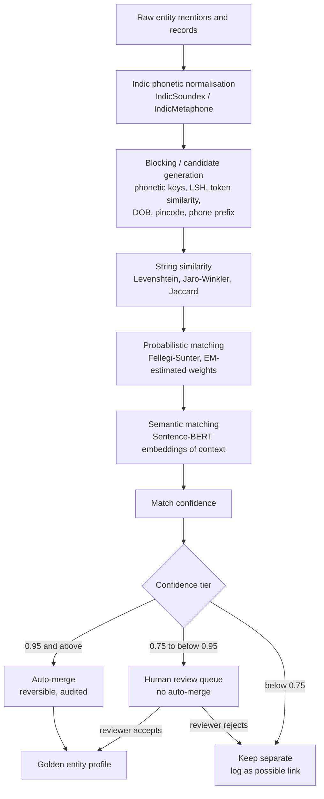

| Step | Purpose | Technique | Status |
|---|---|---|---|
| Indic phonetic normalisation | Collapse phonetic variants to shared keys | Custom IndicSoundex / IndicMetaphone | `[DECIDED]` approach; implementation `[PROPOSED]` |
| Blocking | Make comparison tractable | Phonetic keys, Locality-Sensitive Hashing (LSH) signatures, shared attributes (DOB, pincode, phone prefix) | `[DECIDED]` |
| String similarity | Score surface similarity | Levenshtein, Jaro-Winkler, Jaccard | `[DECIDED]` |
| Probabilistic matching | Weigh field agreements by informativeness | Fellegi-Sunter with Expectation-Maximisation (EM); Splink | `[DECIDED]` |
| Semantic matching | Use context (co-mentioned entities, roles) | Sentence-BERT embeddings | `[DECIDED]` |
| Confidence | Produce a decision-grade score | Combined match confidence | `[DECIDED]` concept; combination method `[OPEN]` (Q-AIM-03) |

### 11.5 Why blocking is mandatory `[DECIDED]`

Pairwise comparison over a national database is O(N²). At 10⁸ records that is on the order of 10¹⁶ comparisons. Blocking reduces the candidate space so that expensive matchers run only inside candidate groups. Blocking has its own failure mode: two records that never share a block can never be matched (a source of false splits; R-03).

### 11.6 Fellegi-Sunter in one line `[RESEARCH]`

Fellegi-Sunter learns, via expectation-maximisation, how much agreement on each field should count — agreement on a rare surname is worth far more than agreement on a common one — and produces a calibrated match weight rather than a hand-tuned threshold.

### 11.7 Identifier evidence and its limits

Shared hard identifiers (e.g., `shared_msisdn`, `dob_exact`) are strong match evidence (S1 output contract). They are not conclusive:

| Identifier | Why agreement may not mean identity |
|---|---|
| Phone number | Family or shared phones; reassigned numbers; SIM swaps |
| Address | Joint households; hostels; registered-office service addresses |
| DOB | Common dates; estimated DOBs in records |
| Bank account | Joint accounts; mule accounts operated by others |

Identity resilience across SIM swaps and handset changes (using IMSI–IMEI history) is `[PROPOSED]` (S3 review suggestion; depends on Q-DAT-02).

### 11.8 Three-tier resolution `[DECIDED]`

| Confidence | Action | Rationale |
|---|---|---|
| ≥ 0.95 | **Auto-merge** | High-confidence matches; still reversible and audited |
| 0.75 – 0.95 | **Human review queue** — do not auto-merge | The zone where automated error is most likely and most harmful |
| < 0.75 | **Keep separate**, log as possible link | Preserve the signal without asserting identity |

Boundary interpretation `[ASSUMPTION]`: auto-merge at [0.95, 1.00]; review at [0.75, 0.95); separate below 0.75. Thresholds are design values; they have not been calibrated on real data (R-03, Q-EVL-02).

### 11.9 False merges vs false splits

| Error | What happens | Impact | Controls |
|---|---|---|---|
| **False merge** | Two people become one entity | An innocent person inherits someone else's network, associates, and risk; a fabricated network may be flagged | Precision-optimised thresholds; mandatory human review band; merge evidence recorded; full reversibility; audit |
| **False split** | One person remains several entities | The network fragments; key players are missed | Indic phonetics; blocking on multiple keys; semantic matching; logging of possible links |

**Why false merges are particularly dangerous.** A false split loses intelligence; a false merge *creates false intelligence about a real person*. Because the graph propagates structure — centrality, community membership, risk — a single wrong merge can move an innocent person into the centre of a network. This is why entity-resolution precision is the priority metric (TARGET: > 0.98, Section 26) and why S1 insists on saying this explicitly.

### 11.10 Output contract `[DECIDED]` · `ILLUSTRATIVE` values

```json
{
  "entity_id": "PERSON_184729",
  "canonical_name": "Mohammad Ali",
  "aliases": ["Mohd Ali", "Md. Ali", "मोहम्मद अली"],
  "match_confidence": 0.96,
  "source_records": 17,
  "evidence": ["phonetic_key_match", "shared_msisdn", "dob_exact"],
  "review_status": "auto_accepted"
}
```

Note: the output contract uses `match_confidence`; the `Person` node uses `resolution_confidence`. Whether these are the same field is `[OPEN]` (C-09).

### 11.11 Reversibility and audit `[DECIDED]`

Every merge is audited with its evidence, and every merge is reversible (S1 risk Q&A). After an unmerge, every derived edge, analytic score and alert that depended on the merged entity must be recomputed or invalidated `[PROPOSED]`.

### 11.12 Classification of merged links `[OPEN]`

Section 19 defines Derived Relationships as produced by deterministic processing or data linkage, and AI-Inferred Leads as produced probabilistically. Probabilistic record linkage sits between the two. Whether an auto-merged identity (≥ 0.95) is treated as DERIVED and a human-confirmed merge as DERIVED-confirmed, or both as INFERRED, is `[OPEN]` (Q-AIM-05).

---

## 12. CRIMINAL KNOWLEDGE GRAPH

*Sources: S1 §6.1, §6.2, §7, §8.10. The CKG name is a v2.0 canonical label for S1's "heterogeneous graph" `[DECIDED]` as terminology.*

### 12.1 Purpose `[DECIDED]`

The Criminal Knowledge Graph (CKG) is the central representation layer of C.I.D. It persists typed nodes and edges with temporal, spatial, confidence and provenance properties, and it is the single substrate from which every analytic, AI and investigator view is produced.

### 12.2 Graph architecture

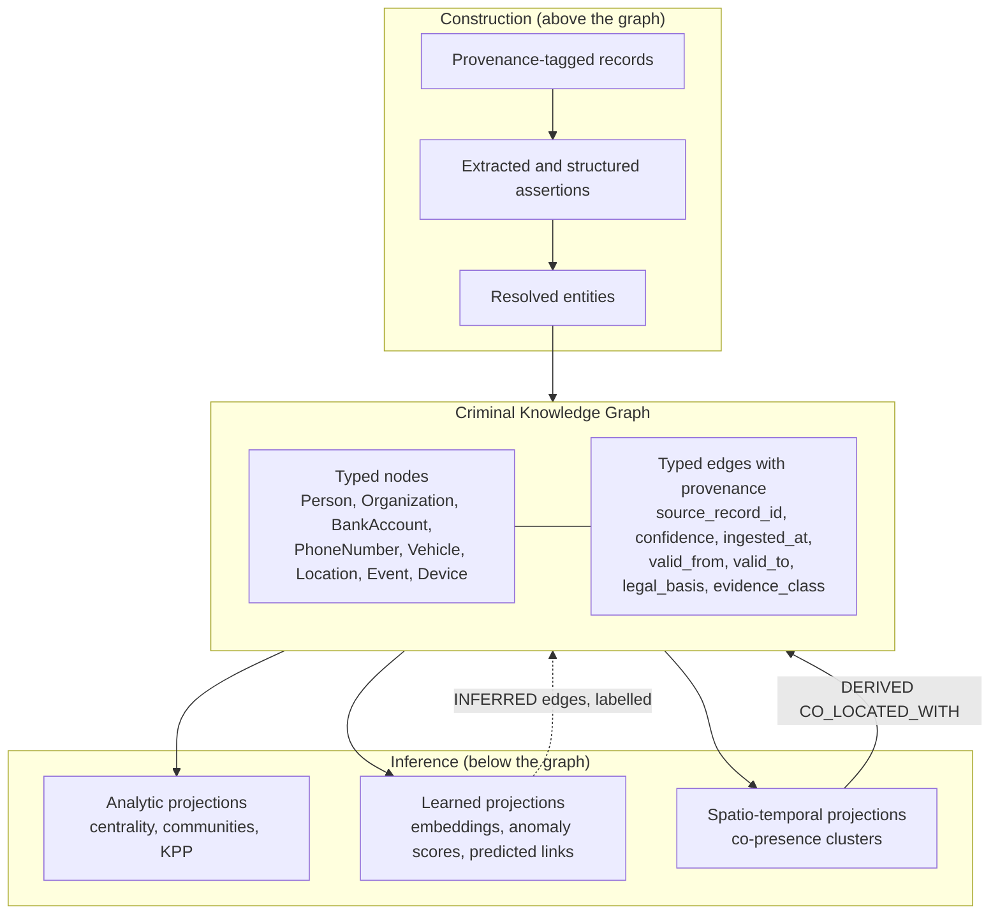

### 12.3 Node semantics

A node represents **one real-world entity as best resolved**. A node's identity is itself a claim with a confidence (`resolution_confidence`), not a certainty.

### 12.4 Edge semantics

An edge is an **assertion with provenance**: "record R, obtained under legal basis L, states (or C.I.D. derived, or a model inferred) that X relates to Y in way T during interval [valid_from, valid_to], with confidence c." Several edges of the same type between the same nodes may coexist when asserted by different records `[PROPOSED]` (multi-source corroboration, 12.8).

### 12.5 Heterogeneous graph `[DECIDED]`

The CKG has multiple node types and multiple edge types. Heterogeneity preserves the meaning of relationships so that analytics and GNNs can weigh relationship types differently (09.7). Meta-paths express typed patterns such as `Person → OWNS → Organization → … → Person`.

### 12.6 Temporal graph `[DECIDED]`

`valid_from` / `valid_to` record when a relationship held; `ingested_at` records when C.I.D. learned of it. Together they allow two different questions:

- "What did the network look like on date *t*?" (valid time — used by the Timeline and time-slider replay)
- "What did C.I.D. know on date *t*?" (ingestion time — needed for deterministic replay of an alert as it was generated)

This two-time-axis design is known as a bitemporal model `[RESEARCH]`; adopting the term is `[PROPOSED]`.

### 12.7 Provenance and source linkage `[DECIDED]`

Every edge links to its source record. Multiple sources converge on the same resolved entities, while each edge keeps its own provenance and legal basis. This allows the investigator to see not only *that* a relationship exists but *which records* support it and *under what authority* they were obtained.

### 12.8 Corroboration `[PROPOSED]`

When independent records support the same relationship (e.g., a KYC record and a registry record both show ownership), the CKG retains each as a separate supporting assertion. The count and independence of supporting sources is a natural input to confidence and to explanation.

### 12.9 Confidence in the graph `[DECIDED]`

Confidence travels on every edge and entity. Low-confidence links are visually distinguished, never hidden (S1 risk Q&A). The confidence taxonomy is Section 09.5 (C-01).

### 12.10 Graph evolution

| Change | Effect | Status |
|---|---|---|
| New record ingested | New assertions; entities may gain aliases or attributes | `[DECIDED]` |
| Entity merge / unmerge | Node identity changes; dependent analytics recomputed | `[DECIDED]` merge reversibility; recomputation `[PROPOSED]` |
| Sunset deletion | Assertions derived solely from deleted records are removed | `[DECIDED]` deletion; propagation `[PROPOSED]` |
| New derived edge (e.g., `CO_LOCATED_WITH`) | Added as DERIVED with `derived_from[]` | `[DECIDED]` |
| New inferred edge (link prediction) | Added as INFERRED, visually distinct, with model version | `[DECIDED]` separation; storage choice `[OPEN]` (Q-ARC-05: inferred edges in the CKG vs a separate overlay) |

### 12.11 Network boundaries `[OPEN]`

"A network" can be delimited in several ways, and S1 does not fix one:

| Boundary definition | Typical use |
|---|---|
| Connected component | Coarse grouping |
| Community (Louvain / Leiden) | Organisational clusters |
| Case-scoped subgraph | Investigation within an authorised case |
| Hop-limited neighbourhood of a seed entity | Network expansion from an FIR |
| Typology-matched subgraph | Alert evidence |

Which boundary a "network risk score" refers to is `[OPEN]` (Q-ARC-04). Purpose limitation (G-01) implies that investigator-facing networks are case-scoped by default `[PROPOSED]`.

### 12.12 Convergence example `ILLUSTRATIVE`

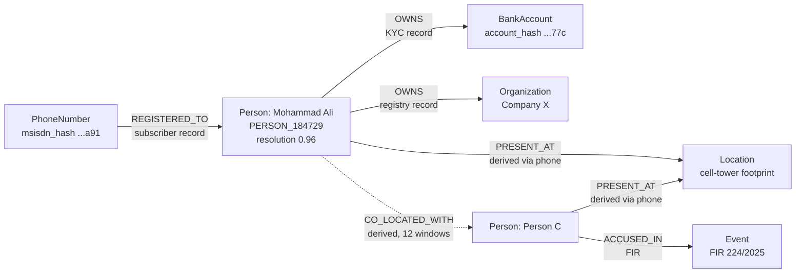

Four source classes (telecom, bank, registry, police) converge on one resolved person. Each edge label names its source class. The dotted edge is derived from the two `PRESENT_AT` edges, not stated by any record.

---
## 13. NETWORK ANALYSIS

*Sources: S1 §8.5, §10, §5; S3 (review notes on KPP computation and hop-depth). Algorithm properties are `[RESEARCH]`.*

### 13.1 Purpose `[DECIDED]`

C.I.D. applies graph analytics to the CKG to identify structurally important entities and sets of entities, communities, connecting paths, and structural change over time. These analytics are deterministic, fast and explainable, and S3 review notes observe that they would already deliver much of C.I.D.'s value before any machine learning is applied (see 14.13).

### 13.2 Methods

| Method | What it measures | What it contributes to C.I.D. | Caution | Status |
|---|---|---|---|---|
| Degree centrality | Number of direct connections | Identifies visible hubs | Visible hubs are often replaceable deputies; syndicates build redundancy around them | `[DECIDED]` |
| Betweenness centrality | How often a node lies on shortest paths between others | Identifies bridges and brokers between groups | Sensitive to missing edges; costly on large graphs (approximation needed at scale) | `[DECIDED]` |
| Eigenvector centrality / PageRank | Influence through connections to influential nodes | Identifies entities embedded in important parts of the network | Direction and edge-type weighting change results materially | `[DECIDED]` |
| Community detection (Louvain / Leiden) | Densely connected groups | Candidate organisational clusters; network boundaries (12.11) | A detected community is not necessarily an organisation; resolution parameter affects results. Leiden guarantees well-connected communities, which Louvain does not `[RESEARCH]` | `[DECIDED]` |
| Connected components | Reachability islands | Coarse grouping; fragmentation measurement | Dominated by giant components in dense data | `[DECIDED]` |
| Shortest / typed paths | How X connects to Y | "Show me how these two are linked" | A path's existence is weak evidence in dense graphs (C-06); rank paths by evidence class, edge type and confidence | `[DECIDED]`; evidence-ranked paths `[PROPOSED]` |
| KPP-1 (Key Player Problem, negative) | Which set of *k* nodes, if removed, maximally fragments the network | Disruption: who to interdict | Evaluates sets; computationally hard (13.7) | `[DECIDED]` |
| KPP-2 (Key Player Problem, positive) | Which set of *k* nodes reaches most of the network fastest | Diffusion: whom to surveil or where to place a source | Optimises coverage, not disruption | `[DECIDED]` |
| Network evolution | Change in structure over time | Emerging networks; behavioural shifts | Ingestion artefacts can look like real change (T-07) | `[DECIDED]` |

### 13.3 Why centrality alone is not "kingpin detection" `[DECIDED]`

Arresting the highest-degree node often fails to disrupt anything. Visible hubs are frequently replaceable, and organised groups deliberately build redundancy around them while insulating the principal. Centrality measures describe *individual* position; disruption depends on *sets* of nodes.

> **The person who matters is not necessarily the person with the most connections.**

### 13.4 The Key Player Problem (Borgatti) `[DECIDED]` / `[RESEARCH]`

Two distinct objectives; conflating them is a classic analyst error.

| | KPP-1 (negative / disruption) | KPP-2 (positive / diffusion) |
|---|---|---|
| **Question** | Which *k* nodes, if removed, maximally fragment the network? | Which *k* nodes reach the most of the network fastest? |
| **Metric** | Distance-weighted fragmentation | m-reach |
| **Operational use** | Whom to arrest / interdict | Whom to surveil / where to insert a source |
| **Key property** | Evaluates the **set**, not individuals — the best *k* is rarely the top-*k* by centrality | Optimises coverage, not disruption |

**The set-versus-individual point.** Two nodes may each be moderately central yet together form the only bridge between two halves of a syndicate. Ranking individuals never finds that pair.

### 13.5 Structural roles

| Role | Structural signature | Primary method | Interpretation |
|---|---|---|---|
| Bridge | Connects otherwise separate groups | Betweenness; KPP-1 | Removing it may split the network |
| Influencer | Reaches much of the network quickly | Eigenvector/PageRank; KPP-2 | Information or instruction may flow through it |
| Bottleneck | Few alternative paths around it | Betweenness; cut analysis | Choke point for flows (including funds) |
| Visible hub | Many direct connections | Degree | Often a replaceable operator |
| Insulated principal | High KPP-1 impact, low degree | KPP-1 vs degree comparison | Candidate for typology T-08 (Section 15) |

### 13.6 Network disruption

KPP-1 provides the structural basis for Network Disruption Simulation (F-04): remove a chosen node or set and measure the change in fragmentation, reachability and component structure. What structural simulation can and cannot show is discussed in Section 20 (F-04) and C-10 — in particular, predicting *who takes over* after a removal is not a structural calculation.

### 13.7 Computational note `[RESEARCH]` · `VERIFY`

Selecting the optimal key-player set is a combinatorial optimisation problem; exact solutions are impractical on large graphs, and practical approaches use greedy or heuristic search over candidate sets. The algorithm C.I.D. will use for KPP set selection is `[OPEN]` (Q-AIM-07).

### 13.8 Edge weighting `[DECIDED]` principle · weights `[OPEN]`

Analytics must weight relationships by type and context: a shared registered address between two companies matters far more than a shared bank branch. Without link-context weighting, the graph becomes a "hairball" where everything is connected. The weights themselves are `[OPEN]` (Q-AIM-08); in the GNN layer, heterogeneous attention learns type importance (14.9).

### 13.9 Interpretation guardrails `[DECIDED]`

- Structural importance is not culpability. A lawyer, accountant, shopkeeper or relative can occupy a bridge position legitimately.
- Missing data distorts centrality: an unrecorded relationship can make someone appear to be a bridge.
- Every structural finding is presented with the edges (and their evidence classes) that produce it.

---

## 14. AI / ML LAYER

*Sources: S1 §6, §8.3, §8.4, §8.7, §8.8, §8.9, §9, §12; S3 (deck statements on natural-language interaction; review notes on separating deterministic from learned claims). Model properties are `[RESEARCH]`; project status is given per component.*

> **Rule.** Listing a model here does not mean it must be implemented. The status column is binding.

### 14.1 AI responsibilities

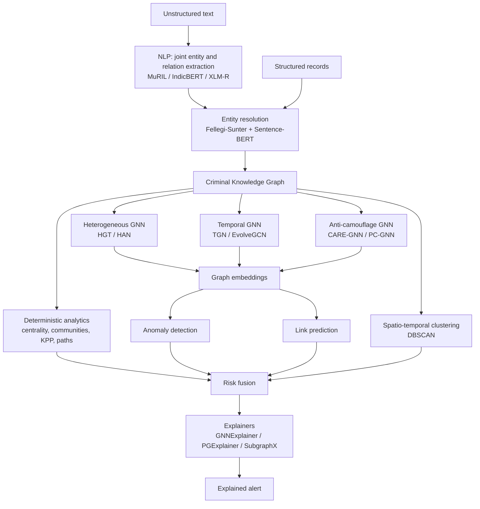

### 14.2 NLP

**Problem.** Extract typed entities and relations from multilingual, code-mixed, often Romanised text, without pipeline error propagation.

| Component | Problem addressed | Input | Output | Strength | Limitation | Status |
|---|---|---|---|---|---|---|
| Joint entity–relation extraction (span-based / table-filling over a transformer encoder) | Pipeline NER → RE propagates errors | Text | Typed entity mentions + typed relations with confidence | Relational context improves entity recognition and vice versa | Needs annotated Indian police-domain data (not available, Q-DAT-04) | `[DECIDED]` approach |
| **MuRIL** | Romanised Hindi / Hinglish in police notes and social media | Text | Contextual embeddings | Pre-trained on transliterated Indic text — the key property for code-mixed input `[RESEARCH]` | Coverage of rarer languages and domain slang | `[DECIDED]` as primary Indic encoder (prototype tier: fine-tuned MuRIL, single model) |
| **IndicBERT** (AI4Bharat) | Native-script regional FIRs | Text | Embeddings | Trained across major Indian languages `[RESEARCH]` | Weaker on Romanised text than transliteration-trained models | `[PROPOSED]` (ensemble teacher) |
| **XLM-RoBERTa (XLM-R)** | Transnational and unseen-language content | Text | Embeddings | 100+ languages; strong zero-shot transfer `[RESEARCH]` | Less Indic-specific | `[PROPOSED]` (fallback / ensemble teacher) |
| Multi-Teacher Knowledge Distillation (MTKD) | Inference cost of running three encoders on a national FIR stream | Soft probabilities of three teachers | One lightweight student | Near-teacher accuracy at a fraction of inference cost (S1 claim; `VERIFY` for this domain) | Student inherits teacher errors; needs unlabeled domain corpus | `[FUTURE]` |

**Code-mixing is the hard part.** *"Usne bola ki paisa hawala se bhejenge"* in Roman script defeats standard multilingual models — arbitrary script switching, non-standard spelling, culturally specific idiom. MuRIL's transliterated pre-training is S1's direct answer.

### 14.3 Entity-resolution models

Section 11. ML components: Fellegi-Sunter (EM-estimated field weights; Splink) and Sentence-BERT context embeddings — both `[DECIDED]`. Custom IndicSoundex — `[PROPOSED]` implementation of a `[DECIDED]` approach.

### 14.4 Graph neural networks

**Why not standard GCN / GraphSAGE.** Standard Graph Convolutional Networks (GCN) and GraphSAGE assume a single node type and lose semantics on a typed graph `[RESEARCH]`.

| Model | Problem addressed | Input | Output | Strength | Limitation | Status |
|---|---|---|---|---|---|---|
| **HGT** (Heterogeneous Graph Transformer) | Type heterogeneity | Heterogeneous graph with node features | Type-aware node embeddings; anomaly scores via a downstream head | Type-specific transformations and attention learn *which relationship type matters* `[RESEARCH]` | Needs labels or a self-supervised objective; compute on large graphs | `[DECIDED]` as core heterogeneous model |
| **HAN** (Heterogeneous graph Attention Network) | Semantic heterogeneity via meta-paths | Graph + meta-path definitions (e.g., `Person → OWNS → Organization → … → Person`) | Embeddings with node- and semantic-level attention | Meta-path attention is interpretable `[RESEARCH]` | Meta-paths must be designed by hand | `[PROPOSED]` (alternative to HGT) |
| **TGN** (Temporal Graph Network) | Networks evolve; sequence and recency matter | Continuous-time stream of interactions | Per-node temporal memory; time-aware embeddings | Captures sequence, recency, burstiness — S1: "decisive" for anti-money-laundering (AML), catching a mule account while funds are still in jurisdiction | Streaming training complexity; memory staleness | `[PROPOSED]` (advanced tier; S1 prototype mentions "a small TGN") |
| **EvolveGCN** | Evolving structure over snapshots | Graph snapshots | Embeddings whose GCN weights evolve over time | Handles changing node sets across snapshots `[RESEARCH]` | Snapshot granularity choice | `[PROPOSED]` (alternative temporal model) |
| **CARE-GNN** | Camouflage: fraudsters transact with legitimate nodes to dilute neighbourhood signals | Graph with relation types | Fraud scores with filtered neighbourhoods | Reinforcement-learning neighbour selector filters deceptive edges `[RESEARCH]` | Designed on fraud benchmarks; transfer to police data unproven | `[PROPOSED]` |
| **PC-GNN** | Extreme class imbalance (fraud < 1% of nodes) | Imbalanced labelled graph | Balanced-sampling fraud classifier | Label-balanced sampling `[RESEARCH]` | Requires labels | `[PROPOSED]` |

### 14.5 Anomaly detection

| Aspect | Content |
|---|---|
| Problem | Flag entities, edges or subgraphs whose structure or behaviour deviates from normal — including networks nobody queried for |
| Input | CKG (heterogeneous, temporal), node/edge features |
| Output | Anomaly scores feeding the risk engine, with an evidence subgraph from the XAI layer |
| Strength | Surfaces patterns not captured by hand-written rules |
| Limitation | Anomalous ≠ criminal. Labels are scarce; public benchmarks (Bitcoin, synthetic AML) differ from Indian police data (R-15). Training regime (supervised, semi-supervised, self-supervised) is `[OPEN]` (Q-AIM-01). |
| Status | `[DECIDED]` capability (HGT anomaly scores are core per S1 prototype prioritisation); models per 14.4 |

### 14.6 Link prediction (Hidden Link Prediction, F-03)

| Aspect | Content |
|---|---|
| Problem | Relationships that likely exist but were never recorded |
| Input | Graph embeddings; candidate entity pairs |
| Output | Predicted edges with `inference_confidence`, always classed `INFERRED` |
| Strength | Tells the investigator where to look next |
| Limitation | The most speculative output in C.I.D.; high false-positive risk in sparse or biased data; must never be rendered as documented |
| Evaluation | Hits@K and Mean Reciprocal Rank (MRR) `[PROPOSED]` (S3 review suggestion) |
| Status | `[DECIDED]` as feature (S2); method `[PROPOSED]` (GNN-embedding link scoring per S1 §8.7 diagram) |

### 14.7 Network / typology classification `[OPEN]`

Every alert carries a `detected_pattern` (named typology). S1 states each typology is "implementable as a graph query, a GNN signal, or both". Whether typology labels come from deterministic pattern queries, a learned classifier, or a hybrid is `[OPEN]` (Q-AIM-04). A hybrid — deterministic query for the documented pattern, GNN score for anomaly strength — is `[PROPOSED]`.

### 14.8 Risk scoring

Section 17. Model logits are never shown to investigators; scores are fused, calibrated, and reported with confidence bands `[DECIDED]`.

### 14.9 Temporal modelling

TGN and EvolveGCN (14.4); stream-window pattern detection (10.6); time-slider replay (Section 21). A benign transaction on Tuesday can be layering on Friday given what preceded it; temporal models capture that dependency.

### 14.10 Spatio-temporal clustering

DBSCAN for co-presence clustering (Section 16) `[DECIDED]`.

### 14.11 Explainers

GNNExplainer, PGExplainer, SubgraphX (Section 18).

### 14.12 Natural-language interaction `[PROPOSED]` · `[OPEN]`

S3 deck material describes investigators asking questions in normal language and receiving summaries, and an on-premise local AI model. S1 does not specify this capability. If adopted, it must obey these constraints `[PROPOSED]`:

- It may translate questions into graph queries and summarise retrieved subgraphs.
- It may never create, modify or upgrade edges, entities or evidence classes.
- Every sentence of a summary must be traceable to CKG elements; untraceable statements must not be shown.
- Summaries are presentation, not evidence.

Model choice, deployment and evaluation are `[OPEN]` (Q-AIM-09).

### 14.13 Deterministic vs learned claims `[PROPOSED]`

S3 review notes recommend making explicit which claims rest on deterministic methods and which on learned models, because learned components can err in ways that are harder to defend.

| Capability | Deterministic basis | Learned basis |
|---|---|---|
| Identity unification | Phonetic keys, string similarity, rules | Fellegi-Sunter weights (statistical), Sentence-BERT |
| Relationship construction | Structured records | Joint extraction from text |
| Key players | Centrality, KPP-1/KPP-2 | — |
| Communities | Louvain/Leiden | — |
| Co-presence | DBSCAN over tower-level presence | — |
| Typologies | Graph pattern queries | GNN anomaly signals |
| Hidden links | — | Link prediction (entirely learned) |
| Anomalies | Rule thresholds | GNN anomaly scores |

### 14.14 Training and validation data `[DECIDED]` strategy

1. Public benchmarks: Elliptic Bitcoin dataset; IBM Transactions for AML (AMLworld); synthetic AML graph generators.
2. Synthetic Indian-context data with injected ground-truth networks.
3. Retrospective validation on a historical solved case (requires real-data access; `[FUTURE]`).

`[DEPRECATED]` "TransXion" as a named AML benchmark ecosystem — not verifiable; removed in v1.0.

### 14.15 Model governance

Version pinning, drift monitoring, periodic revalidation, documented change control (Section 24, G-09).

---

## 15. DETECTION TYPOLOGIES

*Sources: S1 §10 (pattern names and graph signatures are `[DECIDED]`); S1 §8.6–8.9 (temporal and AI signals). All other attributes are v2.0 elaborations `[PROPOSED]`. No threshold values are established; regulatory reporting thresholds are `[OPEN]` (Q-DAT-10).*

A typology is a named pattern that C.I.D. can express as a graph query, a GNN signal, or both. Matching a typology produces a **lead**, never a finding.

### T-01 Shell-company layering

| Attribute | Content |
|---|---|
| Pattern | Funds passed through a chain of companies to distance their origin |
| Data signals | Organization.incorporation_date, directors[], registered_address; `TRANSFERRED_FUNDS_TO` amounts and timestamps |
| Graph structure (S1) | Chain of organisations with recent incorporation, common directors/addresses, high pass-through ratio, low retained value |
| Temporal signals | Short interval between incorporation and first transaction; rapid successive hops |
| AI signals | Heterogeneous attention weighting shared registered addresses and directors; anomaly score on the chain |
| Expected output | Alert with the chain as evidence subgraph; per-hop retained value in Fund Flow |
| Evidence required | Registry records for each company; transaction records for each hop |
| Possible false positives | Legitimate holding structures; payment aggregators; genuinely new businesses; registered-office service addresses shared by unrelated firms |
| Investigator interpretation | A reason to seek beneficial-ownership and financial records under proper authorisation |

### T-02 Mule-account network

| Attribute | Content |
|---|---|
| Pattern | Accounts used to receive and rapidly forward funds on behalf of others |
| Data signals | Account open_date, KYC_status; transaction amounts, timestamps, channels |
| Graph structure (S1) | Star / fan-out from a hub account; short holding time; amounts just under reporting thresholds |
| Temporal signals | Recently opened accounts; short dwell of funds; bursts |
| AI signals | TGN temporal memory; PC-GNN for imbalance; CARE-GNN against camouflage |
| Expected output | Hub and spoke accounts flagged, with holding-time distribution |
| Evidence required | Transaction and KYC records |
| Possible false positives | Payroll disbursement; merchant settlement; family remittances; gig-platform payouts |
| Investigator interpretation | Account holders may themselves be exploited; mule status does not establish knowing participation |

### T-03 Structuring / smurfing

| Attribute | Content |
|---|---|
| Pattern | Splitting value into many transactions below reporting thresholds |
| Data signals | Transaction amounts relative to thresholds; source account; timing |
| Graph structure (S1) | Many transfers below threshold, same source, tight time window |
| Temporal signals | Clustered in a narrow window |
| AI signals | Anomaly on amount distribution and velocity |
| Expected output | Grouped transactions with the threshold they cluster under |
| Evidence required | Transaction records |
| Possible false positives | Instalment payments; routine small payments; business with naturally small tickets |
| Investigator interpretation | Distinct from layering (T-01): structuring splits *amounts*, layering adds *hops* (see C-17) |

### T-04 Burner-phone tree

| Attribute | Content |
|---|---|
| Pattern | Short-lived numbers used to contact a controller while limiting exposure |
| Data signals | PhoneNumber.activation_date; `CALLED` edges; lifetimes |
| Graph structure (S1) | Short-lived MSISDNs, all calling one persistent number, activated in a batch |
| Temporal signals | Batch activation; short active lifetimes; replacement cycles |
| AI signals | Anomaly on phone subgraph; temporal pattern |
| Expected output | The persistent number and its tree of short-lived numbers |
| Evidence required | CDRs and subscriber records (highly sensitive tier) |
| Possible false positives | Corporate SIM batches; call centres; prepaid SIMs for travellers; family bulk purchases |
| Investigator interpretation | The persistent number is a lead to its user; `REGISTERED_TO` shows registration, not use |

### T-05 Hidden co-offending ring

| Attribute | Content |
|---|---|
| Pattern | People who act together but avoid direct recorded communication |
| Data signals | `PRESENT_AT` via tower data; absence of `CALLED` edges |
| Graph structure (S1) | High co-location frequency + zero recorded direct communication ("operational discipline is itself a signal") |
| Temporal signals | Repeated co-presence at unusual hours |
| AI signals | Co-presence clusters (DBSCAN); anomaly relative to communication graph |
| Expected output | `CO_LOCATED_WITH` edges (DERIVED) with window and frequency |
| Evidence required | Tower-level presence records; clustering parameters |
| Possible false positives | Co-workers, neighbours, residents of the same building; dense urban towers covering large populations. Absence of calls in CDRs does not mean absence of communication — messaging apps do not appear in CDRs |
| Investigator interpretation | Co-presence within a tower footprint, not a proven meeting |

### T-06 Trafficking corridor

| Attribute | Content |
|---|---|
| Pattern | Repeated movement of people along a route, with settlement at the endpoint |
| Data signals | Tower-sequence trajectories; travel records (DS-12, `[OPEN]`); transactions at endpoints |
| Graph structure (S1) | Repeated multi-person movement along the same route, with financial settlement at the endpoint |
| Temporal signals | Recurrence of the route; timing relative to payments |
| AI signals | Trajectory clustering; joint spatial–financial pattern |
| Expected output | Route, participants' devices, linked payments |
| Evidence required | Movement records and transaction records |
| Possible false positives | Commuters; labour migration; transport and logistics workers; pilgrims |
| Investigator interpretation | A route pattern is context for investigation, never identification of victims or offenders by itself |

### T-07 Emerging network

| Attribute | Content |
|---|---|
| Pattern | A new organisation forming |
| Data signals | Edge creation rates over time |
| Graph structure (S1) | Rapid densification of a previously sparse subgraph over a short window |
| Temporal signals | Change in density across windows |
| AI signals | TGN (S1: "TGN catches this") |
| Expected output | The densifying subgraph with its growth timeline |
| Evidence required | Records creating each new edge |
| Possible false positives | A new legitimate business or event; **ingestion artefacts** — a newly ingested data batch can create apparent densification that is really new visibility, not new activity (compare `valid_from` with `ingested_at`) |
| Investigator interpretation | S1's "anomaly alert before it matures" is a design aspiration, not a validated capability (R-19) |

### T-08 Kingpin / key-player identification

| Attribute | Content |
|---|---|
| Pattern | A principal deliberately insulated from direct activity |
| Data signals | Full network structure |
| Graph structure (S1) | High KPP-1 fragmentation impact but *low* degree centrality — the deliberately insulated principal |
| Temporal signals | Stable structural position across time windows |
| AI signals | KPP-1 set analysis; embeddings of structural role |
| Expected output | Key-player *sets* with fragmentation impact, compared against degree |
| Evidence required | Every edge underlying the structural position, with evidence classes |
| Possible false positives | Legitimate intermediaries (lawyers, accountants, relatives, shopkeepers); data gaps that make someone appear to be the only bridge |
| Investigator interpretation | "Kingpin" is the typology name only. The output is "structurally important", never "leader" |

---

## 16. SPATIO-TEMPORAL INTELLIGENCE

*Sources: S1 §7, §8.1, §8.6, §8.7, §8.10.*

### 16.1 Purpose `[DECIDED]`

CDR and surveillance data give the CKG a physical dimension. Spatio-temporal intelligence detects co-presence and movement patterns and feeds them back into the graph as edges — the loop that connects digital records to physical reality.

### 16.2 Location entities

`Location` nodes carry geohash, latitude, longitude and type: residence, cell-tower, ATM, crime-scene `[DECIDED]`. These types have very different precision: a crime scene or residence can be a point; a cell tower represents a footprint.

### 16.3 Events and time windows

`Event` nodes (FIR, arrest, meeting) anchor activity in time. Co-presence is defined over **time windows**; window size and the minimum number of repetitions are parameters `[OPEN]` (Q-AIM-10).

### 16.4 Co-location derivation `[DECIDED]`

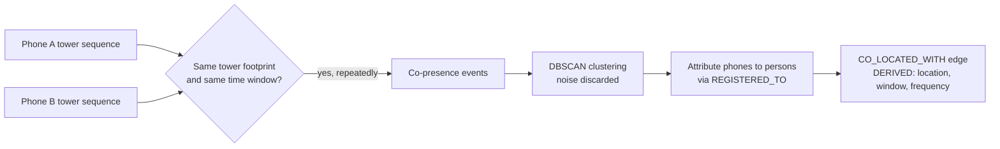

The phone-level observation is documented; the attribution from phone to person is a derivation through `REGISTERED_TO`, and registration is not proof of use.

### 16.5 Movement patterns

Sequences of tower observations form coarse trajectories. Repeated similar trajectories across multiple devices indicate corridors (T-06). Trajectory granularity is limited by tower density.

### 16.6 Cell-tower inference vs GPS tracking `[DECIDED]`

| | Cell-tower-level inference (what C.I.D. does) | Precise GPS tracking (what C.I.D. does not claim) |
|---|---|---|
| Source | CDR cell_tower field | Device GPS — not a C.I.D. source |
| Precision | A few hundred metres (urban) to kilometres (rural) | Metres |
| Correct phrasing | "Co-presence within a tower footprint" | "Was at", "met at" |
| Can identify a specific building? | No | Potentially |
| Evidence class of co-location | DERIVED | — |

> **Never claim GPS precision from CDRs.** A technically literate evaluator will catch it.

S1's illustrative sentence "twelve meetings at 2 a.m. at the same warehouse" implies building-level precision that tower data cannot provide unless another source (e.g., surveillance) places the devices at that building. The canonical phrasing is "twelve co-presence windows at 2 a.m. within the same tower footprint" (C-18).

### 16.7 Spatial clustering — DBSCAN `[DECIDED]` / `[RESEARCH]`

DBSCAN (Density-Based Spatial Clustering of Applications with Noise) finds arbitrarily shaped dense regions without pre-specifying the number of clusters, and explicitly labels outliers as noise. Both properties matter: crime hotspots are not spherical, and most co-location is coincidence that must be discarded. Parameters (neighbourhood radius and minimum points) are `[OPEN]`; they must respect tower footprint size.

### 16.8 Temporal clustering `[PROPOSED]`

Temporal signals include repeated co-presence at unusual hours, bursts of activity, and synchronised behaviour across entities (Timeline overlay). Joint space–time density clustering (e.g., ST-DBSCAN) is a candidate method `[RESEARCH]` · `VERIFY`.

### 16.9 The signal C.I.D. looks for `[DECIDED]` · `ILLUSTRATIVE`

Repeated co-presence of devices belonging to nominally unconnected people, at unusual hours, at non-public locations. **One co-presence is noise. Many, at the same unusual hour and place, form a relationship worth investigating.**

### 16.10 Composite spatio-temporal–financial patterns `[PROPOSED]`

Example: a spike in device co-presence followed within 48 hours by rapid layered transfers. Detected through windowed stream processing (10.6).

### 16.11 Network evolution

Temporal edge validity supports network replay over time (UC-10) and emerging-network detection (T-07).

---
## 17. RISK & ALERT SYSTEM

*Sources: S1 §8.8, §8.9, §12, §14; S3 (review note on supervisory review of proactive alerts). Lifecycle and severity content is `[PROPOSED]`.*

### 17.1 Purpose `[DECIDED]`

The risk engine turns analytic and model outputs into a small number of ranked, explained, actionable alerts. **Never expose raw model logits to an investigator. Fuse them.**

### 17.2 Risk and alert pipeline

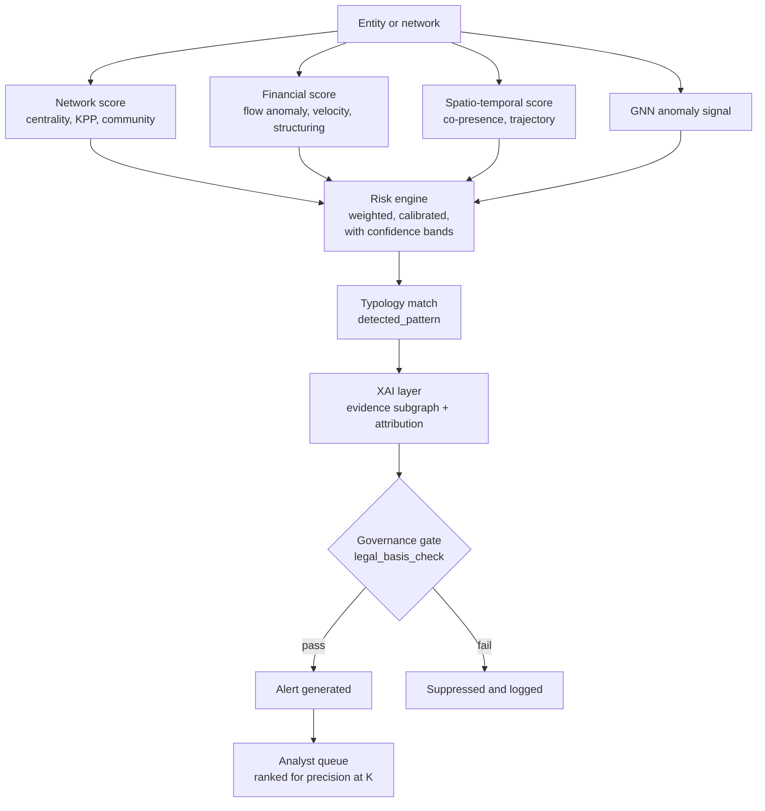

### 17.3 Risk dimensions

| Dimension | Inputs | Status |
|---|---|---|
| Network risk | Centrality, KPP-1/KPP-2 impact, community membership | `[DECIDED]` |
| Financial risk | Flow anomaly, velocity, structuring indicators, pass-through ratios | `[DECIDED]` |
| Spatio-temporal risk | Co-presence frequency, unusual hours, trajectories | `[DECIDED]` |
| Anomaly signal | GNN anomaly scores | `[DECIDED]` as input (S1 §8.7 routes GNN embeddings to risk scoring); whether it is a fourth dimension or feeds the three above is `[OPEN]` |

### 17.4 Fusion and calibration

The risk engine is **weighted, calibrated, and reports confidence bands** `[DECIDED]`. Weights, calibration method, and score range are `[OPEN]` (Q-AIM-11). Scores in S1 examples lie in [0, 1] (`ILLUSTRATIVE`: risk 0.87) `[ASSUMPTION]`.

### 17.5 Risk vs confidence

These are different quantities and must never be merged into one number:

| Quantity | Question it answers |
|---|---|
| **Risk score** | If the pattern is real, how concerning is it? |
| **Confidence (band)** | How sure is C.I.D. that the pattern is real, given data quality, evidence classes and model uncertainty? |

A high-risk, low-confidence alert and a moderate-risk, high-confidence alert need different handling. The definition of `confidence_band` is `[OPEN]` (Q-AIM-11); it should reflect the share of the evidence subgraph that is DOCUMENTED vs DERIVED vs INFERRED `[PROPOSED]`.

### 17.6 Alert severity `[OPEN]`

S1 does not define severity levels. A severity scheme derived from risk and confidence bands is `[PROPOSED]`; no bands or cut-offs are established.

### 17.7 Prioritisation `[DECIDED]`

Alerts are ranked for **precision@K**. An analyst can review on the order of 50 alerts a week, not 5,000 (A-07). A model with high AUC that produces thousands of daily alerts is useless; ranking quality at the top of the queue is what matters.

### 17.8 Alert object schema

Fields established in S1 `[DECIDED]`:

| Field | Meaning |
|---|---|
| `alert_id` | Unique alert identifier |
| `entity_or_network_id` | The entity or network the alert concerns |
| `risk_score` | Fused risk score |
| `confidence_band` | Confidence band for the alert |
| `detected_pattern` | Named typology (e.g., "layering via shell chain") |
| `time_window` | Period of the contributing activity |
| `contributing_records[]` | Source records behind the alert |
| `related_entities[]` | Other entities involved |
| `evidence_subgraph` | Subgraph from the XAI layer |
| `model_version` | Pinned model version(s) |
| `legal_basis_check` | Result of the legal-basis check (what is checked: `[OPEN]`, Q-LEG-04) |
| `generated_at` | Generation timestamp |
| `assigned_to` | Assigned reviewer |

S1: "`model_version` and `legal_basis_check` are what let you defend an alert eighteen months later in court."

Additional fields `[PROPOSED]`:

| Field | Purpose |
|---|---|
| `case_id` | Purpose limitation: the authorised case the alert belongs to |
| `evidence_class_summary` | Counts of DOCUMENTED / DERIVED / INFERRED elements in the evidence subgraph |
| `status` | Lifecycle state (17.9) |
| `reviewed_by`, `review_decision`, `review_reason` | Human decision record |
| `explanation_fidelity` | Fidelity of the attached explanation |
| `replay_reference` | Data snapshot (ingestion time) needed for deterministic replay |

### 17.9 Alert lifecycle `[PROPOSED]`

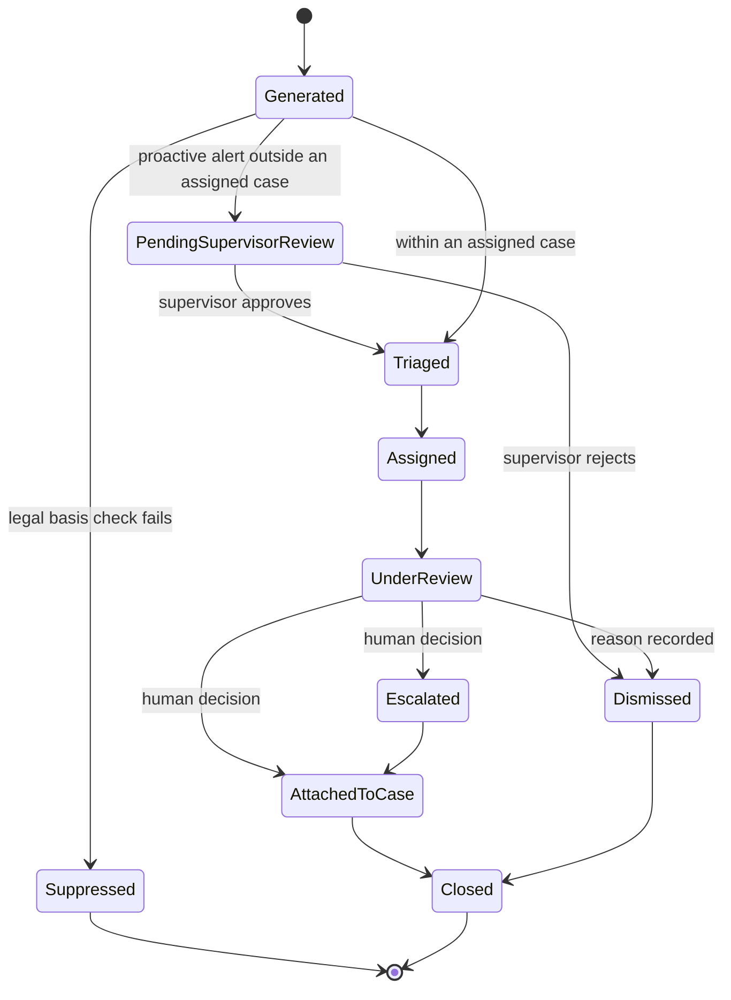

Every transition is recorded in the immutable audit log. Dismissal reasons are retained for evaluation (precision@K measurement) and fairness monitoring. Dismissals must not silently retrain models; retraining goes through model governance (G-09).

### 17.10 Proactive alerts and proportionality `[OPEN]` (C-05)

S1 claims "proactive network discovery … flags networks nobody queried for", while also stating that every query must carry a case ID and legal basis and that C.I.D. "analyses data already lawfully held for a specific case". These statements conflict at the edges: an alert about a network no one queried for is, by definition, not tied to a pre-existing case query. S3 review notes suggest reframing proactive discovery as **"proactive alerts within lawfully held case data, scoped to an authorised investigation and reviewed by a supervisory officer before action"** `[PROPOSED]`, which the lifecycle above reflects. The scope of proactive analysis is a team decision (Q-LEG-01).

### 17.11 Risk ≠ guilt. Alert ≠ proof. `[DECIDED]`

> **A risk score measures how much a pattern warrants human attention. It is not a measure of guilt.**
> **An alert is a prioritised hypothesis. It is not proof that a crime occurred or that any person committed one.**
> **Only source records — obtained lawfully and certified as required — can become evidence. C.I.D. outputs are investigative aids.**

---

## 18. EXPLAINABLE INTELLIGENCE

*Sources: S1 §3, §8.9, §12, §14; S3 (review suggestions on counterfactual explanations and exculpatory context).*

### 18.1 Why explainability is a core capability `[DECIDED]`

"Risk = 94%" is not probable cause. No magistrate grants a warrant on an opaque score, and no defence counsel will let one stand unchallenged. Every alert therefore ships with the evidence subgraph that produced it. Explainability is what makes a lead **reviewable, challengeable and traceable** — it is a product capability, not an appendix.

### 18.2 What every explanation must answer `[DECIDED]` / `[PROPOSED]` format

| Question | Answered by |
|---|---|
| Why was this alert generated? | Named typology (`detected_pattern`) and plain-language reasons |
| Which records contributed? | `contributing_records[]` with click-through (F-01) |
| Which relationships contributed? | Evidence subgraph, each edge with its evidence class |
| Which features contributed? | Feature attribution |
| What is directly documented? | DOCUMENTED elements, listed separately |
| What is AI-inferred? | INFERRED elements, listed separately and visually distinct |
| How confident is the system? | Confidence band; entity-resolution confidences; inference confidences |
| How much does the explanation matter to the model? | Explanation fidelity |
| Can it be reproduced? | Model version and replay reference |

### 18.3 Explainer methods `[DECIDED]` / `[RESEARCH]`

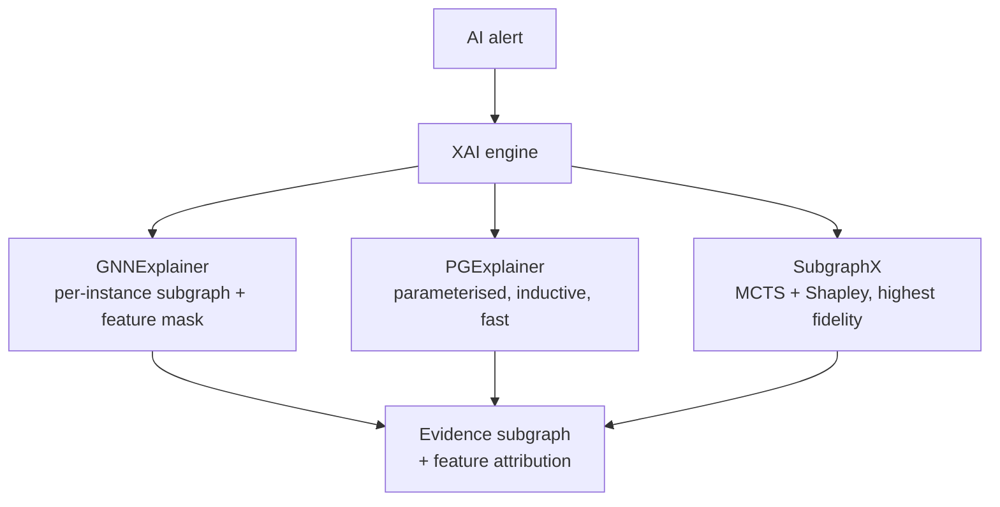

| Method | Mechanism | Role in C.I.D. | Status |
|---|---|---|---|
| **GNNExplainer** | Perturbation-based; maximises mutual information between the prediction and a compact subgraph plus feature mask | Per-instance explanation — "this specific ring" | `[DECIDED]` (core) |
| **PGExplainer** | Learns a parameterised explanation model across instances | Inductive and fast; usable on streaming and new nodes where per-instance optimisation is too slow | `[PROPOSED]` |
| **SubgraphX** | Monte Carlo Tree Search (MCTS) over subgraphs, scored with Shapley values | Highest fidelity; explicitly measures confidence drop when the subgraph is removed; for the highest-stakes cases | `[PROPOSED]` |

Feature attribution for non-graph features (prototype tier: `captum`) `[DECIDED]`.

### 18.4 Explanations for non-GNN alerts `[PROPOSED]`

GNN explainers explain GNN outputs only. Alerts from deterministic analytics (KPP, typology queries, co-presence) are explained by the **query or algorithm itself**: the matched pattern, the paths, the parameters and the underlying edges. Every alert type must have an explanation method.

### 18.5 Explanation fidelity

Fidelity measures how much model confidence drops when the explanation subgraph is removed (`ILLUSTRATIVE`: 0.94 → 0.21). High fidelity means the explanation faithfully reflects what drove **the model**.

> **Caveat (C-19).** S1 states that fidelity "is what converts a model output into evidence". That conflicts with Lead-vs-Evidence Separation. Fidelity shows that an explanation is faithful to the model; it does not show that the model's conclusion is true. Canonical v2.0 position: **fidelity makes a lead auditable; it does not make it evidence.** Evidence status comes only from source records.

### 18.6 Investigator-facing explanation format `[PROPOSED]` · `ILLUSTRATIVE` content

The S1 example, re-expressed with evidence classes:

```
ALERT A-000123 · pattern: layering via shell chain · risk 0.87 · confidence: HIGH
time window: 6 days · model: <pinned version> · legal basis check: passed

EVIDENCE SUBGRAPH
PERSON A
   ├── OWNS ──────────> COMPANY X            [DOCUMENTED · registry record]
   │                        │ ₹18L (3 txns, 6 days)   [DOCUMENTED · txn records]
   │                        ↓
   └── OWNS ──────────> ACCOUNT B            [DOCUMENTED · KYC record]
                            │ ₹17L (same week)        [DOCUMENTED · txn record]
                            ↓
                        PERSON C ── ACCUSED_IN ──> FIR 224/2025   [DOCUMENTED · FIR]

WHY THIS WAS FLAGGED
  • layered transfer chain, each hop retaining <10%            (pattern: layering — see C-17)
  • Company X incorporated 41 days before first transaction   (registry record)
  • Person A ↔ Person C: no direct link; 3 hops via shells    (derived path)
  • entity resolution confidence 0.97 (phonetic + shared MSISDN)
  • explanation fidelity: confidence 0.94 → 0.21 if subgraph removed

WHAT THIS DOES NOT SHOW
  • that any transfer was unlawful
  • that Person A knew of Person C's case
  • possible lawful explanations for this pattern: see T-01 false positives

SOURCE RECORDS (7) · click to open
```

S1 labelled this chain "classic structuring"; per the typology catalogue it is layering (C-17). The company-to-account transfer implies a company account not shown in the ontology-conformant form (C-03).

### 18.7 Exculpatory context `[PROPOSED]` · `[OPEN]`

S3 review notes suggest that explanations surface contrary indicators and alternative lawful explanations alongside incriminating ones (e.g., "these two phones are registered at the same residential address"). This strengthens trust and fairness; its design is `[OPEN]` (Q-UX-05).

### 18.8 Counterfactual explanations `[FUTURE]`

"What minimal change to the evidence would remove this alert?" — suggested in S3 review notes for courtroom use.

### 18.9 Limitations

- Explainers can be unstable: small input changes can yield different subgraphs.
- An explanation explains the model, not the world (C-19).
- Human interpretability must be tested with real users (Section 26).
- Explanations can create unwarranted trust (R-13).

---

## 19. EVIDENCE VS INFERENCE

*Sources: S2 (Lead-vs-Evidence Separation as a required feature); S1 §7, §8.4, §11.4, §14; S3. The three-class definitions are from S2 `[DECIDED]`; classification rules and encoding are `[PROPOSED]`.*

### 19.1 Why this distinction is foundational `[DECIDED]`

C.I.D. mixes three kinds of information in one graph: what records say, what C.I.D. computed from what records say, and what models guess. If they look the same, an investigator can mistake a guess for a fact, a prosecutor can present a model output as evidence, and an innocent person can be harmed. Separating them is C.I.D.'s central trust and governance mechanism.

### 19.2 The three classes

| | **Documented Evidence** | **Derived Relationship** | **AI-Inferred Lead** |
|---|---|---|---|
| Definition | Information directly present in source records | A relationship produced through deterministic processing or data linkage | A probabilistic relationship or pattern suggested by an AI model |
| `evidence_class` | `DOCUMENTED` | `DERIVED` | `INFERRED` |
| Origin | A source record states it | A rule or algorithm computes it from other edges | A model predicts it |
| Examples | `ACCUSED_IN` from an FIR; `TRANSFERRED_FUNDS_TO` from a transaction; `CALLED` from a CDR row | `CO_LOCATED_WITH` from repeated tower co-presence; person-level `CALLED` via `REGISTERED_TO`; a multi-hop path | Link prediction; GNN anomaly; "Amit owns account 1234" read from "through account 1234" |
| Provenance | `source_record_id`, `record_hash`, `legal_basis` | `derived_from[]`, `method` (rule and parameters) | `model_version`, `inference_confidence`, `derived_from[]`, evidence subgraph |
| Can support a case file as… | A pointer to the source record, which is the evidence | A documented reasoning step, reproducible from its inputs | An investigative lead only |
| Visual encoding `[PROPOSED]` | Solid line, "Documented" label | Dashed line, "Derived" label | Dotted line, distinct colour, "AI lead" badge, confidence shown |

### 19.3 Evidence model

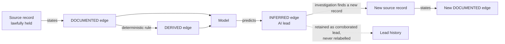

### 19.4 Classification rules `[PROPOSED]`

1. **Documented only by record.** An edge is DOCUMENTED only if a source record states the relationship itself — not merely mentions both entities.
2. **Weakest-input inheritance.** A DERIVED edge computed from any INFERRED input is itself INFERRED. (A `CO_LOCATED_WITH` edge built on an inferred phone-to-person attribution is INFERRED.)
3. **Models produce inferences.** Anything produced by a probabilistic model is INFERRED, however high its confidence.
4. **No automatic promotion.** An INFERRED edge never becomes DOCUMENTED. If investigation later finds a record stating the relationship, a new DOCUMENTED edge is created from that record; the original lead is retained as "corroborated".
5. **Human confirmation is a judgement, not evidence.** An investigator marking a lead "confirmed" records a human decision with their identity; it does not change the evidence class.
6. **Outputs are inference-level.** Risk scores, alerts, key-player rankings and typology matches are always inference-level outputs, even when every underlying edge is documented.
7. **Reports segregate.** Exported case packages list documented evidence, derived reasoning, and AI leads in separate sections.
8. **Merged identities.** The class of edges that depend on entity-resolution merges is `[OPEN]` (Q-AIM-05).

### 19.5 Worked classifications `ILLUSTRATIVE`

| Statement | Class | Why |
|---|---|---|
| Person A and Person B are both named as accused in FIR 224/2025 | DOCUMENTED (two `ACCUSED_IN` edges) | The FIR states it |
| Person A is associated with Person B | DERIVED | Computed from co-accusation; basis = "co-accused in FIR 224/2025" |
| Phone P1 called phone P2 on 2025-03-04 | DOCUMENTED | CDR row |
| Person A called Person B | DERIVED | Via `REGISTERED_TO`; registration is not use |
| Person A and Person C were co-present in one tower footprint in 12 windows | DERIVED | Deterministic clustering of documented presence |
| Person A likely knows Person D | INFERRED | Link prediction |
| Amit owns account 1234 (from "through account 1234") | INFERRED | The text does not state ownership |
| Company X is part of a layering chain | INFERRED | Typology match is an output |

### 19.6 Visual and semantic distinction `[PROPOSED]`

- Evidence class must be encoded by **line style and label**, not colour alone (accessibility).
- AI leads carry a persistent badge and their confidence.
- A filter lets investigators hide or show each class; the default view of an exported case package shows class sections separately.
- Every tooltip for an edge states its class in words ("Documented in: FIR 224/2025").

---

## 20. CORE PRODUCT FEATURES

*Sources: S2 (F-01 to F-04 must be preserved); S1 §3, §5, §8, §10, §11; S3 (deck feature statements). Feature status is given per feature.*

### F-01 Evidence-Linked Graph `[DECIDED]`

| Aspect | Content |
|---|---|
| User problem | Link charts and AI outputs often cannot be traced back to what supports them |
| Input | CKG edges with `source_record_id` |
| Processing | Every edge resolves to its source record (FIR line, CDR row, transaction) on demand |
| Output | Click any relationship → open the exact record that created it |
| Value | "Nothing is asserted without proof"; the bridge from analysis to a case file |
| Limitations | Works fully for DOCUMENTED edges; DERIVED and INFERRED edges resolve to their inputs and method, not to a single record (C-02); record access itself is subject to authorisation tier |

### F-02 Lead-vs-Evidence Separation `[DECIDED]`

| Aspect | Content |
|---|---|
| User problem | AI hypotheses can be mistaken for documented facts |
| Input | `evidence_class` on every edge and output |
| Processing | Classification rules (19.4); visual encoding; segregated exports |
| Output | Documented, derived and AI-inferred elements are visually and semantically distinct everywhere |
| Value | Investigators are not misled; case packages stay defensible |
| Limitations | Depends on correct classification at extraction and derivation time; merged-identity class `[OPEN]` |

### F-03 Hidden Link Prediction `[DECIDED]` feature · method `[PROPOSED]`

| Aspect | Content |
|---|---|
| User problem | Relationships that matter were never recorded anywhere |
| Input | Graph embeddings; candidate pairs |
| Processing | GNN-based link scoring (14.6) |
| Output | Suggested relationships as AI-Inferred Leads, with confidence and the subgraph that motivated them |
| Value | Tells the investigator where to look next, not just what is already known |
| Limitations | Most speculative output; must never be shown as documented; evaluation (Hits@K, MRR) `[PROPOSED]`; bias and sparse-data risks (R-06, R-07) |

### F-04 Network Disruption Simulation `[DECIDED]` feature · scope `[OPEN]`

| Aspect | Content |
|---|---|
| User problem | "What happens to this network if we act against this person or set?" |
| Input | Network subgraph; selected node(s) or KPP-1 set |
| Processing | Remove selection; recompute fragmentation, reachability, components, remaining bridges (13.6) |
| Output | Before/after structure; fragmentation impact |
| Value | Turns analysis into operational strategy; shows that the best removal set is rarely the most-connected individuals |
| Limitations | Structural simulation shows **fragmentation**, not behaviour. S3 deck copy claims it shows "who takes over" / "who steps up"; succession prediction is not a structural calculation and is not established (C-10). Real networks adapt; missing edges distort results. Output is a planning aid, not a recommendation to arrest (C-24). |

### F-05 Indic Entity Resolution `[DECIDED]`

| Aspect | Content |
|---|---|
| User problem | One person spelled many ways across scripts becomes many nodes |
| Input | Mentions and records with names, identifiers, context |
| Processing | Section 11 pipeline; three-tier decision |
| Output | Golden entity profiles with confidence and merge evidence |
| Value | Makes networks visible; S1's highest-leverage contribution |
| Limitations | False merges (R-03); thresholds uncalibrated; custom phonetic keys to be built |

### F-06 Multimodal Heterogeneous Fusion `[DECIDED]`

| Aspect | Content |
|---|---|
| User problem | FIRs, calls, money, vehicles and intelligence live in separate systems |
| Input | DS-01 to DS-12 |
| Processing | Normalisation, extraction, resolution into one typed CKG |
| Output | One connected, typed map |
| Value | Cross-domain chains become visible |
| Limitations | Only as complete as authorised data access (R-18) |

### F-07 Key-Player Identification `[DECIDED]`

| Aspect | Content |
|---|---|
| User problem | The visible hub is often not the person who matters |
| Input | Network subgraph |
| Processing | Centrality + KPP-1 / KPP-2 set analysis |
| Output | Key-player sets with fragmentation / reach impact, contrasted with degree |
| Value | "Finds the person whose removal actually breaks the network — often a quiet name" |
| Limitations | Structural importance ≠ culpability; data gaps distort (13.9) |

### F-08 Proactive Anomaly Alerts `[DECIDED]` capability · scope `[OPEN]`

| Aspect | Content |
|---|---|
| User problem | Lookup systems need a name; unknown networks stay invisible |
| Input | CKG, GNN anomaly scores, typology queries |
| Processing | Risk fusion → alerts → queue |
| Output | Ranked, explained alerts |
| Value | Surfaces clusters, go-betweens and new relationships without a prior query |
| Limitations | Proportionality scope (C-05); false positives; "before it matures" is aspirational (R-19) |

### F-09 Explainable Evidence Subgraph `[DECIDED]`

Every alert carries the subgraph, records, features and fidelity behind it (Section 18). Limitation: explains the model, not the world (C-19).

### F-10 Spatio-Temporal Co-Presence `[DECIDED]`

Detects repeated co-presence within tower footprints and adds DERIVED `CO_LOCATED_WITH` edges (Section 16). Limitation: tower-level precision; subscriber ≠ user.

### F-11 Fund-Flow Tracing `[DECIDED]`

Multi-hop value tracing with per-hop retained value — the layering fingerprint (Section 21). Limitation: requires authorised financial data; accounts ≠ persons.

### F-12 Evidence Export Package `[DECIDED]`

Case-scoped export of entities, subgraphs and source references with hash and audit trail (S1: "evidence export with hash + audit trail"). The S3 deck describes certificate support for the Bharatiya Sakshya Adhiniyam's electronic-evidence requirement; C.I.D. can prepare supporting material, but the certificate itself is a legal act by a responsible person (Q-LEG-03, `VERIFY` the section).

### F-13 Time-Travel Replay `[DECIDED]`

A time-slider replays network growth using `valid_from` / `valid_to`; deterministic replay of alerts uses ingestion time (12.6).

### F-14 Case Management `[DECIDED]`

Attach entities and subgraphs to a case file; cases carry the case ID required for purpose limitation.

### F-15 IPC ↔ BNS Offence Ontology `[DECIDED]`

Historical (IPC) and current (BNS) offence codes map to one ontology so that offence patterns remain comparable across the 1 July 2024 transition.

### F-16 Architectural Guardrails `[DECIDED]`

Purpose limitation at query time, tiered authorisation, sunset deletion, immutable audit, RBAC + ABAC, model governance (Section 24).

### F-17 On-Premise Deployment `[ASSUMPTION]` · wording `[OPEN]`

S3 deck copy claims "100% offline execution" / "fully offline". This conflicts with streaming ingestion and cross-agency federated learning (C-04). The S3 review suggests "air-gapped, on-premise deployment inside the agency network — no record leaves the agency's servers" `[PROPOSED]` wording.

### F-18 Natural-Language Assistance `[PROPOSED]`

Ask questions in normal language; receive grounded summaries (14.12). Not in S1.

---

## 21. INVESTIGATOR EXPERIENCE

*Sources: S1 §5, §8.10; S2. Descriptions are conceptual, not frontend specifications.*

### 21.1 Common trust indicators `[PROPOSED]`

Every interface uses the same indicators so that trust signals are learnable once:

| Indicator | Meaning |
|---|---|
| Evidence-class style | Solid = documented, dashed = derived, dotted + badge = AI lead |
| Confidence value + band | On every edge, entity and alert |
| Source count | Number of supporting records (click to open) |
| Resolution badge | Entity-resolution confidence and review status (auto-accepted / human-reviewed) |
| Authorisation tier marker | Non-sensitive / sensitive / highly sensitive |
| Model version | On every model-derived element |

### 21.2 Interfaces

#### Network Explorer `[DECIDED]`

| Aspect | Content |
|---|---|
| Purpose | Interactive exploration of the CKG |
| Main information | Typed nodes and edges, e.g. `Person ─CALLED─ Person ─OWNS─ Organization ─TRANSFERRED_FUNDS_TO─ …` |
| Main user action | Expand-on-click from any node; select paths; launch disruption simulation (F-04) |
| Important filters | Date range, entity type, relationship type, geography, risk level, minimum confidence, hop depth, evidence class `[PROPOSED]` |
| Important outputs | Case-scoped subgraphs; time-slider replay of network growth |
| Trust indicators | All of 21.1 |

#### Entity 360° `[DECIDED]`

| Aspect | Content |
|---|---|
| Purpose | Everything C.I.D. holds about one resolved identity |
| Main information | Aliases, phones, vehicles, addresses, organisations, accounts, ranked known associates, linked FIRs/events, activity timeline, source records, access log |
| Main user action | Inspect; review or dispute a merge; open source records |
| Important filters | Source type, time, evidence class |
| Important outputs | Entity profile for case file |
| Trust indicators | Risk score *and* resolution confidence shown separately (`ILLUSTRATIVE`: `PERSON_184729 · risk 0.87 · resolution confidence 0.96`); source record count; access log visible |

#### Timeline `[DECIDED]`

| Aspect | Content |
|---|---|
| Purpose | Chronological fusion of events (calls, travel, transfers, meetings, FIRs) |
| Main information | Events on a time axis, overlayable for multiple entities |
| Main user action | Overlay entities to spot synchronised behaviour |
| Important filters | Entity, event type, window |
| Important outputs | Sequences supporting temporal typologies |
| Trust indicators | Evidence class per event; time precision (exact vs window) |

#### Fund Flow `[DECIDED]`

| Aspect | Content |
|---|---|
| Purpose | Sankey-style tracing of value through accounts and companies |
| Main information | `ILLUSTRATIVE`: `Account A ──₹20L──> Company X ──₹18L──> Account B ──₹17L──> Account C` with `₹2L → Account D (dead end)` |
| Main user action | Follow hops; inspect transactions |
| Important filters | Amount, time, hop depth, channel |
| Important outputs | Per-hop retained percentage — the layering fingerprint (C-17 on terminology) |
| Trust indicators | Transaction IDs per hop; account-to-person attribution shown as a separate, classed step |

#### Search `[DECIDED]`

| Aspect | Content |
|---|---|
| Purpose | Find entities, records, cases |
| Main information | Results across resolved entities and aliases, with phonetic/cross-script matching |
| Main user action | Query within authorised scope |
| Important filters | Type, jurisdiction, case |
| Important outputs | Entry points into Entity 360° and Network Explorer |
| Trust indicators | Match reason (exact / phonetic / alias); purpose limitation — queries without case ID and legal basis are rejected (G-01) |

#### Alerts `[DECIDED]`

| Aspect | Content |
|---|---|
| Purpose | Ranked alert inbox |
| Main information | Alert objects (17.8) with pattern, risk, confidence band, window |
| Main user action | Triage, assign, review, dismiss with reason, escalate, attach to case |
| Important filters | Pattern, risk, confidence, case, status |
| Important outputs | Reviewed alerts; dismissal reasons for evaluation |
| Trust indicators | Explanation panel (18.6); evidence-class summary; supervisor-review state for proactive alerts |

#### Case Management `[DECIDED]`

| Aspect | Content |
|---|---|
| Purpose | Organise investigation material under an authorised case |
| Main information | Attached entities, subgraphs, alerts, notes, decisions |
| Main user action | Attach, annotate, record decisions |
| Important filters | Case, assignee, status |
| Important outputs | Case file |
| Trust indicators | Case ID and legal basis visible; all actions audited |

#### Evidence / Report Generation `[DECIDED]`

| Aspect | Content |
|---|---|
| Purpose | Export case material and generate reports |
| Main information | Segregated sections: documented evidence, derived reasoning, AI leads |
| Main user action | Generate package; verify hashes |
| Important filters | Case, time, classes to include |
| Important outputs | Evidence package with hash and audit trail; case intelligence report |
| Trust indicators | Hash; model versions; replay reference; source references |

#### Entity-Resolution Review Queue `[PROPOSED]`

Implied by the 0.75–0.95 human review band. Shows candidate pairs with match evidence (phonetic key, shared identifiers, context) for accept/reject; every decision audited and reversible.

#### Disruption Simulator panel `[DECIDED]` (F-04)

Select node(s) or a KPP-1 set; view before/after fragmentation. Displays the limitation text of F-04.

#### Audit view `[PROPOSED]`

For auditors: who accessed which entity, when, under which authorisation, including access to the audit log itself.

### 21.3 Investigator workflow `ILLUSTRATIVE`

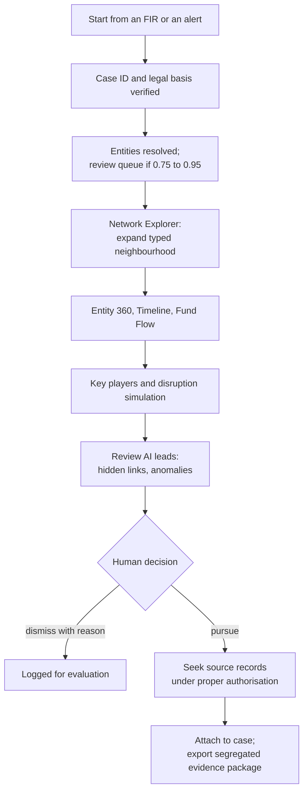

The workflow ends in a human decision and in the pursuit of **source records**. C.I.D. never moves a lead directly into a case file as evidence.

---
## 22. SYSTEM ARCHITECTURE

*Sources: S1 §6.1, §6.2, §8, §9, §11. Logical layers are `[DECIDED]`; application and data decomposition are `[PROPOSED]`.*

### 22.1 Overall system architecture

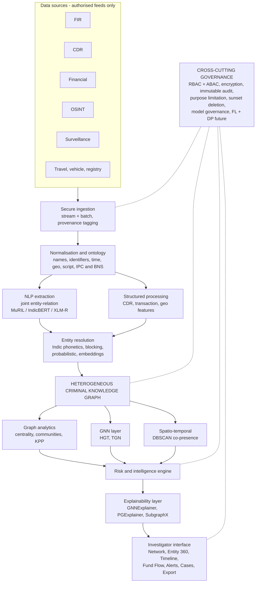

Design principle `[DECIDED]`: the graph is the visual and logical centre. Everything above it is construction; everything below it is inference.

Federated learning with differential privacy appears in S1's cross-cutting layer, while the S1 roadmap schedules its activation for a later phase; in this document it is `[FUTURE]` (C-25).

### 22.2 Logical architecture — layer responsibilities `[DECIDED]`

| # | Layer | Responsibility | Key output |
|---|---|---|---|
| 0 | Sources | Authorised feeds only | Raw records |
| 1 | Ingestion | Batch ETL + real-time streaming, provenance tagging | Timestamped events |
| 2 | Normalisation | Schema mapping, script/language handling, common crime ontology | Unified records |
| 3a | NLP | Joint entity–relation extraction from unstructured text | Typed entities + relations |
| 3b | Structured processing | Transaction, CDR, geo and temporal feature extraction | Typed records |
| 4 | Entity resolution | Collapse variants into one identity | Golden entity profile + confidence |
| 5 | Graph | Persist typed nodes/edges with temporal, spatial, confidence properties | Queryable network |
| 6 | Analytics | Centrality, communities, KPP, GNN embeddings, spatial clustering | Scores + embeddings |
| 7 | Risk engine | Fuse scores into ranked, actionable alerts | Alert objects |
| 8 | XAI | Produce evidence subgraph per alert | Explanation |
| 9 | Presentation | Investigator workflows | Decisions (made by humans) |
| ⊥ | Governance | Access, audit, retention, privacy — wrapping all layers | Compliance |

### 22.3 Data architecture `[PROPOSED]`

| Store | Holds | Why | Status |
|---|---|---|---|
| Source record store | Original records (or authorised references) keyed by `source_record_id`, with `record_hash` | Required for F-01 click-through and evidence integrity; S1 does not specify where source records live | `[OPEN]` (Q-ARC-01) |
| Graph store | The CKG | Central representation | `[DECIDED]` (22.1); product per Section 23 |
| Spatial store | Locations, footprints, spatial indexes | Spatial queries and clustering | `[PROPOSED]` (PostGIS, reference tier) |
| Embedding / feature store | Node embeddings, features, scores with model version | Reproducibility | `[OPEN]` |
| Model registry | Pinned model versions and change records | Model governance (G-09) | `[OPEN]` |
| Audit store | Append-only access and decision log | G-05 | `[DECIDED]` concept |
| Case store | Cases, attachments, decisions | F-14 | `[DECIDED]` concept |

### 22.4 AI architecture

Section 14.1 diagram. AI components consume the CKG and return **scores, embeddings, INFERRED edges and explanations**; they never write DOCUMENTED edges `[PROPOSED]` rule (19.4).

### 22.5 Application architecture `[PROPOSED]`

| Component | Responsibility |
|---|---|
| Ingestion connectors | Source-specific intake; provenance tagging |
| Processing services | Parsing, OCR, normalisation, NLP, ER |
| Graph service | CKG reads/writes; temporal queries |
| Analytics service | Centrality, communities, KPP, paths, simulation |
| ML service | GNN inference; link prediction; anomaly scoring |
| Risk and alert service | Fusion, typology matching, lifecycle |
| XAI service | Explainer execution; explanation packaging |
| API layer | Single governed entry point (FastAPI) enforcing case ID, legal basis, RBAC + ABAC |
| Investigator UI | Views in Section 21 (React + Cytoscape.js) |
| Governance services | Identity, authorisation, audit, retention, model registry |

### 22.6 Security and governance architecture

Governance is cross-cutting: every request passes through one governed API layer that checks identity, role, jurisdiction, case assignment, case ID and legal basis before any data is returned, and writes an audit record whether or not the request succeeds (Section 24).

---

## 23. TECHNOLOGY ARCHITECTURE

*Sources: S1 §8, §9; S3 (deck stack items). S1 presents two columns — a national production choice and a prototype choice. v2.0 names them **Reference deployment** (the national-scale target architecture) and **Reference implementation** (the smaller-scale implementation of the same architecture). These are scales, not a schedule.*

### 23.1 Technology register

| Technology | Category | Purpose | Tier | Status | Notes |
|---|---|---|---|---|---|
| Python | Language | Processing, ML, analytics | Both | `[DECIDED]` (implicit in S1 stack) | |
| FastAPI | API | Governed API layer | Both | `[DECIDED]` | |
| React | Frontend | Investigator UI | Both | `[DECIDED]` | |
| Cytoscape.js | Graph visualisation | Network Explorer | Both | `[DECIDED]` | Sigma.js listed as reference-tier alternative `[PROPOSED]` |
| Neo4j Community | Graph database | CKG | Implementation | `[DECIDED]` | Cypher readable; see D-10 and C-07 (licensing/foreign-vendor consistency) |
| Neo4j Graph Data Science (GDS) | Graph analytics | Centrality, communities | Implementation | `[DECIDED]` | Licence tier of algorithms used: `VERIFY` (C-07) |
| NetworkX | Graph analytics | Algorithms incl. KPP | Implementation | `[DECIDED]` | |
| TigerGraph | Graph database | National-scale deep traversal | Deployment | `[PROPOSED]` | Massively parallel processing (MPP); speed claims are vendor-published benchmarks and must be attributed |
| GSQL / cuGraph | Graph analytics | Analytics at scale | Deployment | `[PROPOSED]` | |
| PyTorch Geometric (PyG) | GNN framework | HGT, TGN, explainers | Both | `[DECIDED]` | DGL listed as reference-tier alternative `[PROPOSED]` |
| HGT | GNN model | Heterogeneous anomaly scoring | Both | `[DECIDED]` | |
| TGN | GNN model | Temporal dynamics | Both (small in implementation) | `[PROPOSED]` | |
| HAN, EvolveGCN, CARE-GNN, PC-GNN | GNN models | Section 14.4 | Deployment | `[PROPOSED]` | |
| GNNExplainer | XAI | Per-alert explanation | Both | `[DECIDED]` | PyG implementation |
| PGExplainer, SubgraphX | XAI | Inductive / high-fidelity explanation | Deployment | `[PROPOSED]` | |
| captum | Attribution | Feature attribution | Implementation | `[DECIDED]` | |
| MuRIL | NLP encoder | Indic, transliterated text | Both | `[DECIDED]` | Fine-tuned, single model in implementation |
| IndicBERT, XLM-R | NLP encoders | Native-script and cross-lingual text | Deployment | `[PROPOSED]` | MTKD teachers |
| MTKD student model | NLP | Low-cost inference | Deployment | `[FUTURE]` | |
| Tesseract / IndicOCR + layout models | OCR | Scanned documents | Deployment | `[PROPOSED]` | IndicOCR availability `VERIFY` |
| PyMuPDF + Tesseract | Parsing / OCR | PDFs | Implementation | `[DECIDED]` | |
| Custom IndicSoundex / IndicMetaphone | ER | Indic phonetic keys | Both | `[PROPOSED]` (to be built) | Q-AIM-02 |
| Splink | ER | Fellegi-Sunter linkage | Both | `[DECIDED]` | |
| Sentence-BERT | ER | Context embeddings | Both | `[DECIDED]` | |
| scikit-learn DBSCAN | Spatial ML | Co-presence clustering | Implementation | `[DECIDED]` | |
| PostGIS | Spatial database | Spatial storage/queries | Deployment | `[PROPOSED]` | |
| Apache Kafka | Streaming | Event ingestion | Deployment (single broker or simple queue in implementation) | `[PROPOSED]` | |
| Apache Flink | Stream processing | Windowed CEP | Deployment | `[PROPOSED]` | National-scale streaming `[FUTURE]` |
| Apache Airflow / Spark | Batch orchestration / processing | ETL | Deployment | `[PROPOSED]` | Python + Pandas in implementation `[DECIDED]` |
| Keycloak | Identity and access | Authentication, SSO | Deployment | `[PROPOSED]` | JWT in implementation `[DECIDED]` |
| Append-only audit store | Audit | Immutable log | Deployment | `[PROPOSED]` | Postgres audit table in implementation `[DECIDED]` |
| SHA-256 | Hashing | Record hashes, export hashes | Both | `[PROPOSED]` | Appears in S3 deck |
| Kubernetes, Prometheus, Grafana | Operations | Orchestration, monitoring | — | `[OPEN]` | Appear in S3 deck only; not in S1 |
| Local large language model | NL assistance | F-18 | — | `[OPEN]` | Q-AIM-09 |

### 23.2 Graph database decision `[DECIDED]` (two-tier) · revisit per C-07

| | Neo4j | TigerGraph |
|---|---|---|
| Model | Index-free adjacency, JVM | C++ Massively Parallel Processing |
| Query language | Cypher (declarative, very readable) | GSQL (procedural, Turing-complete, compiles to C++) |
| Sweet spot | OLTP, localised pattern matching, 1–4 hops | Deep multi-hop (10+), distributed analytics at scale |
| Ecosystem | Largest; APOC, GDS library, large community | Smaller, enterprise-oriented |
| Weakness | Memory pressure and coordination latency on very deep traversals at scale | Steeper learning curve, less community material |

**Argument (S1):** money laundering and organised crime are designed to put distance between principal and act, so detection requires deep traversal — the workload where an MPP architecture is claimed to pull ahead. Hence: **TigerGraph for national deployment, Neo4j for the reference implementation.** Vendor benchmarks claiming "orders of magnitude faster" come from the vendor and must be attributed ("benchmarks published by TigerGraph indicate…").

---

## 24. SECURITY, PRIVACY & GOVERNANCE

*Sources: S1 §3, §6.1, §8.1, §11.3–11.6, §14; S3 (review suggestions on hash-chained ledger). Conceptual level only.*

### 24.1 Governance model `[DECIDED]`

C.I.D.'s governance principle: **safeguards are system behaviour, not policy text.** Because statutory exemptions may apply to law-enforcement processing (Section 25.3), the constitutional proportionality constraint is treated as binding, and the reliable way to honour it is to build limits into the architecture.

### 24.2 Control catalogue

| ID | Control | Implementation concept (S1 unless marked) | Protects against | Status |
|---|---|---|---|---|
| G-01 | Purpose limitation | Every query tagged with a case ID and legal basis; queries without one are **rejected, not just logged** | Fishing expeditions; function creep | `[DECIDED]` |
| G-02 | Tiered authorisation | Non-sensitive / sensitive / highly sensitive; financial and telecom data require documented judicial or designated-authority approval | Disproportionate access | `[DECIDED]` |
| G-03 | Sunset deletion | Automatic time-bound deletion for individuals cleared of suspicion; retention clock starts at case closure | Indefinite retention | `[DECIDED]`; definitions `[OPEN]` (Q-LEG-05) |
| G-04 | Data minimisation | Store hashes and references, not raw PII, where an identifier is only needed for matching | Breach impact; over-collection | `[DECIDED]`; hashing design `[OPEN]` (C-22) |
| G-05 | Immutable audit | Append-only log of every access: who, which entity, when, under which authorisation. "Audit the auditors." | Misuse; untraceable access | `[DECIDED]` |
| G-06 | Access control | RBAC + ABAC — role **and** jurisdiction **and** case assignment must all permit the query | Over-broad access | `[DECIDED]` |
| G-07 | Evidence integrity | Immutable source-record linkage, model version pinning, deterministic replay, hash-chained export | Tampering; irreproducibility | `[DECIDED]` |
| G-08 | Human oversight | Human review band in ER; human decision for every enforcement action; supervisory review of proactive alerts `[PROPOSED]` | Automation errors; over-reliance | `[DECIDED]` (except marked) |
| G-09 | Model governance | Version pinning, drift monitoring, periodic revalidation, documented change control | Silent model change; drift | `[DECIDED]` |
| G-10 | Bias controls | Exclude caste, religion, community as features; audit proxies (e.g., locality); per-group false-positive-rate dashboard | Discrimination; feedback loops | `[DECIDED]` |
| G-11 | Authentication | Keycloak (deployment); JWT (implementation) | Impersonation | `[PROPOSED]` / `[DECIDED]` per tier |
| G-12 | Encryption | Listed in S1's cross-cutting layer; scheme unspecified | Interception; theft | `[DECIDED]` principle; design `[OPEN]` |
| G-13 | Provenance | Mandatory edge properties (Section 09.4) | Untraceable claims | `[DECIDED]` |
| G-14 | Federated learning + differential privacy | Raw data never leaves the originating agency; noised weight updates | Central breach target; data pooling | `[FUTURE]` |
| G-15 | Hash-chained evidence ledger | Each ingested record and each merge/alert decision hashed into a chain with periodic Merkle roots (S3 review suggestion) | Undetected tampering; answers the Blockchain theme (C-16) | `[PROPOSED]` |

### 24.3 Authentication

Every user is individually authenticated; shared accounts would defeat the audit model `[PROPOSED]` principle.

### 24.4 Authorisation

Access requires **all** of: an authorised role, jurisdiction match, case assignment, case ID, legal basis, and — for sensitive tiers — the required approval. Assignment of data sources to tiers beyond telecom and financial (highly sensitive per S1) is `[OPEN]` (Q-SEC-01).

### 24.5 Audit logging

The audit log records every access and every decision (merges, alert reviews, exports), including access to the audit log itself. It is append-only.

### 24.6 Data minimisation and identifier hashing

Hashes and references replace raw identifiers where only matching is needed (`account_hash`, `msisdn_hash`). Two design tensions are recorded (C-22, `[OPEN]`):

- **Low-entropy identifiers.** A 10-digit phone number has few enough possible values that an unkeyed hash can be reversed by enumeration. Keyed hashing (e.g., HMAC with a protected key) is `[PROPOSED]` `[RESEARCH]`.
- **Fuzzy matching.** Hashes support exact matching only. Normalisation must happen before hashing, and fuzzy matching on hashed identifiers is not possible.

### 24.7 Evidence integrity

Immutable source-record linkage (`record_hash` at ingestion), model version pinning, deterministic replay of any alert, and hash-chained export `[DECIDED]`. For the Blockchain & Cybersecurity theme, S3 review notes propose G-15 and the rationale: with a single custodian agency, **tamper-evidence** is the requirement, which a hash-chained, Merkle-anchored ledger provides without the cost of distributed consensus `[PROPOSED]`. Whether C.I.D. adopts this is `[OPEN]` (Q-ARC-07).

### 24.8 Privacy

Privacy is governed by the Puttaswamy proportionality framework (Section 25.2). C.I.D. analyses lawfully held data; it does not collect.

### 24.9 Retention and deletion

Retention begins at case closure; individuals cleared of suspicion are deleted automatically after a time bound `[DECIDED]`. Open issues:
- What constitutes "cleared of suspicion", and the retention periods, are `[OPEN]` (Q-LEG-05).
- Sunset deletion conflicts with immutable audit and hash chains if those contain personal data (C-21). A candidate resolution: audit and ledger entries hold only references and hashes, so personal data can be deleted while the integrity record persists `[PROPOSED]`.
- Deletion must propagate to derived and inferred edges built from deleted records (09.6) `[PROPOSED]`.

### 24.10 Function-creep controls `[DECIDED]`

The named risk: a system built for serious crime gets quietly repurposed for routine policing, protest monitoring, or welfare eligibility. Counter-measures are G-01 (rejection without case ID and legal basis), G-02, G-05, G-09 and change control over new data sources and new uses `[PROPOSED]`.

### 24.11 Model governance

G-09. Model outputs carry `model_version`; alerts are replayable against the pinned model.

### 24.12 Human oversight

G-08. The system produces leads, never verdicts.

### 24.13 Data provenance

Section 09.4–09.6.

### 24.14 Security of the graph as an asset

A fused national graph of people, phones, accounts and locations is itself a high-value target (R-17). Minimisation, tiered access, audit, encryption, and — in future — federated learning (G-14) all reduce this exposure.

---

## 25. LEGAL & ETHICAL FRAMEWORK

*Sources: S1 §8.2, §11, §15. This section is **not legal advice**. It records the legal context the project relies on and distinguishes legal requirements from recommended governance principles and future considerations. Items marked `VERIFY` must be confirmed with authoritative sources before being cited.*

### 25.1 Classification

| Item | Type | C.I.D. response | Status |
|---|---|---|---|
| Right to privacy (Puttaswamy, 2017) and proportionality | **Legal requirement** (constitutional) | Controls mapped to proportionality limbs (25.2) | `[DECIDED]` as binding constraint |
| DPDP Act 2023 and its State exemption | **Legal context** | Treat exemption as a reason to build safeguards into architecture | `[DECIDED]` posture |
| BSA electronic-evidence certification | **Legal requirement** (for evidence use) | Reproducible, attributable outputs; supporting material for certification | `[DECIDED]` posture; section `VERIFY` |
| BNS / BNSS / BSA transition | **Legal context** | Offence ontology maps IPC and BNS | `[DECIDED]` |
| Legal basis for access to telecom and financial data | **Legal requirement** | `legal_basis` on every edge; tiered authorisation | Specific statutes `[OPEN]` (Q-LEG-02) |
| Bias mitigation | **Recommended governance principle** | G-10 | `[DECIDED]` |
| Human oversight | **Recommended governance principle** | G-08 | `[DECIDED]` |
| Function-creep controls | **Recommended governance principle** | G-01, G-05 | `[DECIDED]` |
| Sunset deletion | **Recommended governance principle** | G-03 | `[DECIDED]` |
| Federated learning + differential privacy | **Future consideration** | G-14 | `[FUTURE]` |
| Cross-agency data-sharing arrangements | **Future consideration** | Via existing frameworks (A-01) | `[FUTURE]` |

### 25.2 Constitutional baseline — Puttaswamy `[RESEARCH]`

*Justice K.S. Puttaswamy (Retd.) v. Union of India* (2017): a nine-judge bench of the Supreme Court held privacy to be a fundamental right intrinsic to Articles 14, 19 and 21, and recognised informational self-determination.

Any State intrusion must satisfy the proportionality test, which S1 records in five limbs:

1. **Legality** — a valid law authorises it
2. **Legitimate aim** — the State objective is proper
3. **Necessity / rational nexus** — the measure actually serves that aim
4. **Proportionality stricto sensu** — least restrictive means available
5. **Procedural safeguards** — oversight and remedy exist

`VERIFY` — the precise formulation and its attribution across the 2017 privacy judgment and subsequent judgments should be confirmed before being quoted.

**Mapping of controls to limbs** `[PROPOSED]` (S1 instructs that every control map to a limb; the mapping is v2.0's):

| Limb | C.I.D. controls |
|---|---|
| Legality | `legal_basis` on every edge; G-02 approvals; G-01 rejection without legal basis |
| Legitimate aim | G-01 case ID requirement; purpose-scoped alerts (17.10) |
| Necessity / rational nexus | Typology-based alerts tied to specific offences; case-scoped network boundaries |
| Proportionality stricto sensu | G-04 minimisation; G-02 tiers; G-03 sunset deletion; networks-not-demographics (G-10) |
| Procedural safeguards | G-05 audit; G-08 human oversight; G-09 model governance; reversibility of merges; dismissal records |

### 25.3 Digital Personal Data Protection Act, 2023 `[RESEARCH]`

The DPDP Act 2023 governs digital personal data. **Section 17(2)(a)** permits the Central Government to exempt State instrumentalities in the interests of sovereignty, security of the State, public order and related grounds (verified in S1). A law-enforcement system is therefore likely exempt from much of the Act's operational machinery.

`VERIFY` (added in v2.0): whether Section 17(1)(c), concerning processing in the interest of prevention, detection, investigation or prosecution of offences, is also relevant.

**C.I.D. posture `[DECIDED]`:** exemption is not a reason to skip safeguards; it is the reason the safeguards must be architectural. With statutory exemption available, the constitutional constraint from Puttaswamy is the binding one.

### 25.4 Evidence admissibility — Bharatiya Sakshya Adhiniyam, 2023

The BSA replaced the Indian Evidence Act from 1 July 2024. Electronic records are admissible subject to a certificate requirement analogous to the old Section 65B. S3 deck material refers to it as Section 63. `VERIFY` the section number and certificate format; safe phrasing: "the BSA's electronic-evidence certification requirement."

Architectural implications `[DECIDED]`: immutable source-record linkage, model version pinning, deterministic replay, hash-chained export. C.I.D. can prepare material that supports certification; the certificate is issued by a responsible person, not by the system (Q-LEG-03).

### 25.5 BNS / BNSS / BSA transition `[DECIDED]`

Since 1 July 2024, BNS, BNSS and BSA replace IPC, CrPC and the Indian Evidence Act. Historical records use legacy codes; current records use new codes; the ontology maps both (09.8).

### 25.6 Algorithmic bias `[RESEARCH]` / `[DECIDED]` posture

**The feedback loop.** Predictive systems trained on historical arrest data learn where police were deployed, not where crime occurred; they then direct policing back to the same areas, generating more arrests that appear to confirm the model. This disproportionately harms marginalised communities.

**C.I.D. mitigation posture `[DECIDED]`:**
- Score **networks and transactions**, not neighbourhoods or demographics.
- Exclude caste, religion and community as features; audit for proxies (locality can be a proxy).
- Publish per-group false-positive rates in an internal fairness dashboard (measurement design `[OPEN]`, Q-EVL-05).
- Human decision required for every enforcement action.

**Documented evidence on AI error in Indian policing context** (context only — facial recognition is not a C.I.D. capability, §03.6):

| Fact (verified in S1) | Status |
|---|---|
| Delhi Police treats an 80% similarity score as a positive facial-recognition match (RTI responses obtained by the Internet Freedom Foundation), and continues to investigate below-threshold matches with corroborative evidence | `[RESEARCH]` |
| In 2018, Delhi Police told the Delhi High Court (*Sadhan Haldar v. NCT of Delhi*) that its facial-recognition accuracy was 2% and "not good" | `[RESEARCH]` |
| The ACLU's 2018 test of Amazon Rekognition at an 80% threshold falsely matched 28 sitting US Congress members to mugshots | `[RESEARCH]` |
| "Facial recognition false positive rates sometimes exceed 15% in internal reviews" | `[DEPRECATED]` — unsupported; do not use |

### 25.7 Human oversight, false positives, function creep, purpose limitation

- **Human oversight:** G-08; C.I.D. produces leads, never verdicts.
- **False positives:** every typology lists lawful look-alikes (Section 15); alerts show "what this does not show" (18.6).
- **Function creep and purpose limitation:** G-01, G-05, G-10; change control over new uses.
- **Proportionality of proactive analysis:** `[OPEN]` (C-05, Q-LEG-01).

### 25.8 Context note on NATGRID

S1 records (verified there) that NATGRID is outside RTI purview and has no dedicated parent statute. This is context about the ecosystem, not a claim C.I.D. makes about itself.

---

## 26. EVALUATION FRAMEWORK

*Sources: S1 §5, §12; S3 (review suggestions: link-prediction metrics, cost line). `TARGET` values are S1's "reasonable targets"; none has been measured. No other numbers are established.*

### 26.1 Evaluation principles `[DECIDED]`

- **Lead with precision@K.** Analysts can review a limited number of alerts; ranking quality at the top is what matters.
- **Entity-resolution precision is the priority metric,** because false merges are the dangerous error.
- **Recall on known cases** matters: a system that never surfaces known networks is not useful however precise.
- **No invented outcome percentages.** Before/after improvements (e.g., "days to minutes") are targets with a mechanism, not results.

### 26.2 Metrics

| Area | Metric | What it tells | TARGET (S1) | Status |
|---|---|---|---|---|
| NLP | Entity F1 | Extraction quality of entities | 0.85+ | `[PROPOSED]` target |
| NLP | Relation F1 | Extraction quality of relations | 0.75+ | `[PROPOSED]` target |
| Entity resolution | Precision | Share of merges that are correct | **> 0.98** | `[PROPOSED]` target |
| Entity resolution | Recall; pairwise F1 | Share of true matches found | — | `[DECIDED]` metric |
| Entity resolution | False merge rate | Direct measure of the dangerous error | — | `[PROPOSED]` metric |
| Entity resolution | Review-band volume | Human workload created by the 0.75–0.95 band | — | `[PROPOSED]` metric |
| Detection | Precision@K (e.g., precision@50) | Usefulness of the top of the queue | — | `[DECIDED]` lead metric |
| Detection | Recall on known cases | Whether known networks are surfaced | — | `[DECIDED]` |
| Detection | AUC-ROC | Overall ranking quality | — | `[DECIDED]` (secondary) |
| Detection | AUC-PR | Ranking quality under extreme class imbalance `[RESEARCH]` | — | `[PROPOSED]` |
| Link prediction | Hits@K, Mean Reciprocal Rank (MRR) | Quality of suggested links | — | `[PROPOSED]` |
| Graph | p95 query latency at 5-hop depth | Interactive usability | Sub-second at reference-implementation scale | `[PROPOSED]` target |
| Graph | Analytics runtime (KPP, communities) | Feasibility at scale | — | `[PROPOSED]` metric |
| Explainability | Fidelity (confidence drop when explanation removed) | Faithfulness to the model | > 0.7 | `[PROPOSED]` target |
| Explainability | Sparsity | Compactness of explanation | — | `[DECIDED]` metric |
| Explainability | Evidence coverage | Share of explanation elements traceable to source records | — | `[PROPOSED]` metric |
| Explainability | Human interpretability | Whether investigators understand and correctly calibrate trust | — | `[PROPOSED]` (user study) |
| System | Ingest rate (records/sec) | Throughput | State honestly; no target | `[DECIDED]` |
| System | End-to-end freshness | Time from source event to graph availability | — | `[DECIDED]` |
| System | Reliability | Availability, error rates | — | `[PROPOSED]` |
| Traceability | Share of DOCUMENTED edges with valid `source_record_id` | Provenance integrity | 100% is a **design invariant**, not a statistical target | `[DECIDED]` |
| Governance | Queries executed without case ID / legal basis | Purpose-limitation integrity | Zero by design (G-01 rejects them) | `[DECIDED]` |
| Fairness | Per-group false-positive rate | Disparate impact | — | `[DECIDED]` metric; design `[OPEN]` |

### 26.3 Validation strategy `[DECIDED]`

1. **Public benchmarks** — Elliptic Bitcoin dataset, IBM Transactions for AML, synthetic AML generators. Allows real numbers without sensitive data.
2. **Synthetic Indian-context data** with injected ground-truth networks and deliberately messy name variants.
3. **Retrospective validation** — replay a historical, solved case and check whether C.I.D. surfaces the known network before the arrest date. S1: "the most persuasive demonstration". Requires lawful access to historical case data `[FUTURE]`.

### 26.4 Baselines `[FUTURE]`

Operational claims (time saved, networks found) require an analyst baseline, which S1 assigns to a pilot measured "against analyst baseline" (Section 30).

### 26.5 Cost `[OPEN]`

S3 review notes observe that evaluators ask about deployment cost. No cost estimate exists (Q-EVL-04).

---
## 27. RESEARCH & REFERENCES

*Sources: S1 §15 (fact-check appendix) for items marked "verified in S1"; E for items added in v2.0. This is a reference register, not a bibliography of everything that sounds relevant: every entry names the C.I.D. claim or component it supports.*

**Status key for this section**

| Status | Meaning |
|---|---|
| `[RESEARCH]` · verified in S1 | The claim was independently checked during v1.0 fact-checking |
| `[RESEARCH]` · standard | A foundational, widely cited method; citation details should still be confirmed before formal publication |
| `[RESEARCH]` · candidate · `VERIFY` | Added in v2.0 because it directly supports a claim in this document; not yet checked by the team. Confirm the citation before external use. |

Citations give authors, year and venue only; no URLs are asserted.

### 27.1 Government systems

| Reference | Source | Supports | C.I.D. component | Status |
|---|---|---|---|---|
| CCTNS scale and function (police stations, records, national search) | NCRB / MHA official publications | Ecosystem description; scale of the synthesis problem | §02, §05 | `[RESEARCH]` · verified in S1 — figures need currency check (C-08) |
| ICJS 2.0 and its Criminal Network Link Analysis module; NCRB UNIFY | MHA / NCRB official publications | Closest existing capability; C.I.D. positioning as a layer | §05, §28 | `[RESEARCH]` · verified in S1 |
| NATGRID scope, user agencies, query volume, Gandiva, RTI status | Official statements and reporting | Ecosystem description | §05 | `[RESEARCH]` · verified in S1 |
| Trinetra (UP Police / Staqu, 2018, ~5 lakh records) | Public reporting | Ecosystem description; correction of v0 claims | §05 | `[RESEARCH]` · verified in S1 |

### 27.2 Legal and constitutional

| Reference | Source | Supports | C.I.D. component | Status |
|---|---|---|---|---|
| *Justice K.S. Puttaswamy (Retd.) v. Union of India* (2017) | Supreme Court of India, nine-judge bench | Privacy as a fundamental right; proportionality as the binding constraint | §24, §25 | `[RESEARCH]` · verified in S1 (five-limb formulation `VERIFY`) |
| Digital Personal Data Protection Act, 2023 — §17(2)(a) | Act of Parliament | State-instrumentality exemption; rationale for architectural safeguards | §25.3 | `[RESEARCH]` · verified in S1 (§17(1)(c) relevance `VERIFY`) |
| Bharatiya Sakshya Adhiniyam, 2023 | Act of Parliament | Electronic-evidence certification requirement | §25.4, F-12 | `[RESEARCH]` · section number `VERIFY` |
| Bharatiya Nyaya Sanhita and Bharatiya Nagarik Suraksha Sanhita, 2023 (in force 1 July 2024) | Acts of Parliament | Offence-code transition; dual-code ontology | §09.8, F-15 | `[RESEARCH]` · verified in S1 |
| *Sadhan Haldar v. NCT of Delhi* (Delhi High Court, 2018) — 2% FRT accuracy statement | Court record | Evidence of AI error in Indian policing | §25.6 | `[RESEARCH]` · verified in S1 |
| Internet Freedom Foundation RTI responses on Delhi Police FRT threshold (80%) | RTI responses | Threshold practice | §25.6 | `[RESEARCH]` · verified in S1 |
| ACLU test of Amazon Rekognition (2018) — 28 US Congress members falsely matched | ACLU | False-positive risk at fixed thresholds | §25.6 | `[RESEARCH]` · verified in S1 |

### 27.3 Network analysis

| Reference | Source | Supports | C.I.D. component | Status |
|---|---|---|---|---|
| Borgatti, S.P. (2006). Identifying sets of key players in a social network | *Computational & Mathematical Organization Theory* | KPP-1 / KPP-2; set-based key-player selection | §13.4, F-04, F-07, T-08 | `[RESEARCH]` · verified in S1 |
| Freeman, L.C. (1977). A set of measures of centrality based on betweenness | *Sociometry* | Betweenness centrality | §13.2 | `[RESEARCH]` · standard |
| Brin, S. & Page, L. (1998). The anatomy of a large-scale hypertextual web search engine | WWW Conference | PageRank | §13.2 | `[RESEARCH]` · standard |
| Blondel, V.D. et al. (2008). Fast unfolding of communities in large networks | *J. Statistical Mechanics* | Louvain | §13.2 | `[RESEARCH]` · standard |
| Traag, V.A., Waltman, L. & van Eck, N.J. (2019). From Louvain to Leiden | *Scientific Reports* | Leiden's well-connected communities | §13.2 | `[RESEARCH]` · standard |
| Sparrow, M.K. (1991). The application of network analysis to criminal intelligence | *Social Networks* | Network analysis in criminal intelligence; limits of data | §13.9 | `[RESEARCH]` · candidate · `VERIFY` |
| Morselli, C. (2009). *Inside Criminal Networks* | Springer | Principals are often not the most central actors | §13.3, T-08 | `[RESEARCH]` · candidate · `VERIFY` |

### 27.4 NLP

| Reference | Source | Supports | C.I.D. component | Status |
|---|---|---|---|---|
| Khanuja, S. et al. (2021). MuRIL: Multilingual Representations for Indian Languages | arXiv | Transliterated Indic pre-training | §14.2, D-08 | `[RESEARCH]` · verified in S1 |
| Kakwani, D. et al. (2020). IndicNLPSuite (IndicBERT) | Findings of EMNLP | Native-script Indic encoder | §14.2 | `[RESEARCH]` · verified in S1 |
| Conneau, A. et al. (2020). Unsupervised cross-lingual representation learning at scale (XLM-R) | ACL | 100+ language coverage | §14.2 | `[RESEARCH]` · verified in S1 |
| Eberts, M. & Ulges, A. (2020). Span-based joint entity and relation extraction (SpERT) | ECAI | Span-based joint extraction | §10.3, D-07 | `[RESEARCH]` · candidate · `VERIFY` |
| Wang, J. & Lu, W. (2020). Two are better than one: joint entity and relation extraction with table-sequence encoders | EMNLP | Table-filling joint extraction | §10.3, D-07 | `[RESEARCH]` · candidate · `VERIFY` |
| Hinton, G., Vinyals, O. & Dean, J. (2015). Distilling the knowledge in a neural network | NIPS Deep Learning Workshop | Knowledge distillation underlying MTKD | §14.2 | `[RESEARCH]` · candidate · `VERIFY` |

### 27.5 Entity resolution

| Reference | Source | Supports | C.I.D. component | Status |
|---|---|---|---|---|
| Fellegi, I.P. & Sunter, A.B. (1969). A theory for record linkage | *J. American Statistical Association* | Probabilistic record linkage | §11.6, D-05 | `[RESEARCH]` · verified in S1 |
| Splink (UK Ministry of Justice) | Open-source software documentation | Scalable Fellegi-Sunter with EM | §11.4, §23 | `[RESEARCH]` · standard |
| Reimers, N. & Gurevych, I. (2019). Sentence-BERT | EMNLP-IJCNLP | Context embeddings for semantic matching | §11.4 | `[RESEARCH]` · standard |
| Levenshtein (1966); Winkler (1990) — edit distance; Jaro-Winkler | Standard record-linkage literature | String similarity | §11.4 | `[RESEARCH]` · verified in S1 |
| Indyk, P. & Motwani, R. (1998). Approximate nearest neighbors (LSH) | STOC | Locality-sensitive hashing for blocking | §11.5 | `[RESEARCH]` · verified in S1 (as method) |
| Soundex / Double Metaphone — English-phonology encoders | Standard literature | Why standard phonetics fail on Indic names | §11.3 | `[RESEARCH]` · verified in S1 |
| Existing Indic phonetic-matching libraries | Open-source projects | Starting point for custom IndicSoundex | §11.3, Q-AIM-02 | `[OPEN]` · `VERIFY` availability and coverage |

### 27.6 Graph learning

| Reference | Source | Supports | C.I.D. component | Status |
|---|---|---|---|---|
| Hu, Z. et al. (2020). Heterogeneous Graph Transformer | WWW | HGT | §14.4, D-11 | `[RESEARCH]` · verified in S1 |
| Wang, X. et al. (2019). Heterogeneous Graph Attention Network | WWW | HAN, meta-path attention | §14.4 | `[RESEARCH]` · verified in S1 |
| Rossi, E. et al. (2020). Temporal Graph Networks | arXiv / ICML GRL workshop | TGN temporal memory | §14.4 | `[RESEARCH]` · verified in S1 |
| Pareja, A. et al. (2020). EvolveGCN | AAAI | Evolving GCN weights | §14.4 | `[RESEARCH]` · standard |
| Dou, Y. et al. (2020). Enhancing GNN-based fraud detectors against camouflaged fraudsters (CARE-GNN) | CIKM | Anti-camouflage | §14.4, R-08 | `[RESEARCH]` · verified in S1 |
| Liu, Y. et al. (2021). Pick and Choose: a GNN-based imbalanced learning approach for fraud detection (PC-GNN) | WWW | Imbalance handling | §14.4 | `[RESEARCH]` · verified in S1 |
| Kipf, T. & Welling, M. (2017) GCN; Hamilton, W. et al. (2017) GraphSAGE | ICLR; NeurIPS | Homogeneous baselines C.I.D. does not rely on | §14.4 | `[RESEARCH]` · standard |

### 27.7 Financial crime and benchmark datasets

| Reference | Source | Supports | C.I.D. component | Status |
|---|---|---|---|---|
| Weber, M. et al. (2019). Anti-money laundering in Bitcoin: experimenting with graph convolutional networks for financial forensics (Elliptic dataset) | KDD Workshop | Public benchmark for graph AML | §14.14, §26.3 | `[RESEARCH]` · verified in S1 |
| Altman, E. et al. (2023). Realistic synthetic financial transactions for anti-money laundering models (IBM AML) | NeurIPS Datasets & Benchmarks | Public synthetic AML benchmark | §14.14, §26.3 | `[RESEARCH]` · verified in S1 |
| "TransXion" benchmark ecosystem | — | — | — | `[DEPRECATED]` — unverifiable |

### 27.8 Explainable AI

| Reference | Source | Supports | C.I.D. component | Status |
|---|---|---|---|---|
| Ying, R. et al. (2019). GNNExplainer | NeurIPS | Per-instance subgraph explanations | §18.3, D-12 | `[RESEARCH]` · verified in S1 |
| Luo, D. et al. (2020). Parameterized explainer for GNNs (PGExplainer) | NeurIPS | Inductive explanations | §18.3 | `[RESEARCH]` · verified in S1 |
| Yuan, H. et al. (2021). On explainability of GNNs via subgraph explorations (SubgraphX) | ICML | MCTS + Shapley explanations | §18.3 | `[RESEARCH]` · verified in S1 |
| Captum (PyTorch model interpretability library) | Software documentation | Feature attribution | §18.3, §23 | `[RESEARCH]` · standard |

### 27.9 Spatio-temporal analysis

| Reference | Source | Supports | C.I.D. component | Status |
|---|---|---|---|---|
| Ester, M. et al. (1996). A density-based algorithm for discovering clusters (DBSCAN) | KDD | Co-presence clustering with noise | §16.7, D-21 | `[RESEARCH]` · verified in S1 |
| Birant, D. & Kut, A. (2007). ST-DBSCAN | *Data & Knowledge Engineering* | Joint space–time clustering | §16.8 | `[RESEARCH]` · candidate · `VERIFY` |

### 27.10 Privacy and security

| Reference | Source | Supports | C.I.D. component | Status |
|---|---|---|---|---|
| McMahan, B. et al. (2017). Communication-efficient learning of deep networks from decentralized data (FedAvg) | AISTATS | Federated learning | §30, G-14 | `[RESEARCH]` · standard |
| Dwork, C. et al. (2006). Calibrating noise to sensitivity in private data analysis | TCC | Differential privacy | §30, G-14 | `[RESEARCH]` · standard |
| Abadi, M. et al. (2016). Deep learning with differential privacy (DP-SGD) | ACM CCS | DP for model training; ε trade-off | §30 | `[RESEARCH]` · standard |
| Merkle, R. (1987). A digital signature based on a conventional encryption function (Merkle trees) | CRYPTO | Hash-chained, Merkle-anchored ledger | G-15 | `[RESEARCH]` · candidate · `VERIFY` |
| Keyed hashing (HMAC), IETF RFC 2104 | IETF | Hashing low-entropy identifiers | §24.6, C-22 | `[RESEARCH]` · candidate · `VERIFY` |

### 27.11 Bias in predictive policing

| Reference | Source | Supports | C.I.D. component | Status |
|---|---|---|---|---|
| Lum, K. & Isaac, W. (2016). To predict and serve? | *Significance* | Feedback loops from historical arrest data | §25.6, R-07 | `[RESEARCH]` · candidate · `VERIFY` |
| Ensign, D. et al. (2018). Runaway feedback loops in predictive policing | FAT* (now FAccT) | Formal account of feedback loops | §25.6, R-07 | `[RESEARCH]` · candidate · `VERIFY` |

### 27.12 Comparable systems and vendor material

| Reference | Source | Supports | C.I.D. component | Status |
|---|---|---|---|---|
| i2 Analyst's Notebook | Vendor documentation | Traditional link-analysis workflow | §05, §28 | `[RESEARCH]` · `VERIFY` current capabilities |
| Palantir-class investigation platforms | Vendor documentation | Automated integration platforms | §05, §28 | `[RESEARCH]` · `VERIFY` current capabilities |
| TigerGraph performance benchmarks | Vendor-published | Deep-traversal performance claims — must be attributed | §23.2, D-10 | `[RESEARCH]` · vendor claim |
| Neo4j and Neo4j Graph Data Science documentation | Vendor documentation | Prototype graph store; licence tiers | §23, C-07 | `[RESEARCH]` · `VERIFY` licence terms |

---

## 28. COMPETITIVE DIFFERENTIATION

*Sources: S1 §3, §14, §15; S3 (review notes on framing). All comparative cells describe design focus as understood from S1 and public information; cells marked `VERIFY` must be checked before external use.*

### 28.1 Framing rules `[DECIDED]`

1. Do not claim C.I.D. is the "only", "first" or "unique" system in India or anywhere. Such claims are unverifiable and easily refuted.
2. Credit what existing systems do well. Evaluators may operate them.
3. Differentiate on **combination and design emphasis** — multimodal fusion + Indic entity resolution + learned detection + explainability + evidence discipline — not on the existence of any single capability.
4. Position C.I.D. as a complementary layer, never as a replacement.

### 28.2 Comparison matrix

Legend: **Core** = central design focus · **Partial** = present in some form · **Not a focus** = not a design emphasis per S1 · **VERIFY** = uncertain.

| Capability | Manual analyst workflow | Record / query systems (CCTNS, NATGRID) | ICJS link analysis | Commercial link-analysis platforms | Generic graph analytics / generic AI | C.I.D. (intended design) |
|---|---|---|---|---|---|---|
| Record retrieval at national scale | Not a focus | **Core** | Partial | Partial | Not a focus | Not a focus — consumes it |
| Relationship discovery | **Core** (manual) | Partial (Gandiva for NATGRID) | **Core** on police-system data | **Core** | Partial | **Core** |
| Multimodal fusion (police + telecom + financial + OSINT) | Partial (manual) | Partial (federated query) | Not a focus per S1 · `VERIFY` | Partial–Core · `VERIFY` | Not a focus | **Core** |
| Indic-native, cross-script entity resolution with confidence | Manual judgement | Partial (Trinetra phonetic search) · `VERIFY` others | `VERIFY` | Not a focus per S1 · `VERIFY` | Not a focus | **Core** |
| Set-based key-player analysis (KPP) | Rare | Not a focus | `VERIFY` | Partial · `VERIFY` | Available as algorithms | **Core** |
| Learned anomaly detection on heterogeneous, temporal graphs | Not a focus | Not a focus · `VERIFY` | Not a focus per S1 · `VERIFY` | Partial · `VERIFY` | Available as research code | **Core** |
| Evidence subgraph per alert | N/A (analyst explains) | Not a focus | `VERIFY` | Partial · `VERIFY` | Not a focus | **Core** |
| Documented vs inferred separation | Analyst discipline | Not applicable | `VERIFY` | `VERIFY` | Rarely | **Core** |
| Disruption simulation | Rare | Not a focus | `VERIFY` | Partial · `VERIFY` | Possible with custom work | **Core** |
| Governance built into query path | Institutional procedure | Institutional / system controls | System controls | Configurable | Rarely | **Core** |
| Operational maturity, legal standing, deployment | High | **High** | **High** | **High** | Varies | **None yet** — design stage |

The last row matters: every existing system is deployed and proven; C.I.D. is a design.

### 28.3 Versus government systems

C.I.D. does not compete with CCTNS, ICJS or NATGRID. It depends on the kind of data they hold. Its added value is analysis they are not primarily designed for: resolving fragmented identities across modalities, finding structurally important sets, flagging anomalous structures, and explaining each lead with evidence classes. ICJS's link-analysis module is the closest existing capability, and C.I.D. should be described as extending that direction (multimodal, Indic ER, learned detection, explainability) rather than replacing it.

### 28.4 Versus traditional investigative workflows

The manual analyst is accurate but bounded by reading capacity and memory, and cannot reach patterns spread across thousands of records. C.I.D. aims to do the reading and linking at scale and return a small number of explained leads. The analyst's judgement remains essential and is the final decision point.

### 28.5 Versus commercial link-analysis platforms

Mature platforms offer polished visual analysis and, in some cases, automated integration. S1's differentiation rests on Indic-language entity resolution, sovereign on-premise control, and cost/licensing — but the licensing argument is weakened by C.I.D.'s own use of Neo4j (C-07), and commercial capabilities must be verified before any comparison is made publicly.

### 28.6 Versus generic graph analytics

Generic graph tools provide the algorithms (centrality, communities, paths). C.I.D.'s contribution is the domain layer around them: a crime ontology with provenance, Indic ER, typed typologies, evidence classes, and governance.

### 28.7 Versus generic AI / LLM tools

Generic AI can summarise or answer questions but has no provenance model, no evidence discipline, and can hallucinate. C.I.D.'s design principle is that AI outputs are always labelled as inferences, traceable to records, and never written into the graph as documented facts (§14.12, §19).

### 28.8 Safe vs unsafe differentiation statements

| Safe (use) | Unsafe (avoid) |
|---|---|
| "C.I.D. is designed to answer 'which network should I be looking at, and why?'" | "No system in India can do this." |
| "Adds multimodal fusion, Indic entity resolution, learned anomaly detection and explainability on top of lawfully held data." | "Replaces ICJS / CCTNS / NATGRID." |
| "Every lead shows its evidence and separates documented facts from AI inferences." | "Proves who the kingpin is." |
| "Confidence-scored cross-script identity resolution." | "Nothing in the current stack resolves name variants." (C-12) |
| "Benchmarks published by TigerGraph indicate…" | "TigerGraph is orders of magnitude faster." |
| "Air-gapped, on-premise deployment inside the agency network" (if adopted) | "100% offline" (C-04) |

---

## 29. LIMITATIONS & RISKS

*Sources: S1 §2, §8, §11, §12, §14; S3 review notes. Mitigations are concepts, not guarantees. "Remaining limitation" states what the mitigation does not solve.*

| ID | Risk | Why it occurs | Impact | Mitigation concept | Remaining limitation |
|---|---|---|---|---|---|
| R-01 | Poor data quality | Real FIRs and records contain misspellings, OCR errors, missing fields, inconsistent formats | Wrong extractions, wrong links | ER at the core; confidence propagation; low-confidence links visually distinguished, never hidden (S1) | Garbage in cannot be fully corrected; confidence can be miscalibrated |
| R-02 | Missing records / incomplete networks | Not all activity is recorded; access is limited to authorised data | Networks appear smaller or differently shaped; wrong bridges | Present structure as "given available data"; show data coverage | Absence of evidence is not evidence of absence |
| R-03 | Entity-resolution errors | Name ambiguity, shared identifiers, blocking misses | False merges attach innocent people to networks; false splits hide networks | Three-tier thresholds; human review band; reversibility; merge audit; precision-first metric | Thresholds uncalibrated on real data (Q-EVL-02); review band creates workload |
| R-04 | False positives | Lawful activity resembles typologies (§15) | Wasted effort; harm to innocent people | Precision@K ranking; typology false-positive lists; "what this does not show"; human decision | Some false positives are unavoidable |
| R-05 | False negatives | Novel patterns; camouflage; missing data | Networks missed | Anomaly detection beyond rules; temporal models; recall on known cases | Unknown unknowns remain |
| R-06 | AI inference / hallucination risk | Link prediction and any NL summarisation generate plausible but unsupported claims | Speculation mistaken for fact | INFERRED class; no automatic promotion; NL outputs must be traceable to CKG elements (§14.12) | Users may still over-trust confident-looking suggestions |
| R-07 | Model bias and feedback loops | Historical data reflects where police looked, not only where crime occurred | Discriminatory outcomes; self-confirming patterns | Networks and transactions, not demographics; protected attributes excluded; proxy audit; per-group FPR; human decision | Proxy bias is hard to eliminate; fairness measurement needs group data (Q-EVL-05) |
| R-08 | Adversarial behaviour / camouflage | Offenders transact with legitimate nodes, change phones, split transactions | Detection evaded | CARE-GNN / PC-GNN; temporal models; S1: adaptation itself becomes a detectable signal | Adaptive adversaries can outpace models |
| R-09 | Data and concept drift | Crime patterns, payment channels and data feeds change | Model degradation | Drift monitoring; periodic revalidation; version pinning (G-09) | Detection of drift lags drift |
| R-10 | Temporal ambiguity | Record time ≠ event time; missing `valid_to`; time-zone inconsistencies | Wrong sequences; spurious "emerging networks" | UTC normalisation with source time zone; bitemporal fields; compare `valid_from` vs `ingested_at` | Unknown true event times cannot be recovered |
| R-11 | Spatial ambiguity | Tower footprints span hundreds of metres to kilometres | Spurious co-presence | "Co-presence within tower footprint" framing; DBSCAN noise handling; no GPS claims (C-18) | Dense urban towers still produce coincidental co-presence |
| R-12 | Subscriber ≠ user | Phones and accounts are registered to one person and used by another | Wrong person linked to activity | Person-level edges via `REGISTERED_TO` classed DERIVED; attribution shown as a separate step | Real user often unknowable from records alone |
| R-13 | Over-reliance / automation bias | Confident, visual outputs invite deference | Leads treated as findings | Evidence classes; confidence bands; "leads, never verdicts"; human decision; exculpatory context (proposed) | Cannot be eliminated by design alone; needs training and culture |
| R-14 | Explainability limitations | Explainers approximate; can be unstable | Misleading reassurance | Fidelity metric; multiple explainers; non-GNN explanations; C-19 framing | An explanation of the model is not proof about the world |
| R-15 | Label scarcity and benchmark domain shift | No labelled Indian police-network data; benchmarks are Bitcoin or synthetic | Models that look good on benchmarks may fail on real data | Synthetic Indian-context data; retrospective validation; deterministic analytics as a baseline | Real performance unknown until pilot |
| R-16 | Function creep | Powerful systems get repurposed | Surveillance beyond authorised purpose | G-01 rejection without case ID/legal basis; audit; change control | Institutional pressure is outside system control |
| R-17 | Breach of a centralised graph | A fused graph of people, phones, accounts, locations is a high-value target | Severe privacy harm | Minimisation; tiered access; audit; encryption; future federated learning | Centralisation risk persists until FL is real |
| R-18 | Legal-basis and data-access dependency | C.I.D. can analyse only what is lawfully provided | No real deployment possible without agreements | Assume existing CCTNS/ICJS data-sharing framework (A-01); `legal_basis` on every edge | No data-access arrangement exists (Q-DAT-01) |
| R-19 | Overclaiming | Aspirational capabilities ("before it matures", "who takes over", "100% offline", "6–10 hops") presented as validated | Loss of credibility with technically literate evaluators | Status labels; Section 28.8 safe statements; Appendix L | Requires discipline in every derivative artefact |
| R-20 | Scale and deep-traversal performance | Deep multi-hop queries on national graphs are expensive | Latency; infeasible analytics | Two-tier graph DB (D-10); MPP at scale; approximation for centrality | Performance at national scale is unmeasured |

### 29.1 What C.I.D. cannot do

- It cannot establish guilt, intent, or knowledge.
- It cannot see relationships that leave no trace in authorised records (including communication over channels not in CDRs).
- It cannot provide GPS-grade location from CDRs.
- It cannot predict individual behaviour after a network disruption (C-10).
- It cannot guarantee fairness; it can only measure and mitigate.
- It cannot validate its operational value without a real pilot.

---

## 30. FUTURE EVOLUTION

*Sources: S1 §11.6, §13 (Phases 2–3), §8.3, §9; S3 review suggestions. **Everything in this section is `[FUTURE]`** and must never be described as a current capability.*

### 30.1 Pilot deployment `[FUTURE]`

| Aspect | Content (S1 Phase 2) |
|---|---|
| Duration | 3–6 months |
| Scope | One district or one crime vertical |
| Data | Real data under a Memorandum of Understanding (MoU), with the full governance stack live |
| Measurement | Against an analyst baseline (§26.4) |
| Preconditions | Data-access agreement (Q-DAT-01); legal-basis framework (Q-LEG-02); governance roles staffed (§07.6) |

### 30.2 Scale `[FUTURE]`

| Step (S1 Phase 3) | Meaning |
|---|---|
| Migrate to an MPP graph database | Move from Neo4j to TigerGraph-class infrastructure for deep traversal at national scale (D-10) |
| Add streaming | Kafka + Flink with windowed complex event processing (§10.6) |
| Integrate CCTNS / ICJS APIs | Replace batch extracts with governed system integration |
| Onboard a second agency | First cross-agency deployment |
| Turn on federated learning | §30.3 |

### 30.3 Federated learning with differential privacy `[FUTURE]`

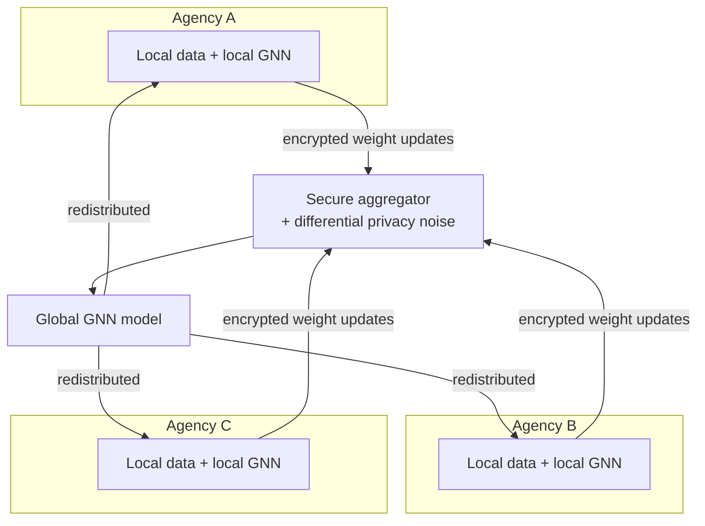

**Raw data never leaves the originating agency.** Agencies will not pool raw classified data, and centralising it creates a single catastrophic breach target. Differential privacy adds calibrated noise to parameter updates so that the aggregate model cannot be inverted to recover individual records. Pitch line: *every agency gets the detection capability of the whole country's data, and no agency gives up its data.*

**Honest cost (S1):** federated learning with differential privacy trades accuracy for privacy, and the privacy budget (ε) is a real tuning problem. It is a designed trade-off, not a free benefit. Note also the tension with "fully offline" wording (C-04): federated learning requires inter-agency exchange of model updates.

### 30.4 Further evolution candidates

| Capability | Description | Status |
|---|---|---|
| Multi-Teacher Knowledge Distillation | Distil MuRIL, IndicBERT and XLM-R into one lightweight student for national-scale NLP | `[FUTURE]` |
| Advanced and temporal GNNs at scale | Full TGN / EvolveGCN, CARE-GNN, PC-GNN on production data | `[FUTURE]` |
| Real-time intelligence | Stream-time typology detection and alerting | `[FUTURE]` |
| Continual learning | Governed model updates as patterns change (through G-09, never silently from dismissals) | `[FUTURE]` |
| Cross-agency interoperability | Case-scoped handoff packages (e.g., to ICJS prosecution and courts) with evidence classes preserved (S3 suggestion) | `[FUTURE]` |
| Succession modelling | Research into predicting network adaptation after disruption — the capability F-04 deck copy implies but structural simulation cannot provide (C-10) | `[FUTURE]` · research |
| Counterfactual explanations | Minimal changes that would remove an alert (§18.8) | `[FUTURE]` |
| Multimodal evidence (images, documents beyond OCR) | Not in S1; candidate only | `[FUTURE]` · `[OPEN]` scope |
| Hash-chained, Merkle-anchored evidence ledger | If adopted (G-15), extend across agencies | `[FUTURE]` (depends on Q-ARC-07) |
| Mature natural-language assistance | Grounded question answering over the CKG (F-18) | `[FUTURE]` (depends on Q-AIM-09) |

---
## 31. PROJECT DECISIONS & RATIONALE

*Sources: S1 (decisions dated "v1.0, Aug 2026"); S2 (decisions dated "v2.0, 2026-09-10"). A decision changes only by amending this registry and the change log (§00.11).*

Each decision records: **Decision · Status · Date · Alternatives · Reason · Consequences · Dependencies · Revisit if**.

### D-01 C.I.D. is an analytical layer, not a data platform

| Field | Content |
|---|---|
| Decision | Build an analytical layer over lawfully held data; do not build or replace a record system |
| Status · Date | `[DECIDED]` · v1.0 |
| Alternatives | A new data lake; a replacement for CCTNS/ICJS |
| Reason | NCRB already has the data; the bottleneck is synthesis, not collection |
| Consequences | Depends on upstream data access; positioning is complementary (§05, §28) |
| Dependencies | A-01, Q-DAT-01 |
| Revisit if | The problem statement owner requests data-platform capabilities |

### D-02 A knowledge graph is the central representation

| Field | Content |
|---|---|
| Decision | Represent all resolved entities and relationships in one graph (the CKG) |
| Status · Date | `[DECIDED]` · v1.0 |
| Alternatives | Relational warehouse with joins; document store; per-source analytics |
| Reason | The problem is relational and multi-hop; networks, paths and key players are graph concepts |
| Consequences | Graph DB required; all analytics consume one substrate |
| Dependencies | D-03, D-04, D-10 |
| Revisit if | Scale or governance makes a single graph infeasible (federated graphs) |

### D-03 The graph is heterogeneous (typed)

| Field | Content |
|---|---|
| Decision | Eight node types and eight edge types (§09) with typed semantics |
| Status · Date | `[DECIDED]` · v1.0 |
| Alternatives | Homogeneous person–person graph |
| Reason | A shared registered address and a shared bank branch mean very different things; homogeneous graphs cannot distinguish them |
| Consequences | Requires heterogeneous GNNs (D-11) and typed meta-paths; ontology gaps must be managed (§09.9) |
| Dependencies | Q-DAT-12 |
| Revisit if | Ontology extensions are adopted |

### D-04 Provenance is mandatory on every edge

| Field | Content |
|---|---|
| Decision | Every edge carries `source_record_id`, `confidence`, `ingested_at`, `valid_from`/`valid_to`, `legal_basis` |
| Status · Date | `[DECIDED]` · v1.0 |
| Alternatives | Provenance at record level only; retrofit later |
| Reason | Non-negotiable for court; retrofitting provenance is impossible |
| Consequences | Enables F-01, deletion propagation, replay; inferred edges need a different provenance form (C-02) |
| Dependencies | A-02, A-03; proposed extensions §09.5 |
| Revisit if | Never removed; extended only |

### D-05 Entity resolution is a core component with an Indic-native pipeline

| Field | Content |
|---|---|
| Decision | ER pipeline: Indic phonetic keys → blocking → string similarity → Fellegi-Sunter → Sentence-BERT → confidence |
| Status · Date | `[DECIDED]` · v1.0 |
| Alternatives | Exact matching; English phonetics (Soundex/Metaphone); embedding-only matching |
| Reason | Identity fragmentation is the root cause of invisible networks; English phonetics fail on Indic names |
| Consequences | Custom IndicSoundex must be built; blocking design determines recall |
| Dependencies | Q-AIM-02, Q-AIM-03 |
| Revisit if | Evaluation shows unacceptable false-merge or false-split rates |

### D-06 Three-tier entity-resolution thresholds

| Field | Content |
|---|---|
| Decision | ≥ 0.95 auto-merge; 0.75–0.95 human review; < 0.75 keep separate, log as possible link |
| Status · Date | `[DECIDED]` · v1.0 |
| Alternatives | Single threshold; fully manual review; fully automatic merging |
| Reason | The middle band is where automated error is most likely and most harmful; a wrong merge makes an innocent person inherit a network |
| Consequences | Creates a review workload and a reviewer role (§07.6) |
| Dependencies | Q-EVL-02, Q-SEC-03 |
| Revisit if | Calibration on real or realistic data shows different operating points |

### D-07 Joint entity–relation extraction

| Field | Content |
|---|---|
| Decision | Extract entities and relations jointly |
| Status · Date | `[DECIDED]` · v1.0 |
| Alternatives | Pipeline NER then relation classification |
| Reason | Pipelines propagate errors: a missed entity can never be related |
| Consequences | Needs joint-annotated training data |
| Dependencies | Q-DAT-04 |
| Revisit if | Domain data makes pipeline approaches competitive |

### D-08 MuRIL as the primary Indic encoder

| Field | Content |
|---|---|
| Decision | Fine-tuned MuRIL is the primary encoder; IndicBERT and XLM-R `[PROPOSED]` as ensemble teachers; MTKD `[FUTURE]` |
| Status · Date | `[DECIDED]` (MuRIL) · v1.0 |
| Alternatives | XLM-R only; IndicBERT only; a three-model ensemble from the start |
| Reason | Police notes and social media are often Romanised; MuRIL is pre-trained on transliterated Indic text |
| Consequences | Native-script and rare-language coverage may need the other encoders |
| Dependencies | Q-DAT-04 |
| Revisit if | Native-script performance is inadequate |

### D-09 Key players are identified as sets (KPP), not by centrality alone

| Field | Content |
|---|---|
| Decision | Use KPP-1 (disruption) and KPP-2 (reach) alongside centrality |
| Status · Date | `[DECIDED]` · v1.0 |
| Alternatives | Degree/betweenness rankings only |
| Reason | Visible hubs are often replaceable; the best removal set is rarely the top-k by centrality |
| Consequences | Combinatorial computation (Q-AIM-07); basis of F-04 |
| Dependencies | D-02 |
| Revisit if | — |

### D-10 Two-tier graph database: Neo4j (reference implementation), TigerGraph (reference deployment)

| Field | Content |
|---|---|
| Decision | Neo4j for the reference implementation; TigerGraph-class MPP for national deployment |
| Status · Date | `[DECIDED]` (two-tier choice) · v1.0; TigerGraph itself `[PROPOSED]` |
| Alternatives | Single graph DB for both; open-source-only stack |
| Reason | Organised crime requires deep traversal, where MPP architectures are claimed (by vendor benchmarks) to outperform; Neo4j is readable and has the largest ecosystem |
| Consequences | Migration path required (§30.2); licence and vendor considerations |
| Dependencies | C-07 |
| Revisit if | The team decides to avoid commercial or foreign-vendor dependencies (C-07), or open-source alternatives meet deep-traversal needs |

### D-11 HGT as the core GNN

| Field | Content |
|---|---|
| Decision | Heterogeneous Graph Transformer for anomaly scoring; HAN, TGN, EvolveGCN, CARE-GNN, PC-GNN `[PROPOSED]` |
| Status · Date | `[DECIDED]` (HGT) · v1.0 |
| Alternatives | GCN / GraphSAGE (homogeneous); rules only |
| Reason | Type-aware attention learns which relationship type matters |
| Consequences | Needs a training signal (Q-AIM-01); explanation via GNNExplainer (D-12) |
| Dependencies | D-03, R-15 |
| Revisit if | Label scarcity makes supervised GNNs impractical |

### D-12 Explainability is a first-class output

| Field | Content |
|---|---|
| Decision | Every alert ships with an evidence subgraph and feature attribution; GNNExplainer is core |
| Status · Date | `[DECIDED]` · v1.0 |
| Alternatives | Scores only; post-hoc explanation on request |
| Reason | "Risk = 94%" is not probable cause; unexplained alerts cannot be acted on responsibly |
| Consequences | Every alert type needs an explanation method (§18.4) |
| Dependencies | C-19 framing |
| Revisit if | — |

### D-13 AI leads are separated from evidence

| Field | Content |
|---|---|
| Decision | Three evidence classes (DOCUMENTED / DERIVED / INFERRED) kept visually and semantically distinct |
| Status · Date | `[DECIDED]` · v2.0 (S2; feature present in S3 deck) |
| Alternatives | Single "confidence" field; unlabelled inferred edges |
| Reason | Prevents speculation being mistaken for fact; protects innocent people and case integrity |
| Consequences | Needs `evidence_class` field and classification rules (§09.5, §19.4, both `[PROPOSED]`) |
| Dependencies | Q-AIM-05, Q-UX-01 |
| Revisit if | — |

### D-14 Human-in-the-loop; leads, never verdicts

| Field | Content |
|---|---|
| Decision | Human decision required for every enforcement action; C.I.D. suggests, ranks and explains |
| Status · Date | `[DECIDED]` · v1.0 |
| Alternatives | Automated action on high-confidence alerts |
| Reason | Legal defensibility; proportionality; error costs fall on real people |
| Consequences | Throughput bounded by human capacity (precision@K, D-19) |
| Dependencies | G-08 |
| Revisit if | Never relaxed |

### D-15 Safeguards are architectural

| Field | Content |
|---|---|
| Decision | Queries without case ID and legal basis are rejected; tiered authorisation, sunset deletion and audit are system behaviour |
| Status · Date | `[DECIDED]` · v1.0 |
| Alternatives | Policy documents and logging only |
| Reason | Statutory exemptions may apply; the constitutional constraint binds, and only system behaviour enforces it reliably |
| Consequences | Tension with proactive discovery (C-05) |
| Dependencies | Q-LEG-01, Q-LEG-02 |
| Revisit if | — |

### D-16 Score networks and transactions, not demographics

| Field | Content |
|---|---|
| Decision | Exclude caste, religion and community as features; audit proxies; no neighbourhood scoring |
| Status · Date | `[DECIDED]` · v1.0 |
| Alternatives | Place-based predictive policing; unrestricted features |
| Reason | Feedback loops in predictive policing harm marginalised communities |
| Consequences | Fairness measurement design needed (Q-EVL-05) |
| Dependencies | G-10 |
| Revisit if | Never relaxed |

### D-17 One offence ontology across IPC and BNS

| Field | Content |
|---|---|
| Decision | Map IPC and BNS sections into one crime ontology |
| Status · Date | `[DECIDED]` · v1.0 |
| Alternatives | BNS only; separate ontologies |
| Reason | Historical FIRs use IPC; post-1 July 2024 FIRs use BNS |
| Consequences | Mapping source needed (Q-DAT-05) |
| Dependencies | — |
| Revisit if | — |

### D-18 Validation without sensitive data

| Field | Content |
|---|---|
| Decision | Validate on public benchmarks, synthetic Indian-context data, and (later) retrospective replay |
| Status · Date | `[DECIDED]` · v1.0 |
| Alternatives | Wait for real data |
| Reason | Produces real numbers without sensitive data |
| Consequences | Domain-shift risk (R-15) |
| Dependencies | Q-EVL-03, Q-EVL-06 |
| Revisit if | Real data becomes available under MoU |

### D-19 Precision@K leads evaluation; ER precision is the priority metric

| Field | Content |
|---|---|
| Decision | Lead with precision@K for alerts and precision for ER |
| Status · Date | `[DECIDED]` · v1.0 |
| Alternatives | AUC-led evaluation |
| Reason | Analysts review tens of alerts, not thousands; false merges are the dangerous ER error |
| Consequences | K must be chosen (Q-EVL-01) |
| Dependencies | A-07 |
| Revisit if | — |

### D-20 CDR location is tower-footprint co-presence

| Field | Content |
|---|---|
| Decision | Never claim GPS precision from CDRs; phrase as "co-presence within a tower footprint" |
| Status · Date | `[DECIDED]` · v1.0 |
| Alternatives | Treat tower location as point location |
| Reason | Footprints span hundreds of metres to kilometres |
| Consequences | Building-level claims require another source (C-18) |
| Dependencies | — |
| Revisit if | — |

### D-21 DBSCAN for co-presence clustering

| Field | Content |
|---|---|
| Decision | Use DBSCAN for spatial co-presence clustering |
| Status · Date | `[DECIDED]` · v1.0 |
| Alternatives | k-means; grid counting |
| Reason | Arbitrary cluster shapes; explicit noise labelling (most co-location is coincidence) |
| Consequences | Parameters must respect footprint size (Q-AIM-10) |
| Dependencies | D-20 |
| Revisit if | Space–time clustering is adopted (§16.8) |

### D-22 Federated learning with differential privacy as the cross-agency model

| Field | Content |
|---|---|
| Decision | Cross-agency learning through FL + DP; raw data never leaves the originating agency |
| Status · Date | `[DECIDED]` as direction · v1.0; activation `[FUTURE]` |
| Alternatives | Central pooling of raw data |
| Reason | Agencies will not pool raw classified data; central pooling creates a breach target |
| Consequences | Accuracy–privacy trade-off (ε); conflicts with "fully offline" wording (C-04) |
| Dependencies | C-25 |
| Revisit if | Cross-agency deployment is out of scope |

### D-23 Fused risk with confidence bands; no raw logits

| Field | Content |
|---|---|
| Decision | Fuse network, financial and spatio-temporal scores (and anomaly signals) into calibrated risk with confidence bands; never expose logits |
| Status · Date | `[DECIDED]` · v1.0 |
| Alternatives | Show individual model scores |
| Reason | Raw scores are uninterpretable and unactionable |
| Consequences | Weights and calibration needed (Q-AIM-11) |
| Dependencies | — |
| Revisit if | — |

### D-24 Canonical project name in this document is C.I.D.

| Field | Content |
|---|---|
| Decision | Use "C.I.D." throughout; no official expansion defined |
| Status · Date | `[DECIDED]` for this document · v2.0 |
| Alternatives | "Sutradhar" (S3 dashboard mockup and review suggestion) |
| Reason | S2 and the deck use C.I.D. |
| Consequences | Name collision with police Crime Investigation Department wings noted (C-20) |
| Dependencies | Q-PRD-01 |
| Revisit if | The team renames the project |

### D-25 The SSOT excludes build schedules and slide mapping

| Field | Content |
|---|---|
| Decision | Remove the hackathon schedule, demo script and slide mapping from the SSOT |
| Status · Date | `[DECIDED]` · v2.0 (S2) |
| Alternatives | Keep them in the master document |
| Reason | The master document describes the project, not the build; implementation planning is a separate derivative |
| Consequences | Derivatives must trace here (Appendix K) |
| Dependencies | — |
| Revisit if | — |

---

## 32. OPEN QUESTIONS

*These questions are intentionally unanswered. A derivative artefact must not answer them without a Section 31 decision.*

### 32.1 Product (PRD)

| ID | Question | Why it matters | Related |
|---|---|---|---|
| Q-PRD-01 | Keep the name C.I.D. or rename (e.g., "Sutradhar")? Is any expansion of "C.I.D." intended? | Collision with police CID wings and a TV show; deck vs mockup inconsistency | C-20, D-24 |
| Q-PRD-02 | What may F-04 claim about post-disruption behaviour ("who takes over")? | Overclaiming risk | C-10, Q-RES-01 |
| Q-PRD-03 | Is natural-language assistance (F-18) part of the product? | Adds hallucination risk and scope | Q-AIM-09 |
| Q-PRD-04 | Should facial recognition / biometrics be declared an explicit non-objective? | Scope clarity; bias exposure | §03.6 |
| Q-PRD-05 | What is the canonical deployment wording — "on-premise, air-gapped" or "fully offline"? | C-04 contradiction | F-17 |
| Q-PRD-06 | How does C.I.D. answer the Blockchain & Cybersecurity theme? | Theme alignment | C-16, G-15, Q-ARC-07 |

### 32.2 Data (DAT)

| ID | Question | Why it matters | Related |
|---|---|---|---|
| Q-DAT-01 | What data-access arrangement would permit real data use? | No deployment without it | R-18, A-01 |
| Q-DAT-02 | What is the source of `Device` / IMEI data? Do CDR feeds include IMEI? | Burner trees, SIM-swap resilience | C-14 |
| Q-DAT-03 | How are social media handles represented? | DS-09 has no node type | §09.9 |
| Q-DAT-04 | Where does annotated Indian police-domain text come from? | Joint extraction training | D-07, D-08 |
| Q-DAT-05 | What source and granularity for the IPC ↔ BNS mapping? | Offence ontology | D-17 |
| Q-DAT-06 | How are case outcomes (acquittal, conviction, closure) represented? | Accused ≠ convicted; sunset deletion | G-03 |
| Q-DAT-07 | How is location precision represented for tower footprints? | Spatial honesty | D-20 |
| Q-DAT-08 | What controlled vocabulary governs `ASSOCIATED_WITH.basis`? | Semantic erosion of a catch-all edge | §09.3 |
| Q-DAT-09 | How are free-text addresses normalised? | Shared-address signals (T-01) | §11.2 |
| Q-DAT-10 | Which reporting thresholds apply to T-02/T-03, from which authoritative source? | Structuring detection | §15 |
| Q-DAT-11 | What fields do surveillance, intelligence and travel sources provide? | DS-07, DS-08, DS-12 undefined | §08 |
| Q-DAT-12 | Which ontology extensions in §09.9 are adopted? | Typologies depend on them | C-13, C-14 |

### 32.3 AI / ML (AIM)

| ID | Question | Why it matters | Related |
|---|---|---|---|
| Q-AIM-01 | What training regime (supervised, semi-supervised, self-supervised) for the GNN layer? | Labels are scarce | R-15, D-11 |
| Q-AIM-02 | How is the custom IndicSoundex designed; which existing Indic phonetic libraries can be reused? | Core of F-05 | D-05 |
| Q-AIM-03 | How are phonetic, string, probabilistic and semantic signals combined into one match confidence? | Threshold meaning | D-06 |
| Q-AIM-04 | Are typology labels produced by queries, a classifier, or a hybrid? | `detected_pattern` semantics | §14.7 |
| Q-AIM-05 | What evidence class applies to edges depending on ER merges (auto vs reviewed)? | Lead-vs-evidence integrity | §11.12, §19.4 |
| Q-AIM-06 | How is confidence propagated across OCR → extraction → ER → inference? | Displayed confidence | §10.7 |
| Q-AIM-07 | Which KPP set-selection algorithm and set size *k*? | Computability and meaning | §13.7 |
| Q-AIM-08 | What edge-type weights for analytics? | Hairball avoidance | §13.8 |
| Q-AIM-09 | If F-18 is adopted: which model, how deployed on-premise, how evaluated for grounding? | Hallucination risk | R-06 |
| Q-AIM-10 | What time-window, repetition, and DBSCAN parameters define co-presence? | False co-presence | D-21 |
| Q-AIM-11 | Risk fusion weights, calibration method, score range, confidence-band definition; is anomaly a fourth dimension? | Alert meaning | D-23, §17 |
| Q-AIM-12 | Link-prediction method, candidate generation and negative sampling for evaluation | F-03 quality | §14.6 |

### 32.4 Architecture (ARC)

| ID | Question | Why it matters | Related |
|---|---|---|---|
| Q-ARC-01 | Where are source records stored for click-through? | F-01 depends on it | §22.3 |
| Q-ARC-02 | Are source records nodes or properties? | Provenance queries | §09.9 |
| Q-ARC-03 | Is `CALLED` stored per call or aggregated per pair and window? | Graph size; temporal analysis | §09.3 |
| Q-ARC-04 | What defines "a network" for scoring and display? | Risk semantics; purpose limitation | §12.11 |
| Q-ARC-05 | Are INFERRED edges stored in the CKG or in a separate overlay? | Contamination risk | §12.10 |
| Q-ARC-06 | Is any relationship with NATGRID envisaged? | Positioning | §05 |
| Q-ARC-07 | Is a hash-chained, Merkle-anchored ledger adopted? | Evidence integrity; theme | G-15, C-16 |
| Q-ARC-08 | How is incremental ER performed on the streaming path? | C-15 | §10.5 |

### 32.5 Security (SEC)

| ID | Question | Why it matters | Related |
|---|---|---|---|
| Q-SEC-01 | Which data sources fall in which authorisation tier beyond telecom and financial? | G-02 | §24.4 |
| Q-SEC-02 | What encryption design (at rest, in transit, key custody)? | G-12 | §24.2 |
| Q-SEC-03 | Who reviews ER merges, with what qualifications and accountability? | D-06 | §07.6 |
| Q-SEC-04 | What hashing design for low-entropy identifiers, and who holds keys? | C-22 | §24.6 |
| Q-SEC-05 | How are immutable audit/ledger and sunset deletion reconciled? | C-21 | §24.9 |

### 32.6 Legal (LEG)

| ID | Question | Why it matters | Related |
|---|---|---|---|
| Q-LEG-01 | What is the permitted scope of proactive analysis beyond assigned cases? | Proportionality | C-05, §17.10 |
| Q-LEG-02 | Which statutes and authorities govern access to telecom and financial data; who is the "designated authority"? | G-02, `legal_basis` | §25.1 |
| Q-LEG-03 | What is the BSA section and certificate workflow; who certifies? | Evidence use | F-12, §25.4 |
| Q-LEG-04 | What exactly does `legal_basis_check` check? | Alert schema | §17.8 |
| Q-LEG-05 | What are retention periods and what does "cleared of suspicion" mean? | G-03 | §24.9 |
| Q-LEG-06 | Is DPDP §17(1)(c) relevant in addition to §17(2)(a)? | Legal framing | §25.3 |

### 32.7 User experience (UX)

| ID | Question | Why it matters | Related |
|---|---|---|---|
| Q-UX-01 | Is the proposed evidence-class encoding understood correctly and accessible? | F-02 effectiveness | §19.6 |
| Q-UX-02 | How should confidence be shown (numbers, bands, both)? | Calibrated trust | §21.1 |
| Q-UX-03 | What is the senior officer's resource-allocation view? | UC-14 undefined | §07.4 |
| Q-UX-04 | How is the ER review queue designed to keep reviewer workload manageable? | D-06 | §21.2 |
| Q-UX-05 | How is exculpatory context presented? | Fairness; over-reliance | §18.7 |

### 32.8 Evaluation (EVL)

| ID | Question | Why it matters | Related |
|---|---|---|---|
| Q-EVL-01 | Which K for precision@K, per role? | D-19 | §26 |
| Q-EVL-02 | How are ER thresholds calibrated? | D-06 | R-03 |
| Q-EVL-03 | How is synthetic Indian-context data generated so that it is representative? | D-18 | R-15 |
| Q-EVL-04 | What is the estimated deployment cost? | Evaluator question | §26.5 |
| Q-EVL-05 | How are per-group false-positive rates measured when protected attributes are excluded as features? | Fairness measurement needs group data for audit only | G-10, R-07 |
| Q-EVL-06 | Which historical solved case could be used for retrospective validation, under what access? | Strongest validation | §26.3 |

### 32.9 Research (RES)

| ID | Question | Why it matters | Related |
|---|---|---|---|
| Q-RES-01 | Can any model credibly predict network adaptation (succession) after disruption? | F-04 scope | C-10 |
| Q-RES-02 | How well do models trained on Elliptic / IBM AML transfer to Indian police data? | R-15 | D-18 |
| Q-RES-03 | What is the evidential value of multi-hop paths in dense criminal graphs? | C-06 | §13.2 |
| Q-RES-04 | What are the current CCTNS figures (police stations, records)? | C-08 | §05 |
| Q-RES-05 | Which body is the correct organisational owner/administrator of CCTNS and ICJS (MHA Women Safety Division vs NCRB)? | C-11 | §00.1 |
| Q-RES-06 | What do the ICJS link-analysis module and commercial platforms currently do? | Fair comparison | C-12, §28 |

---

## 33. GLOSSARY

*v1.0 terms are preserved; v2.0 terms added. Canonical usage rules are in §00.8.*

| Term | Meaning |
|---|---|
| **ABAC** | Attribute-Based Access Control — access decided by attributes such as jurisdiction and case assignment, combined with RBAC in C.I.D. |
| **Alert** | A prioritised, explained hypothesis generated by the risk engine; never proof (§17) |
| **AI-Inferred Lead** | A probabilistic relationship or pattern suggested by a model; `evidence_class = INFERRED` (§19) |
| **Anomaly detection** | Identifying structures or behaviour that deviate from normal; anomalous ≠ criminal |
| **AUC-PR / AUC-ROC** | Area under the precision–recall / receiver-operating-characteristic curve |
| **Bitemporal** | Recording both when a fact held (valid time) and when the system learned it (ingestion time) |
| **Blocking** | Partitioning records so expensive comparisons run only within candidate groups |
| **BNS / BNSS / BSA** | Bharatiya Nyaya Sanhita / Nagarik Suraksha Sanhita / Sakshya Adhiniyam — replaced IPC / CrPC / Indian Evidence Act from 1 July 2024 |
| **C.I.D.** | The project and system name used in this document (no official expansion) |
| **CARE-GNN / PC-GNN** | GNNs designed against camouflage and class imbalance in fraud detection |
| **CCTNS** | Crime and Criminal Tracking Network & Systems (NCRB) |
| **CDR** | Call Detail Record — telecom metadata: numbers, time, duration, cell tower |
| **CEP** | Complex Event Processing — detecting patterns across event streams within time windows |
| **CKG** | Criminal Knowledge Graph — C.I.D.'s heterogeneous, temporal, provenance-bearing graph |
| **Code-mixing** | Mixing languages and scripts in one text, e.g., Romanised Hindi |
| **Co-presence** | Devices observed within the same tower footprint in the same time window; not a proven meeting |
| **Confidence** | A measure of how sure C.I.D. is; v2.0 distinguishes extraction, resolution and inference confidence (C-01) |
| **Confidence band** | Categorical confidence attached to an alert |
| **DBSCAN** | Density-based spatial clustering with explicit noise labelling |
| **Derived Relationship** | A relationship produced by deterministic processing or data linkage; `evidence_class = DERIVED` |
| **Differential privacy (DP)** | Calibrated noise guaranteeing individual records cannot be recovered from a model |
| **Documented Evidence** | Information directly present in source records; `evidence_class = DOCUMENTED` |
| **DPDP Act** | Digital Personal Data Protection Act, 2023 |
| **Entity resolution (ER)** | Determining that multiple records refer to the same real-world entity |
| **Evidence subgraph** | The part of the graph an explainer identifies as producing an alert |
| **Explanation fidelity** | How much model confidence drops when the explanation subgraph is removed; faithfulness to the model, not truth (C-19) |
| **Federated learning (FL)** | Training a shared model from local models whose raw data never leaves its owner |
| **Fellegi-Sunter** | Probabilistic record-linkage model with EM-estimated field weights |
| **FIR** | First Information Report |
| **FIU / ED** | Financial Intelligence Unit (India) / Enforcement Directorate — named in S1 as financial-investigation users |
| **Function creep** | Gradual repurposing of a system beyond its original authorised use |
| **GNN** | Graph Neural Network |
| **Golden entity profile** | The consolidated record of a resolved entity with aliases, sources and confidence |
| **Heterogeneous graph** | Graph with multiple node and edge *types* |
| **HGT / HAN** | Heterogeneous Graph Transformer / Heterogeneous graph Attention Network |
| **ICJS** | Interoperable Criminal Justice System — links police, courts, prisons, prosecution, forensics |
| **IMEI / IMSI / MSISDN** | Handset identifier / SIM subscription identifier / the phone number |
| **KPP-1 / KPP-2** | Key Player Problem — disruption set vs diffusion/reach set (Borgatti) |
| **Lead** | A reason for human investigation; never a finding |
| **Link prediction** | Estimating the likelihood of an unrecorded relationship between two entities |
| **LSH** | Locality-Sensitive Hashing — hashing similar items to the same buckets for blocking |
| **Meta-path** | A typed relationship sequence, e.g., `Person → OWNS → Organization → … → Person`. (v1.0 wrote "TRANSFERS"; the canonical edge name is `TRANSFERRED_FUNDS_TO` — C-03) |
| **MTKD** | Multi-Teacher Knowledge Distillation — compressing several teacher models into one student |
| **NATGRID** | National Intelligence Grid — federated query middleware under MHA |
| **OSINT** | Open-Source Intelligence |
| **Precision@K** | Share of true positives among the top K ranked alerts |
| **Proportionality** | The Puttaswamy test for State intrusion on privacy (§25.2) |
| **Provenance** | The record, time, legal basis and method behind an assertion |
| **Puttaswamy** | *Justice K.S. Puttaswamy (Retd.) v. Union of India* (2017) |
| **RBAC** | Role-Based Access Control |
| **Risk score** | How much a pattern warrants human attention; not a measure of guilt |
| **SCRB** | State Crime Records Bureau |
| **Sunset deletion** | Automatic, time-bound deletion of data about individuals cleared of suspicion |
| **TGN / EvolveGCN** | Temporal Graph Network (continuous-time dynamic graph model) / evolving GCN over snapshots |
| **Tower footprint** | The area served by a cell tower; hundreds of metres (urban) to kilometres (rural) |
| **Typology** | A named suspicious pattern (T-01 to T-08) |
| **XAI** | Explainable AI |

---
## 34. APPENDICES

> **Everything in Appendices A–G is `ILLUSTRATIVE`.** Names, identifiers, amounts, dates and scores are synthetic. They show structure, not results, and never describe real people or cases. Field names follow §09 (established) and §09.5 (proposed extensions, marked).

### Appendix A — Example entities `ILLUSTRATIVE`

```json
[
  {
    "type": "Person",
    "entity_id": "PERSON_184729",
    "canonical_name": "Mohammad Ali",
    "aliases": ["Mohd Ali", "Md. Ali", "मोहम्मद अली"],
    "DOB": "1987-04-12",
    "gender": "M",
    "resolution_confidence": 0.96
  },
  {
    "type": "Organization",
    "entity_id": "ORG_000512",
    "reg_no": "SYNTH-REG-0512",
    "name": "Company X",
    "incorporation_date": "2025-01-20",
    "registered_address": "LOC_77310",
    "directors": ["PERSON_184729"]
  },
  {
    "type": "BankAccount",
    "entity_id": "ACC_39021",
    "account_hash": "h:7f3c…77c",
    "IFSC": "SYNT0000123",
    "holder_ref": "PERSON_184729",
    "open_date": "2025-02-02",
    "KYC_status": "verified"
  },
  {
    "type": "PhoneNumber",
    "entity_id": "PHN_55120",
    "msisdn_hash": "h:91ab…a91",
    "IMSI": "SYNTHETIC-IMSI-001",
    "operator": "Operator-1",
    "activation_date": "2024-11-03"
  }
]
```

Whether `gender` may be used as a model feature is not established; S1 excludes only caste, religion and community (see Q-EVL-05 and G-10).

### Appendix B — Example relationships (one per evidence class) `ILLUSTRATIVE`

```json
[
  {
    "edge": "OWNS",
    "from": "PERSON_184729", "to": "ACC_39021",
    "source_record_id": "BANK-KYC-000871",
    "confidence": 0.96,
    "ingested_at": "2026-03-01T10:02:11Z",
    "valid_from": "2025-02-02", "valid_to": null,
    "legal_basis": "LB-FIN-0042",
    "evidence_class": "DOCUMENTED",
    "record_hash": "sha256:…"
  },
  {
    "edge": "CO_LOCATED_WITH",
    "from": "PERSON_184729", "to": "PERSON_220915",
    "location": "LOC_TOWER_4410", "window": "2025-05-01/2025-06-30", "frequency": 12,
    "source_record_id": null,
    "confidence": 0.81,
    "ingested_at": "2026-03-02T04:00:00Z",
    "valid_from": "2025-05-01", "valid_to": "2025-06-30",
    "legal_basis": "LB-TEL-0017",
    "evidence_class": "DERIVED",
    "derived_from": ["PRESENT_AT:…", "PRESENT_AT:…", "REGISTERED_TO:…"],
    "method": "DBSCAN(eps=<tower footprint>, min_pts=<n>)"
  },
  {
    "edge": "ASSOCIATED_WITH",
    "from": "PERSON_184729", "to": "PERSON_301144",
    "basis": "link_prediction",
    "source_record_id": null,
    "inference_confidence": 0.64,
    "ingested_at": "2026-03-02T05:10:00Z",
    "legal_basis": "LB-CASE-0231",
    "evidence_class": "INFERRED",
    "model_version": "<pinned version>",
    "derived_from": ["<evidence subgraph id>"]
  }
]
```

`evidence_class`, `record_hash`, `derived_from`, `method`, `inference_confidence` and `model_version` are `[PROPOSED]` fields (§09.5). How mandatory `source_record_id` applies to non-documented edges is C-02.

### Appendix C — Example source records `ILLUSTRATIVE`

**FIR (DS-01), synthetic narrative with header fields**

```
FIR_no: 224/2025   section_of_law: BNS <section>   datetime: 2025-06-14T21:40
Narrative: Complainant states that Person C, with an associate known as "Ali bhai",
received payments at the shop premises … (synthetic text)
```

**CDR row (DS-03), S1 fields only**

```
calling: h:91ab…a91   called: h:02de…f10   timestamp: 2025-05-12T02:14:05
duration: 00:00:41    cell_tower: TOWER_4410
```

**Transaction (DS-04), S1 fields only**

```
from_account: h:5d1e…90b   to_account: h:7f3c…77c   amount: 600000
timestamp: 2025-05-14T11:03:22   channel: <channel>   txn_id: TXN-SYN-88213
```

### Appendix D — Example graph `ILLUSTRATIVE`

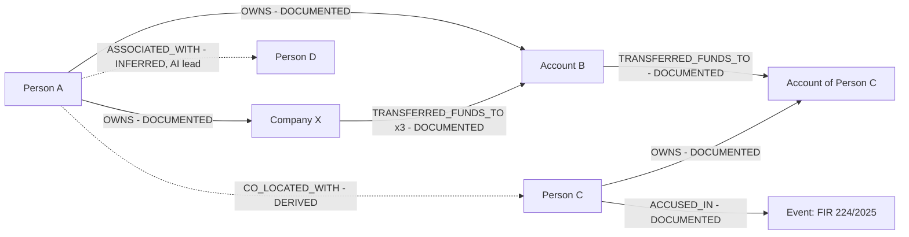

In this ontology-conformant form, the company's transfers originate from a company account; the S1 explanation example abbreviates this as "Company X → Account B" (C-03).

### Appendix E — Example alert `ILLUSTRATIVE`

```json
{
  "alert_id": "A-000123",
  "entity_or_network_id": "NET_0091",
  "risk_score": 0.87,
  "confidence_band": "HIGH",
  "detected_pattern": "layering via shell chain",
  "time_window": "2025-05-10/2025-05-16",
  "contributing_records": ["REG-0512", "TXN-SYN-88213", "TXN-SYN-88214", "TXN-SYN-88220", "BANK-KYC-000871", "FIR-224-2025"],
  "related_entities": ["PERSON_184729", "ORG_000512", "ACC_39021", "PERSON_220915"],
  "evidence_subgraph": "<subgraph id>",
  "model_version": "<pinned version>",
  "legal_basis_check": "passed",
  "generated_at": "2026-03-02T06:00:00Z",
  "assigned_to": "<analyst id>",

  "case_id": "CASE-0231",
  "evidence_class_summary": {"DOCUMENTED": 7, "DERIVED": 1, "INFERRED": 0},
  "status": "Triaged",
  "explanation_fidelity": {"before": 0.94, "after_removal": 0.21},
  "replay_reference": "<ingestion snapshot id>"
}
```

Fields after the blank line are `[PROPOSED]` (§17.8).

### Appendix F — Example evidence chain `ILLUSTRATIVE`

| Step | Claim in alert | Class | Supported by |
|---|---|---|---|
| 1 | Person A owns Company X | DOCUMENTED | Registry record REG-0512 |
| 2 | Company X transferred ₹18L to Account B in 3 transactions over 6 days | DOCUMENTED | TXN records |
| 3 | Person A owns Account B | DOCUMENTED | KYC record BANK-KYC-000871 |
| 4 | Account B transferred ₹17L onward to Person C's account | DOCUMENTED | TXN record |
| 5 | Person C is accused in FIR 224/2025 | DOCUMENTED | FIR |
| 6 | Person A and Person C are connected in 3 hops via shells | DERIVED | Path over steps 1–5 |
| 7 | The chain matches T-01 layering | INFERRED (output) | Typology query + GNN signal; fidelity 0.94 → 0.21 |
| 8 | Person A is a person of interest | Human judgement (not a class) | Investigator decision, recorded with identity |

The chain ends with a human judgement. Step 7 is the only model output; steps 1–5 are pointers to evidence; step 6 is reproducible reasoning.

### Appendix G — Example investigator workflow `ILLUSTRATIVE`

1. An IO opens FIR 224/2025 under CASE-0231; case ID and legal basis are verified (G-01).
2. Entities are resolved; "Ali bhai" is proposed as an alias of PERSON_184729 at 0.82 and goes to the review queue (0.75–0.95); a reviewer rejects it for lack of corroboration, and it remains a logged possible link.
3. Network Explorer expands Person C's typed neighbourhood; Fund Flow shows the Company X chain.
4. The Alerts view shows A-000123; the explanation panel separates documented, derived and inferred elements and lists lawful look-alikes.
5. The analyst runs a disruption simulation on the network; the result shows fragmentation only.
6. The IO decides to seek beneficial-ownership records under proper authorisation. The alert is attached to the case with the decision recorded.
7. The exported package lists documented evidence, derived reasoning, and AI leads in separate sections, with hashes and model versions.

### Appendix H — Consolidated schemas

| Schema | Defined in | Status |
|---|---|---|
| Node types and attributes | §09.2 | `[DECIDED]` |
| Edge types and properties | §09.3 | `[DECIDED]` |
| Mandatory edge properties | §09.4 | `[DECIDED]` |
| Provenance extensions | §09.5 | `[PROPOSED]` |
| Entity-resolution output contract | §11.10 | `[DECIDED]` |
| Alert object | §17.8 | `[DECIDED]` + `[PROPOSED]` fields |
| Alert lifecycle states | §17.9 | `[PROPOSED]` |
| Evidence classes | §19.2 | `[DECIDED]` definitions; encoding `[PROPOSED]` |

### Appendix I — Diagram notation

| Mermaid element | Meaning in this document |
|---|---|
| Solid arrow `-->` | Data flow or DOCUMENTED relationship |
| Dotted arrow `-.->` | DERIVED or INFERRED relationship (label states which), or a `[FUTURE]` / `[OPEN]` connection |
| Subgraph box | Layer, system boundary, or organisation |
| Edge label in CAPS | CKG edge type |
| Diamond `{…}` | Decision point |

Diagram notation is for documentation only; the product's visual encoding for evidence classes is §19.6.

### Appendix J — Reference tables

**J.1 Typology × data source dependency** (✓ = required, ○ = helpful)

| Typology | DS-01 FIR | DS-03 CDR | DS-04 Txn | DS-05 Account | DS-06 Vehicle | DS-11 Registry | DS-12 Travel |
|---|---|---|---|---|---|---|---|
| T-01 Shell layering | ○ | | ✓ | ✓ | | ✓ | |
| T-02 Mule network | ○ | | ✓ | ✓ | | | |
| T-03 Structuring | | | ✓ | ○ | | | |
| T-04 Burner tree | | ✓ | | | | | |
| T-05 Co-offending ring | ○ | ✓ | | | ○ | | |
| T-06 Trafficking corridor | ○ | ✓ | ✓ | | ○ | | ○ |
| T-07 Emerging network | ○ | ✓ | ✓ | | | ○ | |
| T-08 Key player | ✓ | ✓ | ✓ | ✓ | ○ | ○ | |

`[PROPOSED]` (derived from §15).

**J.2 Status-label quick reference** — §00.6. **J.3 Puttaswamy mapping** — §25.2. **J.4 Governance controls** — §24.2.

### Appendix K — v1.0 → v2.0 section mapping

| v1.0 section | v2.0 location | Notes |
|---|---|---|
| Header (PS ID, organisation, category, theme, immediate deliverable) | §00.1 | "Immediate deliverable: internal (college) round pitch deck" is a derivative-artefact note, not project content |
| §0 How to use this document | §00.2–00.10 | Expanded for humans and AI agents |
| §1 The mandate | §01.2, §02, §03 | |
| §2 The problem in the field | §02 | |
| §3 What already exists — and the gap | §05, §01.8, §28 | Absolute claims qualified (C-12) |
| §4 The pitch | §01.9, §06.1 | Five-stage arc reconciled with six-stage (C-23) |
| §5 Product value (personas, before/after, targets) | §07, §03.2, §26 | Before/after figures kept as targets only |
| §6 System architecture | §22, §06.2 | |
| §7 Data model | §09 | Extended with proposed provenance fields and gaps |
| §8.1 Ingestion | §10 | Streaming/ER conflict C-15 |
| §8.2 Normalisation | §10.2, §09.8 | |
| §8.3 NLP | §10.3–10.4, §14.2 | Extraction example annotated (C-03) |
| §8.4 Entity resolution | §11 | |
| §8.5 Graph analytics | §13 | |
| §8.6 Spatio-temporal | §16 | Warehouse precision (C-18) |
| §8.7 GNNs | §14.4 | |
| §8.8 Risk engine | §17 | |
| §8.9 XAI | §18 | Fidelity-as-evidence (C-19); structuring label (C-17) |
| §8.10 Dashboard | §21 | |
| §9 Technology stack | §23 | Columns renamed as tiers |
| §10 Detection typologies | §15 | Expanded to nine attributes each |
| §11 Legal, constitutional, ethical | §24, §25, §30.3 | |
| §12 Evaluation | §26 | |
| §13 Roadmap — Phase 0 (pitch), Phase 1 (36-hour prototype, demo script) | §04.4 (prioritisation signal), §23 (implementation tier) | Schedule, dataset sizes and demo script **removed** from the SSOT (D-25); belong to the implementation plan |
| §13 Roadmap — Phases 2–3 | §30.1–30.2 | `[FUTURE]` |
| §14 Risks and honest answers | §29, §11.11, §17, §24 | Answers distributed to owning sections |
| §15 Fact-check appendix | §05, §25, §27, audit | Corrections kept as `[DEPRECATED]` entries |
| §16 Slide mapping | Removed (D-25) | Belongs to the deck. Tagline and positioning lines preserved in §01 and §06.4 |
| §17 Glossary | §33 | All terms preserved |

### Appendix L — Contradiction Register

All entries remain `[OPEN]` unless stated. Both sides are preserved; this document does not choose between them.

| ID | Topic | Side A | Side B | Why it matters | Resolution path |
|---|---|---|---|---|---|
| C-01 | Meaning of `confidence` | S1 §7: edge `confidence` = "how sure entity resolution was" | S1 elsewhere: extraction confidence, inference confidence, alert confidence bands | One field cannot carry three meanings | §09.5 proposal; Q-AIM-06 |
| C-02 | Provenance of inferred edges | S1: `source_record_id` + `legal_basis` "make the graph evidence rather than speculation"; mandatory on every edge | AI-inferred edges have no source record | Either inferred edges violate the mandatory rule or the rule needs a second form | §09.5 (`derived_from`, `model_version`); Q-ARC-05 |
| C-03 | `TRANSFERRED_FUNDS_TO` endpoints and naming | S1 §7: BankAccount → BankAccount | S1 §8.3: Amit → XYZ Enterprises (Person → Organization); §8.9: Company X → Account B; glossary meta-path "TRANSFERS" | Ontology conformance; typed queries break | Q-DAT-12 |
| C-04 | Offline deployment | S3 deck: "100% offline execution", "fully offline" | S1: Kafka/Flink streaming; federated learning exchanging updates across agencies | Technically literate evaluators will catch it | Q-PRD-05 |
| C-05 | Proactive discovery vs purpose limitation | S1 §3: "flags networks nobody queried for" | S1 §11.5/§14: every query needs case ID + legal basis; "analyses data already lawfully held for a specific case" | Proportionality; mass-surveillance optics | Q-LEG-01; §17.10 proposal |
| C-06 | "6–10 hops" | S1 §2, §3: the link that matters may be 6–10 hops away | S3 review: in dense (small-world) graphs almost everything is within a few hops; path existence is weak evidence | Credibility; evidential value | Q-RES-03 |
| C-07 | Licence / foreign-vendor critique | S1 §3: COTS platforms are "foreign, expensive, licence-bound" | S1 §9: Neo4j (and GDS) for implementation; TigerGraph for deployment — both commercial vendors | Self-contradiction in argument | D-10 revisit |
| C-08 | Statistics currency | S1 §15: 17,130 police stations; 28 crore+ records | S3 review: 17,762 police stations as of 1 June 2026; "28 crore" may be dated | Dated figures undermine credibility | Q-RES-04 |
| C-09 | ER confidence field name | §11 output contract: `match_confidence` | `Person.resolution_confidence` | Schema ambiguity | Q-AIM-03 |
| C-10 | Disruption simulation scope | S3 deck: see "who takes over" / "who steps up" | S1 §8.5: KPP-1 measures fragmentation; succession is not a structural computation | Overclaiming | Q-PRD-02, Q-RES-01 |
| C-11 | Organisational attribution | S1 header: "MHA — NCRB (Women Safety Division)"; S1 §3: "NCRB's Women Safety Division owns CCTNS and ICJS" | The Women Safety Division may be an MHA division rather than part of NCRB (`VERIFY`) | Accuracy before government evaluators | Q-RES-05 |
| C-12 | Absolute uniqueness claims | S1 §3: "None of them answers…"; "Nothing in the current stack resolves Mohd Ali ≡ …" | Trinetra has phonetic search; ICJS has link analysis; NATGRID has Gandiva | Easily refuted absolutes | §28.8 safe phrasing; Q-RES-06 |
| C-13 | Missing edges for roles S1 relies on | S1 §8.3 extracts Victim, Witness; §10 uses common directors and shared addresses | S1 §7 has only `ACCUSED_IN`; directors and address are attributes, not edges | Typologies and extraction outputs cannot be stored as typed edges | Q-DAT-12 |
| C-14 | Phone-level presence | S1 §7: `PRESENT_AT` from Person/Device only | CDRs give PhoneNumber-level presence; S1 §8.6 attributes phone trajectory to person; Device source unspecified | Presence cannot be stored before attribution | Q-DAT-02, Q-DAT-12 |
| C-15 | Streaming path and ER | S1 §8.1 real-time path: … → Flink → normalised event → graph upsert | S1 §6.1: ER precedes the graph for all data | Unresolved identifiers enter the graph | Q-ARC-08 |
| C-16 | Blockchain theme | S1 header / deck: theme "Blockchain & Cybersecurity"; deck "tamper-proof" | No blockchain or ledger mechanism in S1 (only hash-chained export, append-only audit) | Theme fit | Q-PRD-06, G-15 |
| C-17 | Layering vs structuring | S1 §8.9 example: layered chain called "classic structuring"; §8.10: retention per hop is "the structuring fingerprint" | S1 §10: structuring = splitting below thresholds; layering = shell chains | Terminology error visible to financial investigators | Use typology catalogue terms (§15) |
| C-18 | Location precision | S1 §8.6: "twelve meetings at 2 a.m. at the same warehouse" | S1 §8.6: CDR location is tower-level, never GPS | Implied building-level precision | §16.6 canonical phrasing |
| C-19 | Fidelity as evidence | S1 §8.9: fidelity "is what converts a model output into evidence"; explanation "usable for a warrant application" | S2 Lead-vs-Evidence Separation; S1: "Risk ≠ probable cause" | Could lead to model outputs presented as evidence | §18.5 canonical position |
| C-20 | Project name | S2 and deck: "C.I.D." | S3: dashboard mockup labelled "Sutradhar"; review notes the collision with police CID wings | Brand clarity; confusion | Q-PRD-01, D-24 |
| C-21 | Deletion vs immutability | S1 §11.5: sunset deletion of cleared individuals | S1: immutable, append-only audit; hash-chained export; G-15 ledger (proposed) | Personal data in immutable stores cannot be deleted | Q-SEC-05 |
| C-22 | Minimisation vs matching | S1 §7: store `msisdn_hash`, `account_hash` | ER needs identifier matching; unkeyed hashes of phone numbers are reversible by enumeration | Privacy promise may not hold; fuzzy matching lost | Q-SEC-04 |
| C-23 | Transformation stages | S1 §4 / deck: five stages | S2: six stages | Consistent (S2 splits "relationship graph" into Relationships and Criminal Networks) | **Reconciled** — S2 form canonical per source register; recorded for traceability |
| C-24 | "Who to arrest" wording | S1 §8.5 KPP table: operational use "who to arrest / interdict" | Leads-never-verdicts; human decision for enforcement | Output could be read as an arrest recommendation | Canonical: "whose interdiction would most fragment the network, for human decision" (F-04) |
| C-25 | FL + DP status | S1 §6.1: FL + DP shown in the cross-cutting governance layer | S1 §13: federated learning is out of scope for the prototype and turned on in Phase 3 | Status confusion (current vs future) | Treated as `[FUTURE]` (§22.1, D-22) |

---
## MASTER DOCUMENT AUDIT

*Audit of v2.0 against S1 (v1.0) and S2 (restructure brief). Performed 2026-09-10.*

### A.1 Sections covered

| Required | Delivered |
|---|---|
| Sections 00–34 | All 35 present, in order |
| Appendices | A (entities), B (relationships), C (records), D (graph), E (alert), F (evidence chain), G (workflow), H (schemas), I (notation), J (reference tables), K (v1.0 → v2.0 mapping), L (contradiction register) |
| Conceptual diagrams (9 required) | Ecosystem §05.1 · Data → intelligence §06.1 and §10.1 · Knowledge-graph architecture §12.2 · Entity-resolution flow §11.4 · AI pipeline §14.1 · Evidence vs inference §19.3 · Risk and alert pipeline §17.2 · Investigator workflow §21.3 · Overall system architecture §22.1 |
| Additional diagrams | Convergence example §12.12, co-location §16.4, alert lifecycle §17.9, explainers §18.3, federated learning §30.3, example graph Appendix D (16 Mermaid blocks in total) |
| Registries | 18 features, 8 typologies, 14 use cases, 12 data sources, 15 governance controls, 20 risks, 25 decisions, 66 open questions, 25 contradictions, 7 assumptions |

### A.2 Information preserved from v1.0

Every v1.0 section is mapped to a v2.0 location in Appendix K. Preserved in substance: the mandate and three required outputs; the synthesis-not-collection framing; the analytical-layer positioning; the ecosystem facts and all three fact-check corrections (kept as `[DEPRECATED]` entries so they cannot be reintroduced); the four differentiators; the one-line pitch, tagline and positioning lines; personas and targets; the layered architecture and "construction above / inference below" principle; the full ontology and mandatory edge properties; every component deep dive (ingestion, normalisation, joint extraction, entity resolution with three-tier thresholds and output contract, analytics and KPP, spatio-temporal, GNNs, risk engine and alert schema, XAI, dashboard); both technology columns and the graph-database argument; all eight typologies; the full legal framework including federated learning's accuracy–privacy trade-off; evaluation targets and validation strategy; Phases 2–3; every risk Q&A answer; the full glossary.

**Removed by decision D-25:** the 36-hour prototype schedule, synthetic dataset sizes, demo script, and slide mapping with slide-copy rules. These belong to the implementation plan and the deck. The prioritisation signal from the prototype scope is preserved as capability tiers (§04.4).

**Brought in from S2/S3:** features F-01 to F-04 (S2); six-stage transformation (S2); deck statements on on-premise operation, BSA certificate support, natural-language questions and "who takes over" (tagged `[ASSUMPTION]`, `[PROPOSED]` or `[OPEN]`, never `[DECIDED]` alone); review recommendations (hash-chained ledger, reframed proactive alerts, link-prediction metrics, cost line, counterfactuals, exculpatory context) — all at most `[PROPOSED]`.

### A.3 New information inferred in v2.0 (all `[PROPOSED]` unless stated)

- `evidence_class` and provenance extensions (`extraction_confidence`, `inference_confidence`, `derived_from`, `method`, `model_version`, `record_hash`, `source_system`, `authorisation_tier`) — §09.5
- Evidence classification rules, including weakest-input inheritance and no automatic promotion — §19.4
- Confidence taxonomy separating extraction, resolution and inference confidence — §09.5, C-01
- Alert lifecycle, proposed alert fields, risk-vs-confidence distinction — §17
- Governance roles (ER reviewer, supervisor, auditor, model owner) — §07.6
- Capability tiers (Core / Advanced / Future) — §04.4
- Typology attributes beyond S1's graph signatures (data, temporal and AI signals; outputs; evidence; false positives; interpretation) — §15
- Ontology gap candidates — §09.9
- Data-architecture stores — §22.3
- Bitemporal framing of `valid_*` vs `ingested_at` — §12.6
- Keyed hashing for low-entropy identifiers; deletion-vs-immutability reconciliation — §24
- Constraints on natural-language assistance — §14.12
- Deterministic-vs-learned claim table — §14.13
- Puttaswamy limb-to-control mapping (S1 required it; the mapping itself is new) — §25.2
- Evaluation additions: false merge rate, review-band volume, AUC-PR, evidence coverage, human interpretability — §26.2
- Typology × source matrix — Appendix J.1
- Candidate references added as `[RESEARCH]` · `VERIFY` — §27

No v2.0 inference is labelled `[DECIDED]`.

### A.4 Remaining gaps

| Gap | Where recorded |
|---|---|
| No data-access arrangement; no legal-basis framework for telecom/financial access | Q-DAT-01, Q-LEG-02 |
| Fields undefined for surveillance, intelligence and travel sources | Q-DAT-11 |
| Ontology cannot yet store victim/witness roles, directorships, phone-level presence, social handles | §09.9, C-13, C-14 |
| No training labels for GNNs; domain transfer unproven | Q-AIM-01, R-15 |
| Risk-fusion weights, calibration and severity undefined | Q-AIM-11, §17.6 |
| Where source records live for click-through | Q-ARC-01 |
| Retention periods and "cleared of suspicion" undefined | Q-LEG-05 |
| Fairness measurement design | Q-EVL-05 |
| No cost estimate | Q-EVL-04 |
| No operational baseline for before/after claims | §26.4 |

### A.5 Contradictions found

25 entries in Appendix L. By severity:

| Severity | IDs | Reason |
|---|---|---|
| High — would damage credibility or legal defensibility if repeated externally | C-04 (offline), C-05 (proactive vs purpose limitation), C-10 (disruption succession), C-12 (absolute claims), C-16 (blockchain theme), C-19 (fidelity as evidence) | Visible to evaluators; touch the core evidence discipline |
| Medium — schema or design conflicts | C-01, C-02, C-03, C-09, C-13, C-14, C-15, C-21, C-22, C-25 | Must be settled before implementation planning |
| Low — wording or currency | C-06, C-07, C-08, C-11, C-17, C-18, C-20, C-24 | Fix in derivatives with the canonical phrasing |
| Reconciled | C-23 | Five-stage and six-stage forms are consistent; S2 form canonical |

### A.6 Decisions that need team confirmation

Highest priority first:

1. **Scope of proactive alerts** (C-05, Q-LEG-01) — adopt the supervisor-reviewed, case-scoped reframing in §17.10 or not.
2. **Deployment wording** (C-04, Q-PRD-05) — "on-premise, air-gapped" vs "fully offline".
3. **Disruption simulation claims** (C-10, Q-PRD-02) — fragmentation only, or research into succession.
4. **Theme response** (C-16, Q-PRD-06, Q-ARC-07) — adopt the hash-chained ledger (G-15) or not.
5. **Adopt the evidence-class model** as specified (§09.5, §19.4) — definitions are `[DECIDED]`; fields and rules await confirmation, including Q-AIM-05 (class of merged identities).
6. **Ontology extensions** (Q-DAT-12) — at least `DIRECTOR_OF`, victim/witness roles, phone-level presence.
7. **Project name** (C-20, Q-PRD-01).
8. **Graph-database licensing position** (C-07, D-10).
9. **Natural-language assistance** in or out (Q-PRD-03, Q-AIM-09).
10. **Capability tiers** (§04.4) and **alert lifecycle** (§17.9).

### A.7 Claims requiring external verification (`VERIFY`)

| Claim | Where |
|---|---|
| Current CCTNS figures (17,130 vs 17,762 police stations; 28 crore+ records) | §05, C-08 |
| Organisational owner of CCTNS/ICJS (MHA Women Safety Division vs NCRB) | C-11 |
| ICJS link-analysis module capabilities; Trinetra's current capabilities | §05, §28 |
| Palantir-class and i2 capabilities; "no Indic ER" claim | §05, §28 |
| BSA section number and certificate format for electronic evidence | §25.4 |
| Puttaswamy five-limb formulation and its attribution | §25.2 |
| DPDP §17(1)(c) relevance | §25.3 |
| Neo4j / GDS licence terms for the algorithms used | §23, C-07 |
| TigerGraph performance claims (vendor benchmarks — attribute) | §23.2 |
| Availability/coverage of Indic phonetic libraries and IndicOCR | §11.3, §23 |
| MTKD "near-teacher accuracy" in this domain | §14.2 |
| KPP computational characterisation | §13.7 |
| Candidate references in §27 (Sparrow, Morselli, SpERT, table-filling, Hinton, ST-DBSCAN, Merkle, HMAC, Lum & Isaac, Ensign et al.) | §27 |

### A.8 Final quality-control pass

| Check | Result |
|---|---|
| Hallucinations | No new statistics, datasets, accuracy results, partnerships or deployments introduced. All numbers are from S1 (targets marked `TARGET`), S3 (marked `VERIFY`), or synthetic (`ILLUSTRATIVE`). External references added only where they support a stated claim, and flagged as candidates. |
| Contradictions | 25 recorded with both sides preserved; none silently resolved. |
| Status confusion | Every capability carries a status; `[FUTURE]` items isolated in §30; FL + DP status conflict recorded (C-25). No v2.0 inference is `[DECIDED]`. |
| Overclaiming | Absolute and aspirational claims flagged (C-04, C-06, C-10, C-12, C-18, C-19, R-19); safe phrasings in §28.8. |
| Government-system accuracy | S1 fact-check preserved; corrections deprecated; currency and attribution issues flagged (C-08, C-11). |
| Technical consistency | Cross-references checked automatically: every cited C-, Q-, R-, D-, G-, A-, F-, T-, UC- and DS- identifier is defined. Streaming/ER, edge-endpoint and presence conflicts recorded (C-03, C-14, C-15). |
| Evidence consistency | Three-class model applied in examples (§10.4, §18.6, §19.5, Appendices B, D, F); fidelity reframed (C-19). |
| Terminology consistency | Canonical names in §00.8; `TRANSFERRED_FUNDS_TO` vs "TRANSFERS" and layering vs structuring flagged (C-03, C-17). |
| Scope consistency | Non-objectives and AI boundaries in §03.6 and §04.7; no implementation plan content (D-25). |
| Legal consistency | Legal requirements vs governance principles vs future considerations classified (§25.1); unverified sections marked; "not legal advice" stated. |
| AI-agent usability | Stable IDs, status tags on every claim, source line per section, agent rules in §00.10, examples marked synthetic. |

**Label counts (approximate occurrences):** `[DECIDED]` ~285 · `[PROPOSED]` ~141 · `[OPEN]` ~100 · `[RESEARCH]` ~90 · `[FUTURE]` ~38 · `[ASSUMPTION]` ~21 · `[DEPRECATED]` 7 · `VERIFY` ~57.

---

*C.I.D. Master Project Document v2.0 — Single Source of Truth for SIH 2026 PS 26189. Restructured from Master Reference Document v1.0 (built on the deep-research write-up by Jemina, with external claims independently verified and three factual corrections applied). Items marked `[OPEN]` await team decision.*
