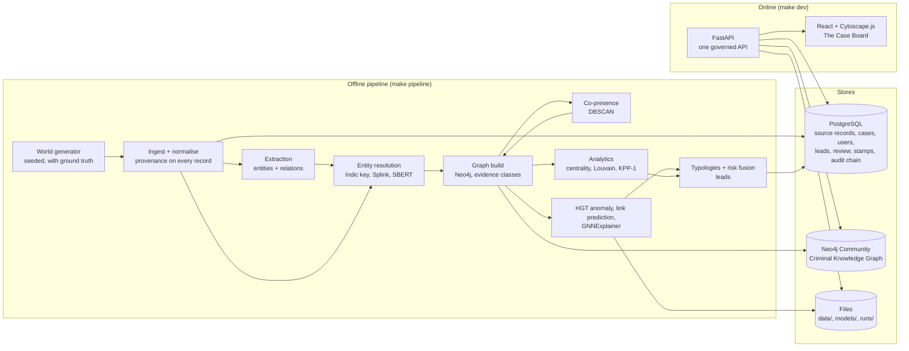

# C.I.D. Prototype — Architecture (`architecture.md`)

> **Source of truth:** `docs/CID_Master_Project_Document_v2.0.md` (the master). Product requirements: `docs/prd.md`. Build order and tests: `docs/implementation.md`.
> Prototype decisions P-01 to P-18 are defined in `prd.md` §10 and are assumed confirmed here.

---

## 1. System at a glance



**Shape:** one Python package with an offline pipeline and an online API, two databases in Docker, one React app. No message queues, no microservices. The master's streaming layer, TigerGraph and federated learning are not in the prototype (master §04.4 Future tier).

---

## 2. Architecture principles

1. **One governed door.** Every data read goes through the FastAPI layer, which checks identity, role, case assignment, case ID and legal basis, and writes an audit entry — allowed or refused (master G-01, G-05, G-06).
2. **Provenance is not optional.** A `DOCUMENTED` edge cannot be written without a `source_record_id` that exists in `source_records`. The graph writer enforces this; a test proves it.
3. **The AI writes in pencil only.** ML code can create only `AI_SUGGESTED` relationships (P-03) and scores. It has no code path to create documented or derived edges.
4. **Deterministic by default.** One seed in `config/cid.yaml` drives generation, splits and training. Every pipeline run gets a `run_id`; every lead, suggestion and metric stores it.
5. **Contracts first.** Each pipeline stage reads and writes a typed contract (Pydantic models in `cid/schemas`). Stages can be re-run independently.
6. **Small graphs on screen.** The API returns case-scoped subgraphs capped at 300 nodes, with crowds bundled.
7. **No external calls at runtime.** Hugging Face models and fonts are fetched once; at runtime `HF_HUB_OFFLINE=1` and `TRANSFORMERS_OFFLINE=1` are set, and the frontend loads nothing from a CDN.

---

## 3. Technology choices

| Layer | Choice | Master status |
|---|---|---|
| Language | Python 3.12 (backend, pipeline, ML); TypeScript (frontend) | DECIDED |
| API | FastAPI + Pydantic v2 + Uvicorn | DECIDED |
| Graph DB | Neo4j 5 Community (Docker `neo4j:5-community`), official `neo4j` Python driver | DECIDED (D-10) |
| Relational store | PostgreSQL 16 (Docker), `psycopg` 3 with plain SQL | DECIDED (Postgres audit table); P-17 |
| Graph analytics | NetworkX 3 on case subgraphs pulled from Neo4j (GDS not required) | DECIDED |
| ER | `jellyfish` (Jaro-Winkler, Levenshtein), `indic-transliteration`, Splink 4 on DuckDB, `sentence-transformers` | DECIDED (D-05) |
| NLP | Hugging Face `transformers`, `google/muril-base-cased` | DECIDED (D-08) |
| Context embeddings | `sentence-transformers/paraphrase-multilingual-MiniLM-L12-v2` (Sentence-BERT family, multilingual) | DECIDED (Sentence-BERT) |
| GNN | PyTorch (CUDA) + PyTorch Geometric: `HGTConv`, `torch_geometric.explain` (GNNExplainer) | DECIDED (D-11, D-12) |
| Spatial | scikit-learn DBSCAN | DECIDED (D-21) |
| Auth | JWT (`pyjwt`), bcrypt-hashed demo users in Postgres | DECIDED (implementation tier) |
| Frontend | React 18, Vite, TypeScript, React Router, Zustand (UI state), TanStack Query (server state) | React DECIDED |
| Graph rendering | Cytoscape.js + `cytoscape-fcose` | DECIDED |
| Styling | Plain CSS with CSS variables (`tokens.css`) and CSS Modules — no UI kit | Prototype choice |
| Fonts | `@fontsource/anek-latin`, `@fontsource/anek-devanagari`, `@fontsource/anek-tamil`, `@fontsource/anek-bangla`, `@fontsource/tiro-devanagari-hindi` (bundled) | Prototype choice (prd §5.4) |
| Testing | pytest; Vitest for frontend pure functions; Playwright for the demo story (`STRETCH`) | Prototype choice |
| Tooling | Docker Compose, `make`, `uv` (or pip) for Python env, `ruff`, `eslint` + `prettier` | Prototype choice |

Pin exact versions in `pyproject.toml` and `package.json` at M0 and do not upgrade mid-build.

---

## 4. Repository layout

```
cid/
├── CLAUDE.md                     agent rules (from implementation.md §0)
├── Makefile                      up, down, world, pipeline, dev, test, reset, verify-offline
├── docker-compose.yml            neo4j, postgres
├── .env.example                  secrets template (HMAC key, JWT secret, DB passwords)
├── config/
│   └── cid.yaml                  seed, thresholds, parameters, model names, paths
├── docs/
│   ├── CID_Master_Project_Document_v2.0.md
│   ├── prd.md  architecture.md  implementation.md
│   └── NOTES.md                  agent scratchpad: decisions, surprises, open conflicts
├── backend/
│   ├── pyproject.toml
│   ├── cid/
│   │   ├── core/                 config.py, db_pg.py, db_neo4j.py, ids.py, hashing.py, logging.py, runs.py
│   │   ├── schemas/              records.py, mentions.py, entities.py, graph.py, leads.py, api.py
│   │   ├── governance/           auth.py, policy.py, audit_chain.py, middleware.py
│   │   ├── pipeline/
│   │   │   ├── generate/         world.py, names.py, narratives.py, networks.py, lookalikes.py, truth.py
│   │   │   ├── ingest/           load.py
│   │   │   ├── normalize/        names.py, phones.py, dates.py, offences.py, addresses.py
│   │   │   ├── extract/          base.py, rules.py, muril_joint.py, train_muril.py
│   │   │   ├── resolve/          indic_key.py, candidates.py, splink_model.py, decide.py, output.py
│   │   │   ├── graph_build/      schema.cypher, writer.py
│   │   │   ├── spatiotemporal/   copresence.py
│   │   │   ├── analytics/        subgraph.py, centrality.py, communities.py, kpp.py, cut.py
│   │   │   ├── ml/               hetero_data.py, features.py, hgt.py, train_hgt.py, linkpred.py, explain.py, registry.py
│   │   │   ├── detect/           typologies.py, risk.py, leads.py, templates.py
│   │   │   └── run.py            orchestrates the stages; writes runs/<run_id>/
│   │   ├── api/                  main.py, routers/{auth,cases,leads,graph,entities,records,analytics,suggestions,review,export,audit,metrics}.py
│   │   └── metrics/              er.py, nlp.py, ml.py, report.py
│   └── tests/                    mirrors cid/ ; fixtures/ holds a tiny seeded world
├── frontend/
│   ├── package.json  vite.config.ts  index.html
│   └── src/
│       ├── main.tsx  routes.tsx
│       ├── design/               tokens.css, fonts.ts, global.css
│       ├── api/                  client.ts, types.ts, hooks.ts
│       ├── state/                session.ts, board.ts
│       ├── shell/                CaseStrip.tsx, Caption.tsx, QuestionRail.tsx, Legend.tsx, TimeStrip.tsx
│       ├── board/                Board.tsx, useCytoscape.ts, styles.ts, applyGraph.ts, overlays/,
│       │                         lenses/{network,money,keyplayers,time,place}.ts, collapse.ts, cut.ts, wobble.ts
│       ├── drawer/               WhyDrawer.tsx, RecordSheet.tsx, Highlight.tsx
│       ├── identity/             IdentityFan.tsx
│       ├── leads/                LeadsPage.tsx, EvidenceTally.tsx
│       ├── review/               ReviewQueue.tsx
│       ├── case/                 CasePacket.tsx
│       ├── audit/                AuditPage.tsx
│       ├── metrics/              MetricsPage.tsx
│       └── lib/                  caption.ts, format.ts (pure, unit-tested)
├── data/                         generated world and intermediates (git-ignored)
├── models/                       hf/ cache, trained models with version hashes (git-ignored)
└── runs/                         per-run metrics.json, config snapshot, logs (git-ignored)
```

---

## 5. Data architecture

### 5.1 PostgreSQL tables

| Table | Key columns | Purpose |
|---|---|---|
| `source_records` | `source_record_id` PK, `source_system`, `record_type` (fir, cdr, txn, kyc, phone_reg, company, vehicle), `legal_basis`, `auth_tier`, `ingested_at`, `raw` jsonb, `text`, `record_hash` | Every original record, for click-through and hashing (P-17) |
| `mentions` | `mention_id` PK, `source_record_id`, `entity_type`, `surface` (as written), `script`, `start`, `end`, `extraction_confidence`, `resolved_entity_id` | Extracted or structured mentions with offsets (drives highlighter) |
| `relation_mentions` | `id`, `source_record_id`, `head_mention_id`, `tail_mention_id`, `rel_type`, `start`, `end`, `extraction_confidence` | Relations stated in text; required for *Pin a record* |
| `entities` | `entity_id` PK, `entity_type`, `canonical_name`, `resolution_confidence`, `review_status`, `run_id` | Golden entity profiles (master §11.10) |
| `er_pairs` | `pair_id`, `mention_a`, `mention_b`, `match_probability`, `evidence` jsonb, `tier`, `decision`, `decided_by`, `decided_at` | Review queue and merge evidence |
| `users`, `case_assignments` | `user_id`, `role`, `display_name`, `password_hash`; (`user_id`, `case_id`) | Demo auth and ABAC |
| `cases` | `case_id`, `title`, `anchor_record_id`, `legal_basis`, `status` | Purpose limitation |
| `leads` | `lead_id` PK, all master §17.8 fields + `case_id`, `status`, `evidence_class_summary`, `explanation_fidelity`, `run_id` | Alerts/leads (master §17.8, P-06) |
| `lead_subgraph` | `lead_id`, `element_id`, `element_kind` (node/edge), `evidence_class`, `role` (core/context) | Evidence subgraph per lead |
| `stamps` | `stamp_id`, `target_kind`, `target_id`, `decision`, `reason`, `user_id`, `at` | Every human decision (violet marks) |
| `case_items` | `case_id`, `item_kind`, `item_id`, `added_by`, `at` | Case file contents |
| `audit_log` | `seq` PK, `at`, `user_id`, `role`, `case_id`, `legal_basis`, `action`, `target`, `outcome`, `prev_hash`, `entry_hash` | Hash-chained audit (P-09) — stores IDs only, never personal data (master C-21) |
| `audit_seals` | `seal_id`, `from_seq`, `to_seq`, `merkle_root`, `at` | Seal every 100 entries |
| `pipeline_runs` | `run_id`, `seed`, `config_snapshot`, `started_at`, `finished_at`, `metrics` jsonb | Traceability |

### 5.2 Neo4j graph schema

Node labels (master §09.2 + P-02): `Person`, `Organization`, `BankAccount`, `PhoneNumber`, `Vehicle`, `Location`, `Event`, `Device`. Every node has `entity_id` (unique constraint), `run_id`.

| Relationship | From → To | Required properties | Class |
|---|---|---|---|
| `ACCUSED_IN`, `VICTIM_IN`, `WITNESS_IN` | Person → Event | common set + `role`, `section`, `FIR_no` | DOCUMENTED |
| `OWNS` | Person/Organization → Organization/Vehicle/BankAccount | common set + `since`, `stake_pct` | DOCUMENTED |
| `DIRECTOR_OF` | Person → Organization | common set | DOCUMENTED |
| `REGISTERED_AT` | Organization/Person → Location | common set | DOCUMENTED |
| `TRANSFERRED_FUNDS_TO` | BankAccount → BankAccount | common set + `amount`, `timestamp`, `channel`, `txn_id` | DOCUMENTED |
| `CALLED` | PhoneNumber → PhoneNumber | common set + `timestamp`, `duration`, `cell_tower` (one edge per call, P-04) | DOCUMENTED |
| `REGISTERED_TO` | PhoneNumber/Vehicle → Person | common set + `date`, `document_type` | DOCUMENTED |
| `PRESENT_AT` | PhoneNumber/Device/Person → Location | common set + `timestamp`, `dwell_time`, `source` | DOCUMENTED (phone), DERIVED (person) |
| `ASSOCIATED_WITH` | Person → Person | common set + `strength`, `first_seen`, `last_seen`, `basis` | DOCUMENTED or DERIVED per `basis` |
| `CO_LOCATED_WITH` | Person → Person | common set + `location`, `window`, `frequency`, `night_share` | DERIVED |
| `AI_SUGGESTED` | any → any | `suggested_type`, `inference_confidence`, `model_version`, `derived_from`, `status` (open/erased/pinned), `run_id` | INFERRED |

**Common set** on every edge: `edge_id`, `source_record_id` (null only for DERIVED/INFERRED), `confidence`, `ingested_at`, `valid_from`, `valid_to`, `legal_basis`, `evidence_class`, `extraction_confidence`, `resolution_confidence`, `derived_from` (list), `method`, `record_hash`, `run_id`.

`confidence` keeps the master's field for compatibility and is set to `min(extraction_confidence, resolution_confidence)` for documented edges (master C-01 recorded; the specific fields are the ones the UI reads).

Constraints and indexes (`schema.cypher`): unique `entity_id` per label; index on relationship `edge_id`; index on `Event.FIR_no`; index on `Location.entity_id`.

### 5.3 Identifiers and hashing

- Entity IDs: `PERSON_000123`, `ORG_000045`, `ACC_…`, `PHN_…`, `VEH_…`, `LOC_…`, `EVT_…`, `DEV_…` (master format).
- Edge IDs: `E_<type>_<sha1(source_record_id|head|tail|type)[:10]>` — stable across re-runs.
- `msisdn_hash`, `account_hash`: `HMAC-SHA256(key, normalised_value)` hex, with the key from `.env` (P-08). Raw values remain only in `source_records.raw`.
- `record_hash`: SHA-256 of the canonical JSON of the source record at ingest.

---

## 6. Pipeline stages and contracts

`python -m cid.pipeline.run --stages all` runs stages in order; `--stages er,graph` re-runs a subset. Each stage writes `runs/<run_id>/<stage>.json` with counts and timings.

### 6.1 Generate (`pipeline/generate`)

Output: `data/world/*.jsonl` (one file per source) + `data/world/truth.json`.

- True people first, then each source *renders* people with variants: spelling variants, abbreviations (Md./Mohd), Devanagari rendering via reverse transliteration, Tamil/Bengali forms for a few, formal-surname swaps (Chatterjee ↔ Chattopadhyay).
- FIR narratives from template **families** (e.g., complaint, seizure, recovery, fraud), in English and Romanised Hindi, with gold entity spans and relations recorded as offsets in `truth.json`. Template families are split: some for training the extractor, others held out for testing (honest F1).
- Networks from `networks.py` (N1–N3 demo + ~30 background, prd §7), look-alikes from `lookalikes.py`.
- Everything seeded from `config.seed`.

### 6.2 Ingest and normalise (`ingest`, `normalize`)

Contract in: world JSONL. Out: `source_records` rows + normalised structured rows.

- Attach `source_system`, `legal_basis` (from the world's case/authorisation table), `auth_tier` (telecom and financial = highly sensitive), `ingested_at`, `record_hash`.
- Phones → E.164 digits then HMAC; dates → UTC with `source_tz` retained; offence codes → `{code_system: IPC|BNS, section, ontology_id}` via a small mapping table in `normalize/offences.py` (synthetic subset; the real mapping source is master Q-DAT-05).
- Reject any record without `legal_basis` (log + count).

### 6.3 Extract (`extract`)

Interface (`base.py`):

```python
class Extractor(Protocol):
    name: str
    def extract(self, record: SourceRecord) -> ExtractionResult: ...
# ExtractionResult = mentions: list[Mention(type, surface, start, end, confidence)]
#                    relations: list[RelationMention(head_idx, tail_idx, rel_type, confidence)]
```

- **Structured sources** (CDR, txn, KYC, registry, vehicle) produce mentions and relations directly with confidence 1.0.
- **`rules.py`** — gazetteer + patterns extractor. Built first so the pipeline runs end to end. Metrics are reported but labelled "rules extractor".
- **`muril_joint.py`** — joint model (D-07, D-08): MuRIL encoder, a BIO token-classification head for entity types, and a span-pair relation head (pooled span embeddings + distance bucket → relation type or none). Trained jointly on the training template families (`train_muril.py`, loss = NER + relation). Evaluated on held-out families. Selected by `config.extract.backend: rules | muril`.

Entity types: Accused, Victim, Witness, Person (other), Alias, Organization, Phone, Account, Vehicle, Location, Offence, DateTime. Relation types: `ACCUSED_IN`, `VICTIM_IN`, `WITNESS_IN`, `ASSOCIATED_WITH`, `OWNS`, `TRANSFERRED_FUNDS_TO`, `DIRECTOR_OF`.

Narrative statements like "through account 1234" produce `OWNS` only as a *candidate* with `evidence_class=INFERRED` semantics — they are stored as relation mentions with `rel_type='MENTIONED_WITH'`, never as documented ownership (master §10.4).

### 6.4 Resolve (`resolve`)

**Indic phonetic key** (`indic_key.py`) — the custom IndicSoundex (master Q-AIM-02):

1. Detect script. If Indic, transliterate to Latin (`indic_transliteration.sanscript`, Devanagari/Tamil/Bengali → ITRANS), lowercase.
2. Strip honorifics (shri, smt, sh, mr, mrs, dr, kumari, late) and punctuation.
3. Expand abbreviations from a table: `md, mohd, mohd., muhammad, mohammed, mohamed → mohammad`.
4. Formal-surname equivalence table: `chattopadhyay → chatterjee`, `bandyopadhyay → banerjee`, `mukhopadhyay → mukherjee`, `gangopadhyay → ganguly`.
5. Phonetic folding, in this order: `aa→a, ee→i, ii→i, oo→u, uu→u, ou→o, au→o`; aspirates `bh→b, dh→d, gh→g, kh→k, jh→j, th→t, ph→f`; `zh→l`, `w→v`, `sh→s`, `q→k`; collapse doubled letters; drop final `a` in tokens longer than 3 letters (schwa).
6. `name_key_tokens` = folded tokens, sorted; `name_key_concat` = folded tokens joined without spaces (so Raj Kumar = Rajkumar).

Required unit tests: the four Mohammad Ali forms → one key; `Azhagiri`/`Alagiri`; `Raj Kumar`/`Rajkumar`/`Raj Kumaar`/`राज कुमार`; `Chatterjee`/`Chaterjee`/`Chattopadhyay`.

**Candidates** (`candidates.py`): one row per person mention with `name_key_concat`, `name_key_tokens`, `first_key`, `last_key`, `dob`, `msisdn_hash`, `account_hash`, `address_key`, `context_text` (co-mentioned entities and roles), `emb` (SBERT vector).

**Splink model** (`splink_model.py`, DuckDB backend):
- Blocking rules: `name_key_concat`; `msisdn_hash`; `account_hash`; `dob` + `last_key`.
- Comparisons: Jaro-Winkler on `name_key_concat` (≥0.95 / ≥0.88 / ≥0.80 / else); exact `dob` / same year / else; exact `msisdn_hash`; exact `account_hash`; Levenshtein on `address_key`; context similarity via a custom SQL comparison on `list_cosine_similarity(emb_l, emb_r)` buckets (≥0.85 / ≥0.7 / else).
- Train u by random sampling, m by EM on two blocking rules; predict `match_probability`.
- Fallback if the Splink API fights back: a hand-written Fellegi-Sunter with EM over the same comparison vectors (document in NOTES.md).

**Decide** (`decide.py`):
- ≥ 0.95 → auto-merge; [0.75, 0.95) → `er_pairs` review queue; < 0.75 → keep separate, log `POSSIBLE_SAME_AS` candidate (not drawn by default).
- Union-find over auto-merge edges, then a **conflict check**: if a cluster contains two mentions with different non-null DOBs or different `msisdn_hash` *and* different DOB, the cluster is not merged; its pairs go to review. This blocks transitive false merges.
- Output per entity: the master §11.10 contract (`entity_id`, `canonical_name`, `aliases`, `match_confidence` = `resolution_confidence`, `source_records`, `evidence` in words, `review_status`).

### 6.5 Graph build (`graph_build/writer.py`)

- Writes nodes and edges in batches with `UNWIND`.
- Guard: raises if a DOCUMENTED edge has no `source_record_id` present in Postgres.
- Person-level `CALLED` and `PRESENT_AT` are not duplicated in the graph; the API derives them through `REGISTERED_TO` when needed and labels them DERIVED.
- `ASSOCIATED_WITH` with `basis='co_accused:<FIR>'` is DERIVED; `basis='stated:<record>'` is DOCUMENTED.

### 6.6 Co-presence (`spatiotemporal/copresence.py`) — P-14

1. From `PRESENT_AT` (phone → tower) events, find phone pairs at the same tower within ±15 minutes.
2. Per pair, run DBSCAN on `[tower_x_km, tower_y_km, hour_sin, hour_cos]` (eps and min_samples from config; min_samples = 4).
3. Clusters with ≥ 4 events → person-level `CO_LOCATED_WITH` (via `REGISTERED_TO`) with `frequency`, `window`, dominant `location`, `night_share` (share of events 00:00–05:00), `derived_from` = contributing edge IDs, `method` = parameters.
4. Also compute `direct_calls` between the pair for T-05.

### 6.7 Analytics (`analytics`)

Works on a case subgraph pulled into NetworkX (`subgraph.py`: case entities + 2 hops, ≤ 2,000 nodes).

- Centrality: degree, betweenness (exact under 2,000 nodes), PageRank.
- Communities: `nx.community.louvain_communities(G, seed=seed)` (master allows Louvain/Leiden).
- **KPP-1** (`kpp.py`, P-15): distance-weighted fragmentation `F = 1 − Σ_{i≠j} (1/d_ij) / (n(n−1))` with `1/∞ = 0`. Greedy: add the node that most increases F after removal, k times; then one pass of swap improvement.
- **Cut** (`cut.py`): input node IDs → remove → components, largest-component share, mean reachable pairs before/after, max shortest path before/after, result sentence from a template.

### 6.8 Machine learning (`ml`)

**Heterogeneous graph** (`hetero_data.py`): builds a PyG `HeteroData` from Neo4j; node types person, organization, account, phone, location, event; edge types from §5.2 (documented + derived only — never `AI_SUGGESTED`) plus reverse edges. Keeps an `edge_id` array per edge type to map explanations back to graph edges.

**Features** (`features.py`) — numeric, per type, standardised:
- person: degree per edge type, number of FIRs as accused, co-presence count, night share, number of accounts/phones.
- account: age at first txn, in/out totals, pass-through ratio, txn count, share below synthetic threshold, median holding time.
- organization: age at first txn, shared-director count, shared-address count, pass-through ratio.
- phone: active lifetime, activation-batch size (phones activated same day same seller), distinct contacts, calls to top contact share.
- location, event: one-hot type + degree.
- **Excluded:** caste, religion, community (not generated at all); gender is not used as a feature (master Q-EVL-05 open).

**HGT anomaly model** (`hgt.py`, `train_hgt.py`): 2 × `HGTConv` (hidden 64, 2 heads) → per-type linear head for person, account, organization. Labels: member of an injected network = 1 (from `truth.json`). **Split by network**: whole networks go to train / val / test; N1–N3 always in test. Weighted BCE for imbalance. Early stopping on val AUC-PR. Output: `anomaly_score` per node, stored with `model_version` = hash of config + weights.

**Link prediction** (`linkpred.py`): HGT encoder (shared weights) + dot-product decoder on person–person pairs. Positives: documented/derived person–person edges; split 85/5/10 by edge; random negatives. Metrics: Hits@10, MRR. Suggestions: for each case, top pairs with no existing documented/derived connection and score ≥ `config.linkpred.min_score` (default 0.6), max 5 per case → `AI_SUGGESTED` (P-03).

**Explanations** (`explain.py`): for each flagged node, `torch_geometric.explain.Explainer(model, algorithm=GNNExplainer(epochs=200), explanation_type='model', node_mask_type='attributes', edge_mask_type='object', model_config=dict(mode='binary_classification', task_level='node', return_type='probs'))` on the 2-hop neighbourhood. Take the top-k edges (k = 6–10) → evidence subgraph (mapped via `edge_id`). **Fidelity**: `p_full` vs `p_without_top_edges` (edges masked) — stored as `{before, after_removal}`. Fallback if heterogeneous GNNExplainer is unsupported by the installed PyG version: occlusion (remove each neighbourhood edge, measure drop, keep top-k) — same output contract.

**Registry** (`registry.py`): `models/<name>/<version>/` with weights, config, metrics, training seed.

### 6.9 Detection, risk and leads (`detect`) — P-07, P-16

Typology queries (`typologies.py`, Cypher) return the matching subgraph element IDs:

| Typology | Query idea |
|---|---|
| T-01 shell layering | Chains of ≥ 2 `TRANSFERRED_FUNDS_TO` hops through accounts owned by organisations incorporated < 90 days before first transfer, with pass-through ratio > 0.9, where organisations share a director or `REGISTERED_AT` location |
| T-02 mule fan-out | An account sending to ≥ 8 accounts opened < 60 days before receipt, median holding time < 48 h |
| T-03 structuring | ≥ 5 transfers from one account below the synthetic threshold within 72 h |
| T-04 burner tree | ≥ 5 phones activated the same day, active < 45 days, whose top contact is the same persistent number |
| T-05 night ring | `CO_LOCATED_WITH` with frequency ≥ 4 and night_share ≥ 0.6 between people with `direct_calls = 0` |
| T-08 key player | Person in the case subgraph's KPP-1 set with degree below the subgraph median |

Risk components (each normalised to 0–1 within the run): network (KPP-1 impact, betweenness), financial (pass-through, sub-threshold share, velocity), communication/place (co-presence frequency, burner indicators), anomaly (HGT score). **Risk** = mean of available components (weights in config, default equal; labelled "uncalibrated"). **Confidence** = High / Medium / Low by the P-07 rule over the lead's subgraph.

Leads (`leads.py`): one lead per typology match (merged when subgraphs overlap > 50%), text from `templates.py` (fixed templates per typology, with slots; plus the fixed "What this does not show" list from master §15). Leads whose entities fall outside any case get `status='pending_supervisor'` (P-06).

---

## 7. API

Base URL `/api`. All routes except `/auth/login` require `Authorization: Bearer <jwt>`. Case-scoped routes also require headers `X-Case-Id` and `X-Legal-Basis`.

### 7.1 Governance middleware (`governance/middleware.py`)

For every request:
1. Decode JWT → user, role.
2. If the route is case-scoped: case exists; `legal_basis` matches the case; user is assigned (or role is supervisor/analyst with assignment); otherwise **403** with `{"message": "Pick a case first. C.I.D. only answers questions inside an authorised case."}`.
3. Role policy (`policy.py`) — e.g., prosecutor responses are filtered to DOCUMENTED only; auditor cannot read case content.
4. Append an audit entry (allowed or refused) to the hash chain before returning.

**Audit chain** (`audit_chain.py`): `entry_hash = sha256(canonical_json(entry_fields) + prev_hash)`; genesis `prev_hash = "0"*64`. Every 100 entries, compute a Merkle root of their `entry_hash`es → `audit_seals`. `verify()` recomputes every hash and seal and returns the first broken `seq` if any. Appends are serialised with a Postgres advisory lock.

### 7.2 Endpoints

| Method and path | Scoped | Returns |
|---|---|---|
| `POST /auth/login` | – | JWT, user, role |
| `GET /cases` | – | Cases visible to the user |
| `GET /leads` | – | Leads for the user's cases; supervisors also get `pending_supervisor` |
| `POST /leads/{id}/decision` | ✓ | Stamp: not_worth_it (reason) / attach_to_case / approve (supervisor) |
| `GET /graph/case` | ✓ | Case graph payload (§7.3) |
| `GET /graph/expand?entity_id=` | ✓ | One-step expansion payload |
| `GET /graph/at?date=` | ✓ | Case graph valid on a date (replay) |
| `GET /entities/{id}` | ✓ | Identity stack: aliases as written, source records, match evidence in words, resolution confidence, stamps |
| `POST /entities/{id}/split` | ✓ supervisor | Unmerge; returns affected entity IDs |
| `GET /why?kind=edge\|node\|lead\|cut&id=` | ✓ | Drawer payload (§7.4) |
| `GET /records/{source_record_id}` | ✓ | Record text, highlight spans, hash, legal basis |
| `GET /analytics/keyplayers?k=` | ✓ | KPP-1 set, per-node impact, degree |
| `POST /analytics/cut` | ✓ | Components, largest share, before/after reachability, sentence, caveat |
| `POST /suggestions/{id}/erase` | ✓ | Stamp; suggestion status → erased |
| `POST /suggestions/{id}/pin` `{source_record_id}` | ✓ | 201 with new DOCUMENTED edge only if a `relation_mentions` row in that record states this pair; else 422 "This record doesn't state this link." |
| `GET /review/queue` | supervisor | Pairs in the review band |
| `POST /review/{pair_id}` `{decision: same\|different}` | supervisor | Stamp; graph updated |
| `POST /cases/{id}/packet` | ✓ IO/prosecutor | Builds the packet; returns packet ID |
| `GET /cases/{id}/packet/{pid}` | ✓ | HTML packet and a zip (packet.html, packet.json, manifest.json with SHA-256 of each file and each record) |
| `GET /audit` / `GET /audit/verify` | auditor/supervisor | Entries; verification result |
| `GET /metrics` | – | Latest run metrics with run ID and seed |

### 7.3 Graph payload

```ts
type GraphPayload = {
  nodes: Array<{
    id: string; type: 'Person'|'Organization'|'BankAccount'|'PhoneNumber'|'Vehicle'|'Location'|'Event'|'Device'|'Bundle';
    label: string; labelAsWritten?: string; script?: 'Latn'|'Deva'|'Taml'|'Beng';
    recordCount: number; resolutionConfidence?: number; reviewStatus?: 'auto'|'reviewed';
    inLead: boolean; stamped: boolean; degree: number;
    firstSeen?: string; lat?: number; lon?: number; footprintM?: number;
    bundle?: { parentId: string; edgeType: string; count: number };
  }>;
  edges: Array<{
    id: string; type: string; source: string; target: string;
    evidenceClass: 'DOCUMENTED'|'DERIVED'|'INFERRED';
    receipts: number; confidence: number; validFrom?: string; validTo?: string;
    amount?: number; keptShare?: number;             // money lens
    tooltip: string;                                   // one plain sentence, built server-side from a template
    suggestion?: { inferenceConfidence: number; modelVersion: string; status: 'open'|'erased'|'pinned' };
  }>;
  counts: { people: number; companies: number; accounts: number; phones: number;
            documented: number; derived: number; inferred: number };
  anchor: { caseId: string; firNo: string; hops: number };
  runId: string;
};
```

For display, parallel `CALLED` edges between the same two phones are aggregated into one edge with `receipts = call count` (P-04). Crowds of > 12 same-type neighbours become a `Bundle` node.

### 7.4 *Why?* payload

```ts
type WhyPayload = {
  title: string;
  onRecord: Array<{ recordId: string; kind: string; excerpt: string; highlights: [number, number][]; summary: string }>;
  workedOut: Array<{ statement: string; how: string; fromIds: string[] }>;
  aiSuggestions: Array<{ statement: string; confidence: number; modelVersion: string; basis: string }>;
  confidence: { band: 'High'|'Medium'|'Low'; sentence: string };
  fidelity?: { before: number; afterRemoval: number; sentence: string };
  doesNotShow: string[];   // fixed per typology
  legalBasisCheck: 'passed'|'failed';
};
```

---

## 8. Frontend architecture

### 8.1 Structure

- **Routes:** `/login`, `/leads`, `/case/:caseId`, `/review`, `/audit`, `/metrics`.
- **Server state:** TanStack Query hooks in `api/hooks.ts`. The API client adds the JWT and, for case routes, `X-Case-Id` / `X-Legal-Basis` from the session store.
- **UI state (Zustand, `state/board.ts`):** `lens`, `selection`, `courtView`, `cut` (idle / previewing / applied + result), `replayDate`, `showErased`, `drawerTarget`, `collapsePlayed`.
- **Design tokens (`design/tokens.css`):** the seven colours of prd §5.4 as CSS variables, type scale, spacing (4 px base), radii (sheets 2 px, pills 999 px), focus ring. No other colours may appear in code — a lint rule (`stylelint` or a grep test) enforces it.

### 8.2 The board (`board/`)

- **One Cytoscape instance** per case, created once in `useCytoscape.ts`; never re-created on data changes.
- **`applyGraph.ts`** diffs the payload against the instance (add / remove / update data) so positions and animations survive updates.
- **`styles.ts`** maps data to the visual language:

```ts
// excerpt — values from tokens
{ selector: 'edge[evidenceClass = "DOCUMENTED"]',
  style: { 'line-color': INK, 'width': 'mapData(receipts, 1, 10, 1.5, 4.5)', 'curve-style': 'bezier' } },
{ selector: 'edge[evidenceClass = "DERIVED"]',
  style: { 'line-color': INK, 'width': 2, 'line-style': 'dotted' } },
{ selector: 'edge[evidenceClass = "INFERRED"]',
  style: { 'line-color': GRAPHITE, 'width': 1.5, 'opacity': 0.8, 'line-style': 'dashed',
           'line-dash-pattern': [9, 2], 'curve-style': 'unbundled-bezier',
           'control-point-distances': 'data(wobble)', 'control-point-weights': 0.5,
           'label': 'AI', 'font-size': 10, 'color': GRAPHITE } },
{ selector: 'node[?inLead]', style: { 'underlay-color': HIGHLIGHTER, 'underlay-opacity': 0.55, 'underlay-padding': 8 } },
{ selector: 'node[?stamped]', style: { 'border-color': STAMP, 'border-width': 3, 'border-style': 'double' } },
{ selector: 'node[recordCount > 1]', style: { 'ghost': 'yes', 'ghost-offset-x': 3, 'ghost-offset-y': 3, 'ghost-opacity': 0.35 } },
{ selector: '.courtview-hidden', style: { 'display': 'none' } },
{ selector: '.dimmed', style: { 'opacity': 0.4 } }, { selector: '.faded', style: { 'opacity': 0.15 } },
```

  `wobble.ts` produces a stable bend per edge: a hash of the edge ID mapped to ±6–12 px. If a Cytoscape version lacks `underlay-*` or `ghost` on nodes, fall back to an extra background node (note it in NOTES.md).

- **Lenses (`lenses/*.ts`)** each export `positions(cy, payload): Record<id, {x, y}>` and `emphasis(cy)`. Switching calls `cy.layout({ name: 'preset', positions, animate: true, animationDuration: 600, animationEasing: 'ease-in-out-cubic' })`. The network lens uses fcose (`randomize: false` from current positions, `packComponents: true`).
  - *money:* BFS depth along `TRANSFERRED_FUNDS_TO` from the earliest source account → x; stable y order within a column; `keptShare` labels.
  - *keyplayers:* concentric by KPP-1 impact from `/analytics/keyplayers`.
  - *time:* x = linear scale of `firstSeen`; y = swim-lane by entity type.
  - *place:* project synthetic lat/lon to px; tower nodes sized by `footprintM`; phones/people placed by deterministic jitter inside the tower they share most.
- **Identity collapse (`collapse.ts`):** on first open of a lead with a stacked person, add temporary nodes for each record surface form around the person, animate them to its position (700 ms), remove them, then show the stack. Skipped under reduced motion.
- **Cut (`cut.ts`):** preview adds `.cut-mark` class to affected edges (red ticks via a short red dashed overlay edge style); on confirm, animate cut nodes' opacity to 0, hide them, run fcose with `packComponents: true`, then place island labels. Undo restores from a snapshot of positions.
- **Overlays (`board/overlays/`):** floating verbs, cut bar, island labels and the identity fan are React components absolutely positioned from `node.renderedPosition()`, updated on Cytoscape `pan zoom position` events (throttled with `requestAnimationFrame`).

### 8.3 Other components

- `Caption.tsx` renders `lib/caption.ts(counts, anchor, lens)` — a pure function with unit tests for singular/plural and zero cases.
- `WhyDrawer.tsx` renders the three sections with their rule styles (solid / dotted / pencil) and uses `Highlight.tsx` to mark spans in Tiro text.
- `TimeStrip.tsx` draws the activity trace as a small inline SVG and drives `replayDate`; play uses `requestAnimationFrame`.
- `EvidenceTally.tsx` draws the three-mark tally on leads.

### 8.4 Performance budgets

≤ 300 nodes rendered; layouts < 400 ms at that size; no layout on every data update (only on lens change, expand, cut); textures off during pan (`textureOnViewport: true`); drawer data fetched on open and cached.

---

## 9. Security in the prototype

| Control | Prototype implementation | Master |
|---|---|---|
| Authentication | Demo users with bcrypt hashes; JWT (1 h) | G-11 |
| Authorisation | Role policy + case assignment (ABAC) in middleware | G-06 |
| Purpose limitation | Case ID + legal basis required and checked on every scoped route | G-01 |
| Tiered data | `auth_tier` on records; highly sensitive record text visible only to IO/supervisor on assigned cases | G-02 |
| Minimisation | HMAC-hashed identifiers in the graph; raw only in `source_records` | G-04, P-08 |
| Audit | Hash-chained, sealed, verifiable; IDs only | G-05, G-15, P-09 |
| Evidence integrity | `record_hash` at ingest; packet manifest; model versions on every lead | G-07 |
| Human oversight | Review band; stamps; supervisor approval for out-of-case leads | G-08, P-06 |
| Secrets | `.env` only; never committed | – |

---

## 10. Configuration (`config/cid.yaml`)

```yaml
seed: 20260310
world: { people: 1500, firs: 500, cdr_rows: 5000, txns: 2000, towers: 60,
         background_networks: 30, synthetic_threshold_inr: 50000 }
extract: { backend: rules }          # rules | muril
er: { auto_merge: 0.95, review_min: 0.75,
      sbert_model: sentence-transformers/paraphrase-multilingual-MiniLM-L12-v2 }
nlp: { encoder: google/muril-base-cased }
copresence: { window_minutes: 15, dbscan_eps: 0.5, dbscan_min_samples: 4, night_hours: [0, 5] }
analytics: { case_hops: 2, kpp_k: 2, bundle_threshold: 12, max_nodes: 300 }
hgt: { hidden: 64, heads: 2, layers: 2, epochs: 200, lr: 0.005 }
linkpred: { min_score: 0.6, max_per_case: 5 }
explain: { epochs: 200, top_k_edges: 8 }
risk: { weights: { network: 1, financial: 1, comms_place: 1, anomaly: 1 },
        confidence: { high_documented_share: 0.7, medium_documented_share: 0.4, high_min_resolution: 0.95 } }
```

---

## 11. Runtime and deployment

- `docker compose up -d` starts Neo4j (ports 7474/7687) and Postgres (5432) with named volumes.
- Backend and frontend run on the host in development (GPU access without container setup): `make dev` starts Uvicorn on 8000 and Vite on 5173 (Vite proxies `/api`).
- `make verify-offline` runs the pipeline's inference steps and the demo API calls with outbound networking blocked (e.g., `unshare -n` or a Docker network with no egress) and fails on any external connection attempt.

---

## 12. Mapping to the master and known deviations

| Topic | Prototype | Master reference |
|---|---|---|
| Graph DB | Neo4j only | D-10 (TigerGraph is Future tier) |
| Communities | Louvain | §13.2 allows Louvain/Leiden |
| GDS | Not used; NetworkX on subgraphs | §23 lists both; either allowed |
| Extraction | Rules extractor first, then joint MuRIL model | D-07, D-08; rules is a scaffold, labelled in metrics |
| Explainer | GNNExplainer; occlusion fallback with the same contract | D-12 |
| Streaming / ER on streams | Not present (batch only) | C-15, Future tier |
| AI suggestions storage | `AI_SUGGESTED` relationship type | P-03 answers Q-ARC-05 |
| Ontology additions | `DIRECTOR_OF`, `VICTIM_IN`, `WITNESS_IN`, `REGISTERED_AT`, phone-level `PRESENT_AT`, organisation `OWNS` | P-02 answers C-03, C-13, C-14 |
| Ledger | Hash-chained audit with Merkle seals | P-09 answers Q-ARC-07, C-16 |

Anything else that differs from the master must be recorded in `docs/NOTES.md` under "Deviations" with the reason.
